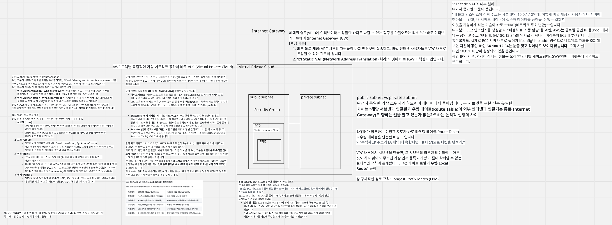

# ☁️ AWS VPC 및 EC2 기반 웹 서비스 인프라 구축 미션

## 1. 아키텍처 다이어그램 (Architecture Diagram)
> VPC, Subnet, Internet Gateway, EC2, Security Group 구성 요소와 외부에서 서비스로 들어오는 트래픽 흐름을 표현한 다이어그램입니다.


*(💡 안내: 추후 직접 그리신 아키텍처 다이어그램 이미지를 `docs/architecture.png` 경로에 저장하시면 위 이미지가 정상적으로 표시됩니다.)*

---

## 2. 외부 접속 증빙 (방식 A 선택)
**선택한 검증 방식**: (A) 브라우저에서 `http://<퍼블릭IP>`로 접속
**접속 URL (또는 IP)**: `http://[여기에 퍼블릭 IP를 입력하세요]`

### 외부 접속 결과 스크린샷
> 서버에 접속했을 때 정상 응답(예: "Welcome to nginx!")이 나타나는 화면입니다.


---

## 3. 보너스 과제: Docker 컨테이너 배포 상세 정보
> EC2 인스턴스 내부에 Docker를 설치하고, 컨테이너 환경으로 웹 서비스를 실행했습니다.

* **실행한 컨테이너 이미지명**: `nginx:latest` (기본 공식 Nginx 이미지)
* **컨테이너 실행 방식**:
  ```bash
  sudo docker run -d -p 80:80 nginx
  ```
* **포트 매핑 정보**: 호스트(EC2) 포트 `80`번을 컨테이너 내부의 `80`번 포트와 매핑(`80:80`)

### Docker 검증 스크린샷 1: 컨테이너 정상 구동 (`docker ps`)


### Docker 검증 스크린샷 2: 외부 접속 확인
*(위 2번 항목에서 촬영한 외부 접속 성공 스크린샷을 이곳에도 동일하게 첨부하거나 대체할 수 있습니다.)*


---

## 4. 트러블슈팅 보고서
인프라 구축 및 설정 과정에서 발생했던 통신/권한 등의 문제와, 이를 해결한 과정을 상세히 기록한 문서입니다.
* 📄 **문서 바로가기**: [트러블슈팅 보고서 (troubleshooting.md)](./docs/troubleshooting.md)

---

## 5. 리소스 정리 체크리스트 (운영 안정성/과금 방지)
실습 종료 후 과금을 방지하기 위해 생성된 모든 리소스(EC2, 보안그룹, VPC 등)를 안전하게 삭제하고 확인한 체크리스트입니다.
* 📄 **문서 바로가기**: [리소스 정리 체크리스트 (cleanup-checklist.md)](./docs/cleanup-checklist.md)