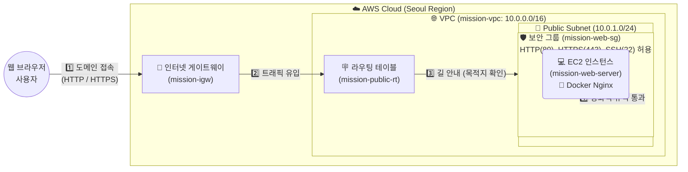
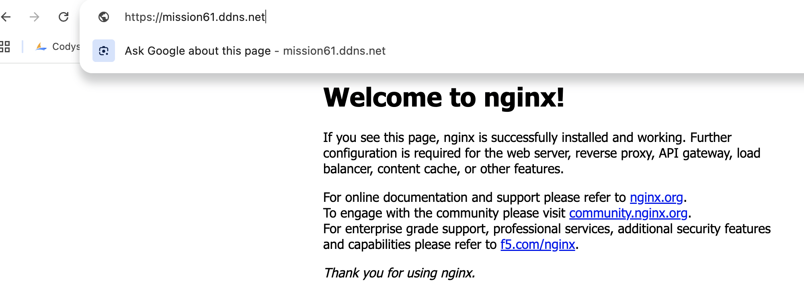
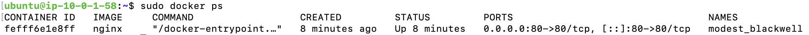
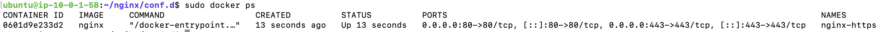
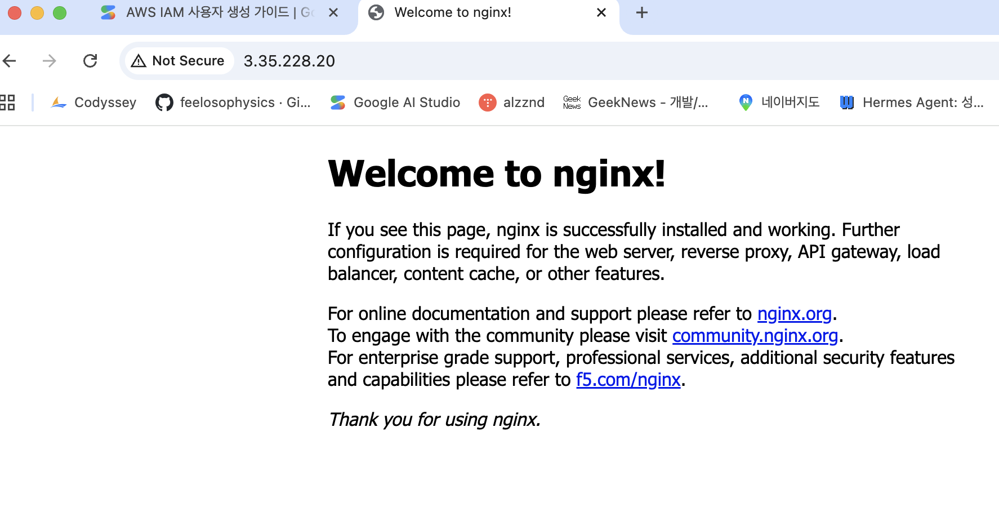

# ☁️ AWS VPC 및 EC2 기반 웹 서비스 인프라 구축 미션

## 0. 개발 환경 및 인프라 설계 규격

- **Cloud Provider**: Amazon Web Services (AWS)
- **Region**: ap-northeast-2 (서울 리전)
- **Instance**: t3.micro (프리 티어 대상 인스턴스)
- **OS**: Ubuntu 24.04 LTS
- **Web Server**: Nginx (Docker 컨테이너 환경)
- **네트워크 설계**:
  - **VPC**: `mission-vpc` (`10.0.0.0/16`)
  - **Public Subnet**: `mission-public-subnet` (`10.0.1.0/24`, 퍼블릭 IPv4 자동 할당 활성화)
  - **Internet Gateway**: `mission-igw` (VPC 연결 및 라우팅 테이블 `0.0.0.0/0 -> IGW` 연결 완료)
- **보안 그룹 (mission-web-sg) 규칙**:
  - **인바운드**:
    - `HTTP (80)`: `0.0.0.0/0` (모든 외부 인터넷 허용)
    - `HTTPS (443)`: `0.0.0.0/0` (모든 외부 인터넷 허용)
    - `SSH (22)`: 학습자 개인 IP (보안 최소 권한 적용)
  - **아웃바운드**: All Traffic 허용 (`0.0.0.0/0`)

## 1. 아키텍처 다이어그램 (Architecture Diagram)
> VPC, Subnet, Internet Gateway, EC2, Security Group 구성 요소와 외부에서 서비스로 들어오는 트래픽 흐름을 표현한 다이어그램입니다.

### 🌐 AWS 인프라 아키텍처 및 트래픽 흐름도



1. **사용자 (Client)**: 발급받은 도메인(`https://내도메인.ddns.net`)을 통해 웹 브라우저로 접속을 시도합니다.
2. **인터넷 게이트웨이 (IGW)**: VPC가 외부 인터넷과 통신할 수 있도록 연결해 주는 '대문' 역할을 하여 트래픽을 받아들입니다.
3. **라우팅 테이블 (Route Table)**: 들어온 트래픽이 올바른 서브넷(Public Subnet)으로 찾아갈 수 있도록 '이정표(길 안내)' 역할을 합니다.
4. **보안 그룹 (Security Group)**: EC2 인스턴스를 감싸고 있는 가상 방화벽입니다. 설정해 둔 규칙에 따라 80번(HTTP) 또는 443번(HTTPS) 포트의 접근만 안전하게 통과시킵니다.
5. **EC2 인스턴스 & Docker Nginx**: 보안 그룹을 무사히 통과한 트래픽이 최종적으로 우분투 서버 내부의 도커 컨테이너(Nginx)에 도달하여 "Welcome to nginx!" 웹 페이지를 반환합니다.

---

## 2. 외부 접속 증빙 (방식 A 선택)
**선택한 검증 방식**: (A) 브라우저에서 `http://[도메인]`으로 접속

> [!NOTE]
> 보너스 과제를 통해 HTTPS(SSL/TLS) 및 도메인을 추가 설정하였기 때문에, 일반 HTTP(80) 포트로의 접속 시도 역시 HTTPS(443) 포트로 자동 리다이렉션되도록 설계했습니다. 아래의 접속 스크린샷은 최종 HTTPS 환경의 웹 서버 웰컴 페이지 접속 화면입니다.

### 외부 접속 결과 스크린샷


---

## 3. 보너스 과제 1: HTTPS 적용 및 SSL 인증서 발급
> 무료 DDNS 도메인을 발급받고, Let's Encrypt를 통해 SSL/TLS 인증서를 인스턴스에 적용하여 HTTPS 보안 접속을 구성했습니다.

### 1) No-IP 도메인 설정
* **도메인(DDNS) 주소**: `https://[여기에 도메인을 입력하세요]`
* **설정 방식**: No-IP 서비스에서 고유 호스트 네임을 생성하고, 생성된 EC2 인스턴스의 퍼블릭 IP를 타겟 IP로 지정하여 도메인과 인스턴스 IP를 연동했습니다.

### 2) Let's Encrypt를 통한 SSL/TLS 인증서 발급 (Certbot Standalone)
* 80번 포트를 임시 점유하여 도메인 소유권을 인증하는 standalone 방식을 사용했습니다.
* **인증서 발급 명령어**:
  ```bash
  sudo apt-get update
  sudo apt-get install -y certbot
  sudo certbot certonly --standalone -d mission61.ddns.net
  ```
* **결과**: 발급 완료 후 `fullchain.pem` 및 `privkey.pem` 파일이 정상적으로 생성된 것을 확인했습니다.

### 3) Nginx SSL 설정 (`~/nginx/conf.d/default.conf`)
* HTTP(80)로 유입되는 모든 요성을 HTTPS(443)로 강제 리다이렉트하고, 443번 포트에서 SSL/TLS 암호화 통신을 처리하기 위한 Nginx 설정 파일 내용입니다.
  ```nginx
  server {
      listen 80;
      server_name [도메인];

      # HTTP 요청을 HTTPS로 301 강제 리다이렉트
      return 301 https://$host$request_uri;
  }

  server {
      listen 443 ssl;
      server_name [도메인];

      # Let's Encrypt SSL 인증서 및 개인키 경로 설정
      ssl_certificate /etc/letsencrypt/live/[도메인]/fullchain.pem;
      ssl_certificate_key /etc/letsencrypt/live/[도메인]/privkey.pem;

      # 보안성 향상을 위한 프로토콜 및 암호화 목록 명시
      ssl_protocols TLSv1.2 TLSv1.3;
      ssl_ciphers HIGH:!aNULL:!MD5;

      location / {
          root /usr/share/nginx/html;
          index index.html index.htm;
      }
  }
  ```

---

## 4. 보너스 과제 2: Docker 컨테이너 배포 상세 정보
> EC2 인스턴스 내부에 Docker 엔진을 설치하고, 컨테이너 환경으로 Nginx 웹 서비스를 격리하여 구성했습니다.

* **실행한 컨테이너 이미지명**: `nginx:latest` (공식 Nginx 이미지)
* **컨테이너 실행 명령어**:
  ```bash
  sudo docker run -d \
    -p 80:80 \
    -p 443:443 \
    -v /etc/letsencrypt:/etc/letsencrypt \
    -v ~/nginx/conf.d:/etc/nginx/conf.d \
    --name nginx-https \
    nginx
  ```
* **포트 매핑 정보**:
  - `80:80`: 호스트(EC2) 포트 80번을 컨테이너 내부 80번 포트로 전달 (HTTP 접속 및 HTTPS 리다이렉션 처리 목적)
  - `443:443`: 호스트(EC2) 포트 443번을 컨테이너 내부 443번 포트로 전달 (HTTPS SSL 암호화 통신 처리 목적)
* **볼륨 마운트 정보**:
  - `/etc/letsencrypt:/etc/letsencrypt`: 호스트에 생성된 Let's Encrypt SSL 인증서 디렉토리를 컨테이너 내부에 공유
  - `~/nginx/conf.d:/etc/nginx/conf.d`: 호스트에 작성된 SSL 리다이렉션 Nginx 설정 파일을 컨테이너 내부 가상 호스트 설정 경로에 주입

### Docker 검증 스크린샷 1: 컨테이너 정상 구동 (`docker ps`)
* **HTTP(80) 포트 구동 상태**:  
  
* **HTTPS(443) 포트 구동 상태**:  
  

### Docker 검증 스크린샷 2: 외부 접속 확인
* **HTTP 접속 시도 및 HTTPS 리다이렉션**:  
  
* **HTTPS 보안 접속 최종 확인**:  
  

---

## 5. 트러블슈팅 보고서
인프라 구축 및 설정 과정에서 발생했던 결제 및 환경 관련 문제와 해결 과정을 구조적으로 기록한 문서입니다.
* 📄 **문서 바로가기**: [트러블슈팅 보고서 (troubleshooting.md)](./docs/troubleshooting.md)

---

## 6. 리소스 정리 체크리스트 (운영 안정성/과금 방지)
실습 종료 후 과금을 방지하기 위해 생성된 모든 리소스(EC2, 보안그룹, VPC 등)를 안전하게 삭제하고 확인한 체크리스트입니다.
* 📄 **문서 바로가기**: [리소스 정리 체크리스트 (cleanup-checklist.md)](./docs/cleanup-checklist.md)