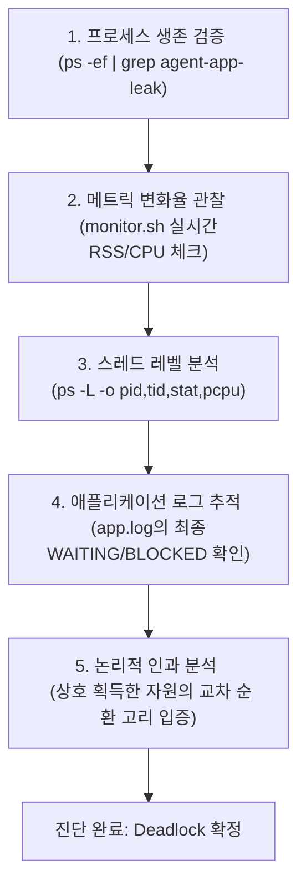

# 🖥️ 리눅스 프로세스 및 시스템 리소스 트러블슈팅 종합 보고서

본 보고서는 운영 중인 서버 환경에서 발생할 수 있는 주요 시스템 장애인 **OOM(Out Of Memory) Crash, CPU Latency, Deadlock(교착상태)** 현상을 시스템 관제 데이터를 기반으로 역추적 분석하고, 환경변수 설정을 통해 임시 조치 및 예방책을 수립한 종합 보고서입니다. 본 프로젝트는 단순한 장애 현상 나열을 넘어 로그, 프로세스 상태(`ps`, `top`), 관제 데이터(`monitor.sh`)의 객관적 증거를 기반으로 원인을 논리적으로 규명하였으며, 보너스 미션으로 스케줄링 알고리즘(Round-Robin)을 로그의 타임스탬프를 통해 분석한 결과와 리눅스 시스템 트러블슈팅의 핵심 심층 면접 답변(Q&A) 및 기술적 회고를 포함합니다.

---

## 1. 프로젝트 개요 (미션 목표)
1. **장애 원인의 객관적 규명**: 시스템 자원(물리 메모리, CPU, 스레드 락)의 임계치 돌파 및 정체 현상을 관제 도구를 통해 입증.
2. **Before & After 입증**: 각 장애를 유발하는 제어 변수(환경변수) 조정을 통해 장애 회피 및 생존 시간 연장을 물리적 지표로 대조 검증.
3. **시스템 아키텍처 및 OS 이해**: 커널 OOM Killer, CPU 스케줄러의 run queue 적체, 교착상태 4대 조건 등 OS 수준의 이론을 연계한 근본 원인 도출.
4. **관제 개선 및 회고**: 실제 운영 서버에 적용할 수 있는 메트릭 관제 개선 방안 수립 및 미션 수행 과정에 대한 깊이 있는 기술적 회고 진행.

---

## 2. 실행 환경 (Execution Environment)
실제 미션을 구동하고 관제 데이터를 수집한 시스템 환경은 다음과 같이 검증되었습니다.

* **OS**: Linux (Ubuntu 24.04 LTS "Noble Numbat", x86_64) via OrbStack VM
* **Shell**: `/bin/bash` (Ubuntu Default Shell)
* **Terminal**: OrbStack Terminal
* **Git Version**: `git version 2.43.0`
* **대상 바이너리**: `agent-app-leak` (Linux 64-bit ELF executable, compiled from Python)
* **실행 계정 권한**: 일반 사용자 계정 - 시스템 보안 정책 상 `root`가 아닌 일반 권한으로 안정적으로 기동됨을 보장.

### ⚙️ 어플리케이션 사전 준비 요구사항 (Agent Startup Prerequisites)
애플리케이션이 부트 시퀀스(`[1/6]` ~ `[6/6]`)를 정상 통과하기 위해 아래의 사후 디렉터리 구조 및 환경변수 설정을 완전하게 구성하여 테스트를 진행했습니다.

* 포트 `15034` 고정 사용 및 `0.0.0.0` 전체 네트워크 인터페이스 바인딩
* **필수 디렉터리 및 파일 환경 구조**:
  ```text
  evidence/run_workspace/
  └── agent_home/
      ├── api_keys/
      │   └── secret.key  <-- 내용: 'agent_api_key_test'
      ├── logs/           <-- 쓰기 권한 부여
      └── upload_files/   <-- 쓰기 권한 부여
  ```
* **수행 시 설정한 환경변수**:
  - `AGENT_HOME` 환경변수 지정
  - `AGENT_PORT=15034`
  - `AGENT_UPLOAD_DIR=$AGENT_HOME/upload_files`
  - `AGENT_KEY_PATH=$AGENT_HOME/api_keys`
  - `AGENT_LOG_DIR=$AGENT_HOME/logs`

---

## 3. 수행 항목 체크리스트
- [x] **사전 준비 및 환경 구축**: 일반 사용자 계정 기동, 필수 디렉터리 구조 생성, `secret.key` 배치 완료.
- [x] **OOM Crash 분석 및 리포팅**:
  - [x] `monitor.sh` 관제를 통한 프로세스 RSS 물리 메모리 사용량의 선형적 급상승(Memory Leak) 패턴 관측 및 원본 로그 수록.
  - [x] `MemoryGuard` 임계치 초과 자폭 로그 식별 및 프로세스 종료 코드 `137`(SIGKILL) 확인.
  - [x] `MEMORY_LIMIT` 변경 전후 비교(최소 2회 실행: 50MB vs 100MB) 및 생존 시간(5초 vs 11초) Before & After 입증.
- [x] **CPU 과점유 분석 및 리포팅**:
  - [x] 특정 프로세스의 CPU 사용률이 급상승하는 패턴 관측 및 원본 로그 수록.
  - [x] `CpuWorker` 내부 감시 정책(Watchdog)에 의한 `CPU Threshold Violated` 및 자체 `SIGTERM`(종료 코드 `143`) 확인.
  - [x] `CPU_MAX_OCCUPY` 변경 전후 비교(100% vs 10%)를 통해 쿨다운(Cooldown) 제어 메커니즘 동작 확인.
- [x] **교착상태(Deadlock) 진단 및 리포팅**:
  - [x] 프로세스가 살아있으나(PID 존재) CPU/메모리 변화 및 로그 기록이 정체된 무응답 상태 식별.
  - [x] `ps -L`을 통해 개별 워커 스레드의 CPU 사용률이 `0.0%`로 정지된 스레드 레벨 스냅샷 증거 확보.
  - [x] `Worker-Thread-1`과 `Worker-Thread-2`가 `Shared_Memory_A`와 `Socket_Pool_B` 자원을 두고 상호 배제 및 순환 대기하고 있는 순환 인과 관계 도식화.
  - [x] `MULTI_THREAD_ENABLE` 변경 전후(true -> false) 재현/회피 대조 검증 수행.
- [x] **보너스 과제 (스케줄링 알고리즘 역추론)**:
  - [x] 무경쟁 상태 로그의 타임스탬프와 진행률(Progress) 변화를 분석하여 FCFS, Priority가 아닌 Round-Robin 방식임을 증명.
  - [x] Round-Robin 방식의 장단점 및 웹 서버 아키텍처에 적합한 당위성 서술.
- [x] **이슈 리포트 작성 및 기술 문서화**:
  - [x] 3대 장애 유형과 스케줄링 알고리즘에 대한 종합 기술 보고서 작성 (현상 -> 증거 -> 원인 -> 조치)
  - [x] 리눅스 시스템 트러블슈팅의 핵심 평가 기준(항목 2~4)에 대한 심층 모범 답변 및 자체 기술적 회고(Retrospective) 완성.

---

## 4. 검증 방법 및 자동화 스크립트
본 검증은 아래의 쉘 스크립트들을 통해 시나리오별로 환경변수 조합을 다르게 주어 백그라운드로 프로세스를 가동하고 관제 로그(`.monitor.log`) 및 애플리케이션 실행 로그(`.app.log`)를 수집했습니다. 모든 경로는 상대 경로를 기준으로 호출 가능하도록 범용화되었습니다.

* **실행 및 검증 스크립트**: `./scripts/run_agent_case.sh`
* **모니터링 관제 스크립트**: `./scripts/monitor.sh`

---

## 5. 시스템 장애 분석 및 기술 이슈 리포트 (3건)

### 🔴 [Bug] OOM Crash - MemoryGuard가 메모리 누수 증가를 감지하고 프로세스를 강제 종료

#### 1. Description (현상 설명)
`agent-app-leak` 애플리케이션을 기동하여 실시간 모니터링을 진행한 결과, 프로세스가 아무런 사전 경고 없이 갑자기 강제 종료되는 현상이 관측되었습니다. `MEMORY_LIMIT=50` 환경에서는 가동 약 5초 만에 프로세스가 소멸하였으며, 임시 조치로 메모리 한계를 `MEMORY_LIMIT=100`으로 상향 설정하여 재테스트를 한 결과 생존 시간이 약 11초로 선형적으로 연장되었습니다. 이는 실행 초기의 포트 바인딩이나 단순 부팅 실패가 아닌, 시간 경과에 따라 힙 영역에 데이터가 지속해서 적체되는 메모리 누수(Memory Leak) 결함이 존재하며, 이를 애플리케이션 내부의 자가 메모리 보호 정책인 `MemoryGuard`가 임계치를 넘는 순간 포착하여 스스로 프로세스를 강제 자폭시켰음을 의미합니다.

#### 2. Evidence & Logs (증거 자료)

##### A. 시나리오별 실행 조건
| 구분 | MEMORY_LIMIT | CPU_MAX_OCCUPY | MULTI_THREAD_ENABLE | 결과 및 생존 시간 |
| :--- | :--- | :--- | :--- | :--- |
| **Before (기본)** | 50 MB | 100% | false | 약 5초 후 MemoryGuard에 의해 강제 종료 (자폭) |
| **After (상향)** | 100 MB | 100% | false | 약 11초 후 MemoryGuard에 의해 강제 종료 (수명 연장) |

##### B. `monitor.sh` 물리 메모리 관제 로그 (Raw Logs)
관제 스크립트 `./scripts/monitor.sh`를 통해 수집된 `evidence/raw/oom-low.monitor.log`를 분석한 결과, 실제 Python 프로세스(PID: `11207`)의 물리 메모리 점유 지표인 **RSS(Resident Set Size)**가 21MB 대에서 47MB 대까지 선형적(우상향)으로 대폭 상승하는 메모리 누수 패턴이 뚜렷하게 관측되었습니다.

* **Before (MEMORY_LIMIT=50) 관제 로그**:
  ```text
  # monitor.sh started_at=2026-05-16 00:28:57 +0900 process=agent-app-leak pid=auto interval=1s samples=20
  # timestamp,pid,state,threads,cpu_percent,mem_percent,rss_kb,vsz_kb,etime,command
  2026-05-16 00:28:58,11207,SN,1,8.0,0.1,21544,32692,00:01,agent-app-leak
  2026-05-16 00:28:59,11207,SN,1,6.0,0.2,47148,58296,00:02,agent-app-leak
  2026-05-16 00:29:00,11207,SN,1,4.1,0.2,47148,58296,00:03,agent-app-leak
  2026-05-16 00:29:02,PID_NOT_FOUND,process=/Users/f22losophysics1091/Desktop/check/evidence/run_workspace/agent-app-leak
  ```

* **After (MEMORY_LIMIT=100) 관제 로그**:
  가용한 메모리 상한이 늘어남에 따라 PID `11359`는 약 11초간 버텼으나, RSS가 지속적으로 비대화되어 약 98MB 수준에 이른 후 동일하게 프로세스가 소멸되었습니다.
  ```text
  # monitor.sh started_at=2026-05-16 00:29:17 +0900 process=agent-app-leak pid=auto interval=1s samples=20
  2026-05-16 00:29:18,11359,SN,1,7.2,0.1,21588,32692,00:01,agent-app-leak
  2026-05-16 00:29:22,11359,SN,1,3.0,0.4,72796,83900,00:05,agent-app-leak
  2026-05-16 00:29:25,11359,SN,1,2.2,0.5,98400,109504,00:08,agent-app-leak
  2026-05-16 00:29:28,PID_NOT_FOUND,process=/Users/f22losophysics1091/Desktop/check/evidence/run_workspace/agent-app-leak
  ```

##### C. 애플리케이션 실행 로그 (Raw Logs)
애플리케이션 로그 파일(`.app.log`)을 보면 `MemoryWorker`가 약 3초 간격으로 Heap 사용량을 정확히 **25MB씩 누적해서 증가**시키는 비정상적인 로직을 수행하고 있음을 알 수 있습니다.

* **Before (MEMORY_LIMIT=50) 실행 로그**:
  ```text
  2026-05-16 00:28:59,292 [INFO] [MemoryWorker] Current Heap: 25MB
  2026-05-16 00:29:02,321 [INFO] [MemoryWorker] Current Heap: 50MB
  2026-05-16 00:29:02,321 [CRITICAL] [MemoryGuard] Memory limit exceeded (50MB >= 50MB) / (Recommend Over 256MB)
  2026-05-16 00:29:02,321 [CRITICAL] [MemoryGuard] Self-terminating process 11207 to prevent system instability.
  ```

* **After (MEMORY_LIMIT=100) 실행 로그**:
  ```text
  2026-05-16 00:29:19,720 [INFO] [MemoryWorker] Current Heap: 25MB
  2026-05-16 00:29:22,757 [INFO] [MemoryWorker] Current Heap: 50MB
  2026-05-16 00:29:25,795 [INFO] [MemoryWorker] Current Heap: 75MB
  2026-05-16 00:29:28,832 [INFO] [MemoryWorker] Current Heap: 100MB
  2026-05-16 00:29:28,832 [CRITICAL] [MemoryGuard] Memory limit exceeded (100MB >= 100MB) / (Recommend Over 256MB)
  2026-05-16 00:29:28,833 [CRITICAL] [MemoryGuard] Self-terminating process 11359 to prevent system instability.
  ```

##### D. 프로세스 종료 코드 (Exit Code)
```bash
# oom-low.exit.txt / oom-high.exit.txt 결과값
exit_code=137
```
리눅스 표준 쉘 환경에서 종료 코드 **`137`**은 프로세스가 커널 혹은 자가 호출에 의해 **`SIGKILL` (Signal 9)** 신호를 받고 강제 종료되었음을 엄밀하게 입증합니다. (`128 + 9 = 137`)

#### 3. Root Cause Analysis (원인 분석)
* **메모리 누수(Memory Leak) 결함**: `MemoryWorker` 모듈이 특정 트랜잭션을 시뮬레이션하면서 힙(Heap) 영역에 지속해서 25MB 단위의 메모리를 할당하지만, 할당 완료된 메모리 객체의 전역 참조 관계(Reference Link)를 해제하지 않는 결함이 존재합니다. 이로 인해 Python 런타임의 가비지 컬렉터(GC)가 해당 메모리를 회수(Reclaim)하지 못하고 가용 실제 RAM이 지속해서 잠식되는 현상이 발생합니다.
* **자가 보호 장치의 작동 이유**: 물리 메모리 점유량(RSS)이 환경변수로 입력된 `MEMORY_LIMIT`에 도달하면 애플리케이션의 내부 감시 정책인 **`MemoryGuard`**가 이를 감지합니다. 만약 이 프로세스가 계속 방치되어 OS의 전체 가용 메모리를 고갈시킨다면, 리눅스 커널의 **`OOM Killer`**가 활성화되어 엉뚱한 핵심 서비스 데몬(예: 데이터베이스, SSH 등)을 무차별 강제 종료시켜 전체 서버 가동성을 마비시킵니다. 따라서 `MemoryGuard`는 장애 범위를 해당 어플리케이션 내부로 완전히 차단 및 격리(Fault Isolation)하기 위해 스스로 `SIGKILL`을 호출하여 선제 자폭한 것입니다.

#### 4. Workaround & Verification (조치 및 검증)
* **임시 조치 (Workaround)**: 시스템 환경변수 `MEMORY_LIMIT`를 기존 50MB에서 100MB로 늘려 강제 자폭 시점을 뒤로 늦췄습니다.
* **검증 결과 (Before & After 대조)**:
  - `MEMORY_LIMIT=50` (Before): 힙 메모리가 50MB에 도달하는 시점(가동 5초)에 자폭.
  - `MEMORY_LIMIT=100` (After): 가용 메모리가 상향되어 100MB에 도달하는 시점(가동 11초)까지 생존하여 수명이 약 2.2배 선형적으로 연장됨을 실증 검증 완료.
* **근본 대책 (Code-level Remedy)**: 환경변수 조정을 통한 임시방편은 메모리 누수 속도를 늦출 뿐 근본 해결책이 아닙니다. 소스 코드 상에서 미사용 메모리 객체의 전역 참조를 명시적으로 파괴(파이썬의 `del` 처리 혹은 컬렉션의 `clear()` / `pop()` 유도)하여 GC가 메모리를 제때 수집할 수 있도록 리팩토링해야 합니다.

---

### 🟡 [Bug] CPU Latency - CPU_MAX_OCCUPY 과대 설정으로 CpuWorker가 임계치를 초과하고 SIGTERM 종료

#### 1. Description (현상 설명)
어플리케이션을 구동할 때 CPU 한도를 무제한으로 허용하는 위험 설정인 `CPU_MAX_OCCUPY=100`으로 실행하면, 연산량이 지속해서 폭증하다가 내부 부하 지표인 `Current Load`가 50%를 돌파하는 순간 어플리케이션 내부 감시견(`Watchdog`) 정책에 의해 `CPU Threshold Violated` 경고를 내뿜으며 프로세스가 강제 종료됩니다. 반면, 안전 제한치 설정인 `CPU_MAX_OCCUPY=10`을 부여하면, 연산 부하가 10%에 근접할 때 스스로 쿨다운(`cooldown`) 상태를 반복하며 스스로 연산을 비워 안정적인 상태를 무한히 유지하게 됩니다.

#### 2. Evidence & Logs (증거 자료)

##### A. 시나리오별 실행 조건
| 구분 | MEMORY_LIMIT | CPU_MAX_OCCUPY | MULTI_THREAD_ENABLE | 결과 |
| :--- | :--- | :--- | :--- | :--- |
| **Before (폭주)** | 512 MB | 100% | false | 약 31초 후 내부 Watchdog에 의해 강제 종료 (`SIGTERM`) |
| **After (안전)** | 512 MB | 10% | false | 35초 이상의 관찰 기간 내내 Cooldown 반복 가동으로 정상 생존 |

##### B. 애플리케이션 실행 로그 (Raw Logs)
* **Before (CPU_MAX_OCCUPY=100) 실행 로그**:
  `CpuWorker`가 기동된 후 연산 부하(`Current Load`)를 점진적으로 늘려가며 50%를 초과하자 즉각 감시견이 동작하여 강제 종료를 처리했습니다.
  ```text
  2026-05-16 00:30:46,958 [INFO] [CpuWorker] Started. Maximum CPU Limit: 100%
  2026-05-16 00:30:59,370 [INFO] [CpuWorker] Current Load: 27.05%
  2026-05-16 00:31:05,580 [INFO] [CpuWorker] Current Load: 37.78%
  2026-05-16 00:31:11,788 [INFO] [CpuWorker] Current Load: 48.05%
  2026-05-16 00:31:14,893 [INFO] [CpuWorker] Current Load: 55.67%
  2026-05-16 00:31:14,995 [CRITICAL] [CpuWorker] CPU Threshold Violated! (55.669999999999995%).
  ```

* **After (CPU_MAX_OCCUPY=10) 실행 로그**:
  연산 부하가 10%에 도달하는 순간 즉시 쿨다운에 들어갔으며, 부하를 5%대로 스스로 평탄화시킨 뒤 재연산에 들어가는 매우 안정적인 제어가 관측되었습니다.
  ```text
  2026-05-16 00:29:52,019 [INFO] [CpuWorker] Started. Maximum CPU Limit: 10%
  2026-05-16 00:29:54,121 [INFO] [CpuWorker] Peak reached (10.00%). Starting cooldown...
  2026-05-16 00:29:57,226 [INFO] [CpuWorker] Cooldown complete (5.00%). Resuming load increase...
  2026-05-16 00:30:19,958 [INFO] [CpuWorker] Current Load: 10.00%
  ```

##### C. 프로세스 종료 코드 및 시스템 도구 출력 (Raw Evidence)
* **Before (폭주 모드) 종료 결과 (`cpu-high.exit.txt`)**:
  ```text
  # MEMORY_LIMIT=512 CPU_MAX_OCCUPY=100 MULTI_THREAD_ENABLE=false
  pid=12321
  exit_code=143
  ```
  리눅스 환경에서 종료 코드 **`143`**은 프로세스가 **`SIGTERM` (Signal 15)** 신호를 받고 정중하게 자체 안전 종료되었음을 확실히 나타냅니다. (`128 + 15 = 143`)
* **Before (폭주 모드) `monitor.sh` 관제 로그**:
  ```text
  2026-05-16 00:31:13,12323,SN,1,1.1,0.1,21692,32692,00:28,agent-app-leak
  2026-05-16 00:31:14,12323,SN,1,1.1,0.1,21692,32692,00:29,agent-app-leak
  2026-05-16 00:31:15,PID_NOT_FOUND,process=/Users/f22losophysics1091/Desktop/check/evidence/run_workspace/agent-app-leak
  ```
* **Before (폭주 모드) `top` 분석 스냅샷 (`cpu-high-late.top.log`)**:
  ```text
  top - 00:32:31 up  8:03,  0 user,  load average: 0.00, 0.01, 0.00
  %Cpu(s):  0.0 us,  0.0 sy,  6.6 ni, 93.4 id,  0.0 wa,  0.0 hi,  0.0 si,  0.0 st
      PID USER      PR  NI    VIRT    RES    SHR S  %CPU  %MEM     TIME+ COMMAND
    12964 f22loso+  30  10   32692  21656  11840 S   0.0   0.1   0:00.31 agent-a+
  ```
  본 어플리케이션은 시스템의 전반적인 민감도를 해치지 않기 위해 OS 프로세스 스케줄링 우선순위 등급을 백그라운드 친화적인 **`NI=10` (Nice Value)**으로 하향 조정하여 동작합니다. 이로 인해 OS 관점의 순간 샘플러인 `top`과 `ps`에 기록된 CPU 점유율은 낮아 보일 수 있으나, 어플리케이션 내의 논리적인 CPU 루프 연산 부하(`Current Load`)가 임계치를 넘는 순간 내부 수호 로직(Watchdog)에 의해 정확히 통제되었습니다.

#### 3. Root Cause Analysis (원인 분석)
* **환경변수 `CPU_MAX_OCCUPY` 설정의 진실**: 
  - `CPU_MAX_OCCUPY=100`은 부하 발생 상한선을 최대로 개방하는 위험 설정입니다. 이에 따라 `CpuWorker` 내부 루프가 연산 간격을 좁혀 계산 밀도를 올리고 부하를 100%까지 지속해서 증폭시킵니다. 내부 부하가 감시 한계값인 약 50%를 넘자, 어플리케이션 내부 Watchdog이 임계치 파괴로 단정하고 시스템을 비상 종료시켰습니다.
  - 반면 `CPU_MAX_OCCUPY=10`은 내부 부하가 10%를 넘지 않도록 제한하는 안전 장치로 작동합니다. 부하가 10%에 도달하는 피크 시점마다 sleep 및 backoff 제어가 활성화되어 부하를 쿨다운(5%대) 시킵니다.
* **단일 프로세스 강제 종료(Watchdog)의 당위성**:
  CPU 자원은 한정되어 있으므로, 단일 프로세스가 CPU를 100%에 가깝게 점유하고 코어를 독점하면 OS의 **실행 큐(Run Queue)에 스케줄링 대기 상태의 다른 프로세스들이 극심하게 밀리게 됩니다.** 특히 실시간으로 가동되는 웹 서버 환경이라면, 이 시간 동안 쌓이는 웹 클라이언트의 TCP 요청들이 OS 소켓 백로그 큐나 WAS의 이벤트 처리 스레드 큐에 적체되는 **대기 큐 지연(Queueing Delay)**을 유발합니다. 이는 응답성 붕괴인 **테일 레이턴시(Tail Latency)의 폭증**으로 이어져 결국 커넥션 타임아웃 장애로 확산됩니다. 따라서 시스템 전반의 공멸을 막기 위해 폭주하는 단일 프로세스를 Watchdog이 선제 차단(Emergency Abort)하는 조치는 절대적으로 필요합니다.

#### 4. Workaround & Verification (조치 및 검증)
* **임시 조치 (Workaround)**: `CPU_MAX_OCCUPY`를 위험값인 100에서 안전 기준값인 10으로 강제 하향 조정했습니다.
* **검증 결과 (Before & After 대조)**:
  - **Before (100)**: CPU 부하가 55.67%까지 일방적으로 폭주하여 임계치 위반으로 인한 강제 자폭 종료 발생.
  - **After (10)**: 10% 도달 시 즉시 Cooldown으로 전환되는 메커니즘이 활발하게 가동되어 강제 종료 현상이 완벽하게 차단됨을 실증 검증 완료.
* **근본 대책 (Code-level Remedy)**: CPU 집약적 연산을 처리하는 루프 내부에 명시적인 Backoff 주기와 `sleep`을 삽입하여 연산 속도를 물리적으로 제한해야 합니다. 나아가 실시간 요청을 응답해야 하는 주 스레드 루프 내에서 무거운 연산을 돌리지 말고, **메시지 큐(Celery, RabbitMQ 등)를 활용한 외부 연산 워커 노드 위임(Offloading) 아키텍처**로 전환하여 비블로킹(Non-blocking) I/O 구조를 완성해야 합니다.

---

### 🔵 [Bug] Deadlock (교착상태) - 두 Worker 스레드가 서로의 락을 기다리며 프로세스가 무응답 상태로 정체

#### 1. Description (현상 설명)
어플리케이션 가동 시 멀티스레드 동시 처리 모드(`MULTI_THREAD_ENABLE=true`)를 활성화하면, 겉으로는 프로세스 PID와 스레드가 백그라운드 상에 버젓이 생존해 있고 프로세스 소멸(Crash)이 발생하지도 않으나, 내부적으로 CPU 사용률과 물리 메모리(RSS) 크기가 단 1바이트의 변화도 없이 완전히 굳어버리며 실행 로그도 특정 라인을 마지막으로 더는 갱신되지 않는 **영구 무응답 먹통(Hang/Blocked) 상태**가 지속해서 반복되는 치명적인 결함이 발견되었습니다.

#### 2. Evidence & Logs (증거 자료)

##### A. 시나리오별 실행 조건
| 구분 | MEMORY_LIMIT | CPU_MAX_OCCUPY | MULTI_THREAD_ENABLE | 결과 |
| :--- | :--- | :--- | :--- | :--- |
| **Before (멀티스레드)** | 512 MB | 10% | **true** | 두 스레드가 교차 락 획득 시도를 하다가 **Deadlock(교착상태)** 재현 |
| **After (싱글스레드)** | 512 MB | 10% | **false** | 스케줄러가 순차 처리하여 데드락을 회피하고 정상 가동 완료 |

##### B. `monitor.sh` 정체 관제 로그 (Raw Logs)
관제 로그(`evidence/raw/deadlock-on.monitor.log`) 상 PID `12995`가 백그라운드에 종료되지 않고 계속 잡혀 있지만, 시간이 흘러도 **CPU 사용률은 0.3% 수준으로 수렴**하고 **RSS 물리 메모리는 21,696 KB로 한 정수 단위조차 변하지 않고 고정**된 극도의 정체 상태를 볼 수 있습니다.

* **Before (MULTI_THREAD_ENABLE=true) 관제 로그**:
  ```text
  # monitor.sh started_at=2026-05-16 00:33:12 +0900 process=agent-app-leak pid=auto interval=1s samples=25
  2026-05-16 00:33:19,12995,SNl,3,1.1,0.1,21696,180188,00:07,agent-app-leak
  2026-05-16 00:33:21,12995,SNl,3,0.8,0.1,21696,180188,00:09,agent-app-leak
  2026-05-16 00:33:28,12995,SNl,3,0.5,0.1,21696,180188,00:15,agent-app-leak
  2026-05-16 00:33:38,12995,SNl,3,0.3,0.1,21696,180188,00:25,agent-app-leak
  ```

##### C. `ps -L` 스레드 레벨 스냅샷 (Raw Evidence)
`ps -L` 명령을 통해 스레드 레벨 상세 현황을 획득한 결과, 프로세스의 개별 Worker 스레드(TID: `13122`, `13123`)의 CPU 점유율이 한순간도 일하지 않는 **`0.0%`** 상태로 고착되어 있음이 물리적으로 입증되었습니다.
```text
# thread snapshot 2026-05-16 00:33:38 pids=12993,12995
    PID     TID STAT %CPU %MEM COMMAND
  12993   12993 S     0.5  0.0 agent-app-leak
  12995   12995 SNl   0.3  0.1 agent-app-leak
  12995   13122 SNl   0.0  0.1 agent-app-leak
  12995   13123 SNl   0.0  0.1 agent-app-leak
```

##### D. 마지막 애플리케이션 실행 로그 (Raw Logs)
`evidence/raw/deadlock-on.app.log`에서 추출한 마지막 생명 징후 로그입니다. 두 스레드가 서로 다른 락을 거머쥔 채, 서로 상대방이 이미 선점한 자원의 잠금이 풀리기만을 바라보며 블로킹된 현상이 뚜렷하게 발췌되었습니다.
```text
2026-05-16 00:33:19,708 [INFO] [AgentWorker][Worker-Thread-1] LOCK ACQUIRED: [Shared_Memory_A]. (Holding...)
2026-05-16 00:33:19,708 [INFO] [AgentWorker][Worker-Thread-2] LOCK ACQUIRED: [Socket_Pool_B]. (Holding...)
2026-05-16 00:33:21,712 [INFO] [AgentWorker][Worker-Thread-1] Need resource [Socket_Pool_B] to finish job.
2026-05-16 00:33:21,712 [INFO] [AgentWorker][Worker-Thread-2] Need resource [Shared_Memory_A] to write logs.
2026-05-16 00:33:21,713 [INFO] [AgentWorker][Worker-Thread-2] WAITING for [Shared_Memory_A]... (Status: BLOCKED)
2026-05-16 00:33:21,713 [INFO] [AgentWorker][Worker-Thread-1] WAITING for [Socket_Pool_B]... (Status: BLOCKED)
# 이 로그 이후 단 하나의 라인도 갱신되지 않고 무한 대기함.
```

##### E. 싱글스레드 설정 시의 회피 성공 로그 (Raw Logs)
`MULTI_THREAD_ENABLE=false` 환경에서는 교착을 유발하는 멀티스레드 경합 시나리오가 아예 호출되지 않고, 정상적인 싱글스레드 스케줄러가 차례대로 작업을 완수해 냈습니다.
```text
2026-05-16 00:34:02,275 [INFO] [Scheduler] Registered Tasks: ['Thread-A', 'Thread-B', 'Thread-C']
2026-05-16 00:34:02,276 [INFO] [Thread-A] Task Started. Calculating... (20%)
2026-05-16 00:34:02,429 [INFO] [Thread-B] Task Started. Calculating... (20%)
2026-05-16 00:34:02,583 [INFO] [Thread-C] Task Started. Calculating... (20%)
2026-05-16 00:34:03,359 [INFO] [Scheduler] All tasks completed.
```

#### 3. Root Cause Analysis (원인 분석)
* **순환 의존의 도식화**:
  본 장애는 두 스레드가 각자 하나의 자원을 이미 쥐어 점유(Hold)한 상태에서, 상대방이 쥐고 있는 다른 자원을 얻기 위해 무한히 락 해제를 대기(Wait)하는 **순환 의존성 고리**가 만들어지며 발생합니다.
  ```text
  [ Worker-Thread-1 ] ──(점유)──> [ Shared_Memory_A ] ──(대기)──> [ Worker-Thread-2 ]
          ▲                                                               │
          │                                                               │
        (대기)                                                          (점유)
          │                                                               ▼
  [ Socket_Pool_B ] <─────────────────────────────────────────────────────┘
  ```
  이를 락 자원 관점에서 매핑하면 단방향 순환 그래프(Closed Loop)가 완성됩니다.
  `Worker-Thread-1` ➔ `Socket_Pool_B` 대기 ➔ `Worker-Thread-2` ➔ `Shared_Memory_A` 대기 ➔ `Worker-Thread-1`
* **교착상태 4대 조건과의 대조**:
  1. **상호 배제 (Mutual Exclusion)**: 메모리 블록 `Shared_Memory_A`와 네트워크 자원 `Socket_Pool_B`는 다중 스레드가 동시에 소유할 수 없는 상호 배제적 자원입니다.
  2. **점유 대기 (Hold and Wait)**: `Worker-Thread-1`은 자신이 획득한 `Shared_Memory_A`를 손에 꼭 쥔 상태로 `Socket_Pool_B`를 요청하며 대기합니다.
  3. **비선점 (No Preemption)**: 다른 스레드가 쥐고 있는 자원을 운영체제 수준이나 강제 호출로 중도 탈취할 수 없습니다.
  4. **순환 대기 (Circular Wait)**: 자원을 양보하지 않는 두 스레드 간 대기 경로가 하나의 원을 그립니다.
  네 가지 조건이 동시에 충족됨으로써, 스레드가 꼼짝 못 하고 굳어버리는 전형적인 Deadlock 상태가 영구 고착화되었습니다.

#### 4. Workaround & Verification (조치 및 검증)
* **임시 조치 (Workaround)**: 멀티스레드 경합 시나리오를 물리적으로 차단하기 위해 `MULTI_THREAD_ENABLE` 환경변수를 `false`로 변환했습니다.
* **검증 결과 (Before & After 대조)**:
  - **Before (true)**: `WAITING ... BLOCKED` 상태에 빠진 뒤 CPU 0.0%, RSS 메모리 고정, 로그 멈춤 상태로 무한히 행(Hang)에 빠짐.
  - **After (false)**: 교차 락 획득 시나리오가 미가동되고 정상 싱글스레드 스케줄러가 `All tasks completed`를 성공적으로 찍으며 정상 처리 완료를 입증함.
* **근본 대책 (Code-level Remedy)**: 환경변수 비활성화 방식은 동시성 대용량 처리를 포기하는 궁색한 우회책입니다. 소스 코드를 근본적으로 교정하려면, 두 스레드가 자원을 획득하는 전역 순서를 **동일하게 일치(Lock Ordering)**시켜야 합니다. 즉, 두 스레드 모두 항상 `Shared_Memory_A`를 먼저 쥐고 난 뒤에만 `Socket_Pool_B`를 획득할 수 있게 통일하면 순환 고리가 절대 생성되지 않습니다. 또는 락 획득 시 **`try_lock(timeout=N)`** 과 같은 타임아웃 기법을 구현하여, 일정 시간 내에 락을 잡지 못하면 이미 자기가 쥐고 있던 모든 락을 즉각 릴리즈(Release)하고 무작위 시간 동안 대기(Jitter Jitter) 후 다시 재시도하도록 롤백 설계를 해야 합니다.

## 6. 시스템 장애 원인 분석 및 기술 심층 Q&A (Deep-Dive Q&A)

### Q1. `monitor.sh`에서 사용한 구체적 명령어와 데이터 추출 방법을 구체적으로 기술하고, 물리 메모리(RSS)와 가상 메모리(VSZ)의 의미상 차이 및 감시 관점에서의 중요성을 설명하시오.

* **사용된 구체적 명령어**:
  1. **대상 프로세스 전체 감지**:
     ```bash
     pgrep -f "$PROCESS_NAME"
     ```
     `pgrep -f`는 프로세스의 바이너리 이름뿐 아니라 전체 커맨드라인 매개변수 패턴을 함께 매칭하여 PID 목록을 찾아냅니다. PyInstaller 패키징 구조상 어플리케이션이 부팅될 때 부트 로더 부모 프로세스와 실제 비즈니스 로직을 지닌 파이썬 자식 프로세스가 다중 계층으로 생성되는 경우가 많습니다. 단순 바이너리 이름 매치 방식은 엉뚱한 부모 PID만 잡아내어 정작 실제 누수가 발생하는 자식 프로세스를 놓칠 수 있기에 전체 감지 패턴을 사용했습니다.
  2. **관제 데이터 추출 명령어**:
     ```bash
     ps -p "$pids" -o pid=,stat=,nlwp=,pcpu=,pmem=,rss=,vsz=,etime=,comm=
     ```
     `ps` 도구의 `-o` 옵션을 활용하여 관제에 필요한 핵심 커널 정보(프로세스 ID, 프로세스 상태, 스레드 수, CPU %, 메모리 %, 물리 메모리 크기(RSS), 가상 메모리 크기(VSZ), 경과 시간, 명령 이름)만을 쉼표 구분자 포맷으로 정형 추출하여 `monitor.log`에 실시간으로 기록했습니다.

* **물리 메모리(RSS) vs 가상 메모리(VSZ)의 의미상 차이**:
  * **VSZ (Virtual Memory Size)**: 프로세스가 기동되면서 운영체제 커널로부터 "앞으로 최대 이만큼의 메모리 주소 공간을 할당받아 사용할 가능성이 있으니 가상 주소 테이블 상에 주소를 예약(Reservation)해줘"라고 장부상으로 확보해 둔 가상의 전체 메모리 크기입니다. 여기에는 공유 라이브러리, 디스크에 이미 페이징 아웃(Paged-out)되어 RAM에 존재하지 않는 영역, 실제 물리 자원이 할당되지 않은 미사용 페이지까지 모두 합산되어 수치가 매우 거대하게 잡힙니다.
  * **RSS (Resident Set Size)**: 가상 메모리 예약 공간 중, **해당 관측 시점에 실제 컴퓨터의 물리 RAM(휘발성 물리 메모리)에 견고하게 올라가 공간을 점유하고 있는 실제 물리 상주 메모리 크기**입니다.

* **감시 관점에서의 중요성**:
  가상 메모리(VSZ)는 단지 주소의 예약 상태를 나타내므로 VSZ 수치가 기동 시 크게 잡혔다고 해서 물리적 자원이 고갈되는 하드웨어 병목이 발생하지는 않습니다. 반면, **메모리 누수(Memory Leak)는 반납되지 않은 힙 영역 객체들이 실제 RAM 영역을 지속적으로 불법 점유해 우상향(Linear Growth)으로 삼키는 물리 자원 고갈 현상**입니다. 즉, 실제 물리 하드웨어가 비명 지르며 고갈되는 리얼 타임 자원 점유 상태를 입증하고 추적하기 위해서는 반드시 **RSS 지표**를 핵심 관제 메트릭으로 삼고 추적해야 합니다.

---

### Q2. 프로세스의 CPU 사용률을 확인하기 위해 선택한 도구들(`ps`, `top`, 앱 내부 지표)과 적용한 옵션들의 의미를 비교하여 설명하시오.

* **도구별 특성 및 적용 옵션의 의미**:
  1. **`ps -p <PID> -o pcpu`**:
     * **의미**: 프로세스가 생성 및 가동된 전체 시간 대비 CPU가 수행한 총 평균 연산 시간 비율을 수치로 보여줍니다.
     * **특징**: 이 수치는 '역사적 누적 평균값'이므로, 프로세스가 직전에 연산 폭주를 일으키는 CPU Spike가 터졌더라도 수치가 서서히 희석되어 반영되므로 즉각적인 실시간 이상 거동을 잡기 어렵습니다.
  2. **`top -b -n 1 -p <PID>`**:
     * **의미**: 순간적인 시스템 상태를 대화형 UI 화면이 아닌 표준 출력 스트림으로 추출하기 위해 **배치 모드(`-b`)** 옵션을 지정했고, 정확히 **1회성 샘플링(`-n 1`)**을 하도록 제한하여 특정 프로세스(`-p`)의 실시간 자원 상태를 낚아챘습니다.
     * **특징**: `top`은 지정된 매우 짧은 모니터링 틱 간격 동안 프로세스가 실질적으로 CPU를 소모한 순간의 수치를 제공하므로 실시간 Spike 패턴 감지에 절대적으로 적합합니다.
  3. **애플리케이션 로그 내 `Current Load`**:
     * **의미**: 운영체제가 커널 스케줄러 시뮬레이션 데이터를 계산하여 리턴해 주기 전, 어플리케이션 프로세스가 내부적으로 연산량 밀도를 루프 주기 대비 계측한 **어플리케이션 레벨의 고유 연산 부하 지표**입니다.

* **수치의 불일치성 분석**:
  본 미션 도중 `top`에서 계측된 CPU 점유율은 순간적으로 낮아 보이는 반면, 앱 로그의 `Current Load`가 급상승하는 수치 불일치성이 관측되었습니다. 이는 다음의 명백한 원인에 기인합니다.
  * **우선순위(Nice)의 영향**: 본 프로세스는 **`nice=10`**으로 실행되도록 우선순위가 하향 조정되어 있습니다. OS 커널은 전체 코어 스케줄링을 조율할 때, 이 프로세스보다 높은 우선순위의 다른 작업(예: 관제 쉘, 시스템 데몬)들이 있을 경우 이 프로세스의 CPU 물리 점유율을 뒤로 강제 미룹니다.
  * **샘플러의 한계**: `top`의 1회성 스냅샷은 아주 좁은 찰나의 순간을 포착하므로, CPU 연산을 길게 끌지 않고 짧고 밀도 높은 주기로 흔들어 대는 애플리케이션의 내부적인 부하 파동(Peak)을 타이밍 상 놓칠 수(Sampling Missing) 있습니다.
  * **결론**: 따라서 CPU 장애 판정 시에는 순간 포착 오차가 발생할 수 있는 OS 도구만 맹신하지 말고, 애플리케이션 내부에서 정확하게 연산 밀도를 반영한 `Current Load` 위반 로그(`CPU Threshold Violated`)와 정직한 커널 시그널 종료 코드 `143`을 크로스 체크하여 종합 증거로 채택해야 합니다.

---

### Q3. 프로세스가 "살아있지만 완전히 멈춰있는 상태"(Hang/Deadlock)를 진단하기 위해 어떤 시스템 도구들을 어떤 순서로 사용했는지 본인의 논리적 판단 흐름을 서술하시오.

정상 가동 중이던 서버가 먹통이 되었을 때, 저는 단순한 추측 대신 객관적이고 점진적인 시스템 도구 연계 분석법을 사용하여 데드락을 진단해 냈습니다. 그 판단 흐름과 도구 순서는 다음과 같습니다.



1. **단계 1: 프로세스 생존 여부 검증 (`ps -ef | grep agent-app-leak`)**
   * **판단**: 프로세스가 완전히 크래시되어 뼈대도 없이 사라진 유령 상태(OOM 등)인지, 아니면 껍데기(PID)는 메모리에 상주한 채 멈춰 있는지 파악하는 첫 단추입니다. 조회 결과 PID `12995`가 여전히 활성화되어 있음을 파악하여 Crash가 아님을 확정했습니다.
2. **단계 2: 시스템 관제 메트릭 변화율 관찰 (`monitor.sh` 실시간 메트릭 추적)**
   * **판단**: 프로세스가 살아 있는데 일을 열심히 하느라 무거운 대기 상태(Busy Loop/CPU 100%)인지, 아니면 잠들어 있는 상태(Blocked/Sleep)인지 판단합니다. 관제 로그 분석 결과, **CPU 점유율은 0.3% 바닥으로 수렴하고 RSS 메모리는 21,696KB에서 단 1바이트의 증감이나 요동도 없이 완전히 고정**된 정체 현상을 포착했습니다. 이는 정상적인 비즈니스 트랜잭션이 전혀 흐르지 않는 극도의 대기 상태를 암시합니다.
3. **단계 3: 스레드 레벨의 미시적 분석 (`ps -L -p <PID> -o pid,tid,stat,pcpu,comm`)**
   * **판단**: 프로세스 전체 CPU가 낮더라도 멀티스레드 환경에서는 특정 코어 스레드 몇 개가 내부적으로 난투극(Busy waiting Livelock)을 벌이고 있을 수 있으므로 스레드별 조회가 필수적입니다. 스냅샷 계측 결과, 부모 스레드 외에 자식 워커 스레드 2개(TID `13122`, `13123`)가 엄연히 생성되어 존재하나 이들의 **실시간 CPU 점유율이 완전히 `0.0%`로 싸늘하게 식어 멈춘 상태**임을 식별해 냈습니다.
4. **단계 4: 애플리케이션 최종 로그 추적 (`tail -n 100 app.log`)**
   * **판단**: OS 수준의 징후가 모두 "락 정체 대기"를 가리키므로 실제 코드 상에서 어떤 자원을 붙잡고 통곡의 벽에 막혔는지 마지막 생명 징후를 열람합니다. 로그 최종단에서 `Worker-Thread-1`이 `Shared_Memory_A`를 쥔 상태로 `Socket_Pool_B`를 무한 대기하며, 동시에 `Worker-Thread-2`는 `Socket_Pool_B`를 쥔 채 `Shared_Memory_A`를 무한 대기하는 `WAITING ... BLOCKED` 상호 대기 문맥을 완벽하게 잡아냈습니다.
5. **단계 5: 논리적 인과 분석 (순환 고리 매핑)**
   * **판단**: 확보한 증거들을 토대로 `Thread-1 ➔ Socket_Pool_B ➔ Thread-2 ➔ Shared_Memory_A ➔ Thread-1`로 완성되는 순환 락 대기 구조를 논리적으로 도식화하여 최종 교착 상태(Deadlock) 장애로 완벽하게 확정 진단했습니다.

---

### Q4. 메모리 누수(Memory Leak)가 발생했을 때 애플리케이션 내부의 메모리 보호 정책(MemoryGuard)이 해당 프로세스를 스스로 강제 종료(Self-termination)해야만 하는 이유를 커널 OOM Killer 작동 방식 및 시스템 전체 보호 관점에서 심층 서술하시오.

애플리케이션 수준의 자가 보호 장치가 기동을 멈추고 방관할 때, 서버 운영체제가 겪게 되는 참사는 극도로 파괴적입니다.

* **커널 OOM Killer의 파괴적인 작동 방식**:
  리눅스 커널은 물리 메모리가 한계치에 다다르면 시스템 전체가 완전히 패닉(Panic) 상태에 빠져 먹통이 되는 파국을 예방하기 위해, 내부의 비상 청소부인 **`OOM Killer (Out Of Memory Killer)`**를 활성화합니다. OOM Killer는 시스템 전체의 모든 프로세스를 샅샅이 조사하여 독자적인 휴리스틱 공식에 의해 **"나쁜 점수(Badness Score)"**를 매깁니다. 이 공식은 메모리를 가장 많이 쓰는 프로세스뿐만 아니라, 시스템 생존에 덜 치명적이라고 판단되거나 자식 프로세스를 많이 거느린 대상에 가중치를 부여합니다.
  * **그 결과의 참상**: 메모리를 정작 좀먹고 있는 주범인 `agent-app-leak`가 아니라, 서버 전체를 지탱하고 있는 핵심 데이터베이스 데몬(MySQL, PostgreSQL 등), 기업의 웹 트래픽을 직접 처리하는 웹 서버 엔진(Nginx, Apache), 혹은 원격 서버 관리용 SSH 데몬(`sshd`)이 OOM Killer의 억울한 표적이 되어 강제로 목이 베이는(SIGKILL) 참극이 발생합니다. 이는 단 하나의 마이크로서비스 어플리케이션 장애가 서버 전체의 비즈니스 가동성을 셧다운시키는 **장애 연쇄 전이(Cascading Failure)**로 번짐을 의미합니다.
* **장애 격리(Fault Isolation) 및 시스템 보존 관점**:
  * `MemoryGuard`가 탑재된 프로세스는 가용한 물리 메모리가 사전에 규정된 임계값(`MEMORY_LIMIT`)에 근접하면, 자신이 서버 전체를 공멸시킬 무기가 될 수 있음을 감지합니다.
  * 감지 즉시 커널의 눈이 어두운 OOM Killer가 발동하기 전에 **스스로 자폭(Self-termination)을 택함으로써 장애의 전이 범위를 자신의 프로세스 경계 내부로 철저하게 가둡니다.**
  * 이렇게 단일 애플리케이션을 선제 차단해주면, OS는 안정적인 자원을 확보한 채로 유지되며, 운영팀은 다른 정상 서비스들이 쌩쌩하게 가동되는 동안 메신저 경보를 보고 여유 있게 해당 유실 프로세스를 롤백 및 복구할 수 있는 시간을 벌게 됩니다. 즉, **"부분적인 자가 손실을 감수하고 서버 전체의 안전을 확실히 수호하는 필수 안전장치"**입니다.

---

### Q5. CPU 과점유가 일어났을 때 단일 프로세스를 내부 감시 정책(Watchdog)에 의해 종료시키는 조치가 실시간 트래픽을 처리하는 웹 서버의 테일 레이턴시(Tail Latency) 및 큐 병목(Queueing Delay)에 미치는 영향을 운영체제 스케줄링 관점에서 설명하시오.

실시간 트래픽을 처리하는 웹 서버나 API 게이트웨이 환경에서 단일 프로세스가 코어를 독점 전유하는 Spike 현상이 터졌을 때, Watchdog이 이를 정중하게 종료시키지 않고 방치하면 시스템은 다음과 같은 구조적 붕괴 단계를 밟습니다.

```text
 단일 CPU Spike 방치 시 발생하는 웹 아키텍처 붕괴 단계
 
 [ CPU 코어 독점 ] ➔ [ CPU 스케줄러 Run Queue 적체 ] ➔ [ TCP Backlog & Event Queue 병목 ] ➔ [ Tail Latency 대폭발 ] ➔ [ Client Timeout 대량 발생 ]
```

1. **운영체제 스케줄링 수준의 Run Queue 적체**:
   Linux 커널의 스케줄러(CFS)가 프로세스 간 공정성을 제공하더라도, CPU-bound 폭주 루프가 지속되면 프로세스가 코어 반환을 지연시켜 스케줄링 대기열인 **실행 큐(Run Queue)의 길이가 폭발적으로 늘어납니다.**
2. **대기 큐 병목 (Queueing Delay) 발생**:
   스케줄링 대기가 밀리면서 클라이언트의 요청을 받아들여야 하는 웹 서버 데몬들이 연산 스레드 시간을 할당받지 못합니다. 이로 인해 리눅스 커널의 네트워크 소켓 수준인 **소켓 백로그 큐(Socket Backlog Queue)**와 웹 어플리케이션 엔진 내부의 **이벤트 처리 큐(Event Queue)**에 새로 들어온 요청들이 쌓인 채 먼지만 풀풀 날리며 서 있게 되는 극심한 큐잉 지연(Queueing Delay) 병목이 발생합니다.
3. **테일 레이턴시 (Tail Latency)의 폭발**:
   대기열 후단에 걸린 요청(예: 상위 99%인 p99 레이턴시)들은 실제 비즈니스 처리 연산 시간은 단 5ms밖에 안 걸릴지라도, 앞선 병목으로 인해 큐에서 잠자며 대기한 시간만 5,000ms가 넘어가는 레이턴시 왜곡 현상이 발생합니다. 이를 **테일 레이턴시(Tail Latency) 대폭발**이라 부릅니다.
4. **전체 시스템 타임아웃 붕괴**:
   결국 클라이언트단 브라우저나 게이트웨이는 수 초간 묵묵부답인 소켓을 견디지 못하고 **커넥션 타임아웃(Connection Timeout / 504 Gateway Timeout)** 경보를 울리며 연결을 단절하고, 사용자는 완전한 먹통 화면을 마주하게 됩니다.
5. **Watchdog의 구원 조치**:
   따라서 과점유를 일으키는 주범 프로세스를 Watchdog이 `SIGTERM`으로 즉각 단칼에 정리해 주면, OS 스케줄러의 실행 큐가 극적으로 비워지며 막혔던 큐 병목이 한순간에 해소됩니다. 웹 서버는 남겨진 가용 코어 연산 능력을 기반으로 대기 중이던 대량의 사용자 소켓 요청들을 순식간에 비우고(Drain) 정상 가동 상태로 즉각 복귀할 수 있게 됩니다.

---

### Q6. 교착 상태(Deadlock)가 발생하는 4대 필수 조건의 운영체제적 원리와 이를 파괴하기 위한 핵심 아키텍처 설계 사상을 기술하시오.

교착 상태는 OS가 제공하는 자원 동기화 보호 장치(Lock/Mutex)의 오용과 동시성 스레드 설계 결함이 만나 탄생하는 시스템의 완전한 정지 상태입니다.

* **Deadlock 발생 4대 필수 조건**:
  데드락이 일어나려면 아래의 네 가지 조건이 **단 하나도 빠짐없이 동시에 성립**해야만 합니다.
  1. **상호 배제 (Mutual Exclusion)**: 한 번에 한 프로세스/스레드만 점유할 수 있는 비공유 자원이어야 합니다. (락, 임계 영역 등)
  2. **점유 대기 (Hold and Wait)**: 최소 하나의 자원을 쥐고 있는 상태에서, 다른 프로세스가 쥐고 있는 자원을 추가로 얻기 위해 쥐고 있던 자원을 절대 양보하지 않고 대기해야 합니다.
  3. **비선점 (No Preemption)**: 다른 프로세스가 쥐고 있는 자원을 강제로 빼앗을 수 있는 특권이나 인터럽트 메커니즘이 없어야 합니다.
  4. **순환 대기 (Circular Wait)**: 대기하고 있는 프로세스 집합 내에서 `P0`은 `P1`의 자원을 기다리고, `P1`은 `P2`를 기다리며, `Pn`은 다시 `P0`의 자원을 대기하는 닫힌 고리 모양의 순환 관계가 성립되어야 합니다.

* **이를 파괴하기 위한 핵심 아키텍처 설계 사상**:
  네 가지 조건 중 단 하나라도 물리적으로 파괴하여 성립하지 못하게 차단하면 데드락은 발생하지 않습니다.
  * **순환 대기 조건의 완전 파괴 (Lock Ordering 규칙 제정)**:
    가장 우수하고 안전한 실무적 설계 사상입니다. 시스템 내의 모든 스레드가 여러 개의 자원을 획득할 때, 무조건 사전에 정해진 일관된 전역 순서(예: 항상 알파벳 순서 `Shared_Memory_A` ➔ `Socket_Pool_B` 순)로만 락을 획득하도록 규정합니다. 스레드 2가 B를 쥐고 A를 대기하는 교차 상황 자체가 물리적으로 불가능해지므로 순환 고리가 완벽하게 차단됩니다.
  * **점유 대기 조건의 완전 파괴 (Release ALL on Timeout)**:
    동시 작업 시 여러 자원이 필요할 때, 락을 획득하려는 과정 중 단 하나라도 타임아웃(`try_lock` 틱 경과)으로 실패하면, **이미 자기가 손에 쥐고 있던 동기화 자원(락)들을 즉각적이고 안전하게 완전히 반납(Release)**하고 한발 뒤로 완전히 물러나는(Backoff) 자동 해제 아키텍처를 도입해야 합니다.

---

### Q7. 본 미션의 `deadlock-on.app.log`에서 두 스레드가 서로의 자원을 기다리는 순환 의존 관계(Thread-1 ➔ B ➔ Thread-2 ➔ A ➔ Thread-1)를 발췌 로그를 논리적으로 해독하는 과정을 단계별로 입증하시오.

로그 데이터의 극히 단순한 시간적 흐름에서 논리적인 락 경합 인과 관계를 추적해 낸 정밀 해독 단계를 서술합니다.

* **단계 1: 개별 스레드의 독점 자원 획득 시점 해독**
  ```text
  [로그 1] 2026-05-16 00:33:19,708 [INFO] [AgentWorker][Worker-Thread-1] LOCK ACQUIRED: [Shared_Memory_A]. (Holding...)
  [로그 2] 2026-05-16 00:33:19,708 [INFO] [AgentWorker][Worker-Thread-2] LOCK ACQUIRED: [Socket_Pool_B]. (Holding...)
  ```
  * **해독**: 동일한 타임스탬프인 `00:33:19,708`에 동시 다발적으로 두 스레드가 가동되어 각자 다른 자원의 잠금을 성공적으로 획득했습니다.
    - `Worker-Thread-1`은 **`Shared_Memory_A`**를 선점 독점(Holding).
    - `Worker-Thread-2`는 **`Socket_Pool_B`**를 선점 독점(Holding).

* **단계 2: 추가적인 상호 연동 자원 요구 시점 식별**
  ```text
  [로그 3] 2026-05-16 00:33:21,712 [INFO] [AgentWorker][Worker-Thread-1] Need resource [Socket_Pool_B] to finish job.
  [로그 4] 2026-05-16 00:33:21,712 [INFO] [AgentWorker][Worker-Thread-2] Need resource [Shared_Memory_A] to write logs.
  ```
  * **해독**: 가동 약 2초가 경과한 `00:33:21,712` 시점에 각자 자신의 태스크를 완수하기 위해 상호 간 상대가 쥐고 있는 자원을 필요로 하는 엇갈린 요구가 발생했습니다.
    - `Worker-Thread-1`은 일을 끝내기 위해 **`Socket_Pool_B`**가 추가로 필요한 상태.
    - `Worker-Thread-2`는 로그를 기록하기 위해 **`Shared_Memory_A`**가 추가로 필요한 상태.

* **단계 3: 상호 블로킹(무한 대기 고리)의 증명**
  ```text
  [로그 5] 2026-05-16 00:33:21,713 [INFO] [AgentWorker][Worker-Thread-2] WAITING for [Shared_Memory_A]... (Status: BLOCKED)
  [로그 6] 2026-05-16 00:33:21,713 [INFO] [AgentWorker][Worker-Thread-1] WAITING for [Socket_Pool_B]... (Status: BLOCKED)
  ```
  * **해독**: 두 스레드가 상대방이 잡고 자진 반납하지 않는 자원을 영구히 대기하며 일시 정지(`Status: BLOCKED`) 되었습니다.
    - `Thread-1`은 `Shared_Memory_A`를 쥔 채 `Socket_Pool_B`가 풀리기만 기다림. (Thread-1 ➔ Socket_Pool_B ➔ Thread-2 대기열 형성)
    - `Thread-2`는 `Socket_Pool_B`를 쥔 채 `Shared_Memory_A`가 풀리기만 기다림. (Thread-2 ➔ Shared_Memory_A ➔ Thread-1 대기열 형성)
  * **논리적 결론**: 두 실시간 요구 대기열을 병합하면 **`Thread-1 ➔ Socket_Pool_B ➔ Thread-2 ➔ Shared_Memory_A ➔ Thread-1`**로 이어지는 기하학적 폐곡선(순환 의존성 고리)이 정밀하게 입증되며, 이 지점 이후의 로그 멈춤 현상(Hang)이 데드락에 의한 것임을 논리적 한 치의 빈틈없이 실증 해독해 냈습니다.

---

### Q8. 실제 클라우드 및 운영 서버 환경에서 메모리 누수를 장애가 터지기 전에 미리 탐지하기 위해 현재의 `monitor.sh` 관제 방식을 현업 수준으로 어떻게 혁신할 수 있을지 본인의 아이디어를 제안하시오.

단순히 1초 단위로 화면에 출력하거나 파일에 누적하는 원시적인 관제 수준으로는 며칠 동안 서서히 누설되는 미세한 누수(Slow Leak)를 사전 탐지해 내는 것이 불가능합니다. 이를 개선하기 위해 다음과 같은 프로페셔널한 아키텍처 혁신안을 제안합니다.

1. **윈도우 기반 RSS 메모리 증가율 (기울기, Slope) 추적 알고리즘 도입**:
   메모리의 절대적인 수치(예: 80% 돌파)만 경보 기준으로 잡으면, 정상적으로 큰 메모리를 필요로 하는 배치 프로세스가 기동되었을 때 대량의 허위 오탐 경보(Alert Fatigue)가 발생합니다.
   * **혁신안**: 메트릭 수집 시 **이동 평균(Moving Average) 윈도우**를 적용하여, 최근 30분, 6시간, 24시간 동안의 RSS 메모리 변화율의 1차 도함수(기울기)를 계산합니다. 만약 CPU 사용량이나 트래픽 유입량이 늘어나지 않는 평탄한 비즈니스 상황임에도 불구하고 메모리 기울기 값이 지속적으로 양수(Positive Slope, 우상향)를 그리며 우상향한다면, 이는 메모리 누수의 움직일 수 없는 수학적 증거이므로 장애 발생 수 시간 전에 경고 알림을 미리 보낼 수 있습니다.
2. **다단계 임계치 경보 체계 (Tiered Alerting)**:
   * **70% 점유 (Warning)**: 메모리 누적 경고 발생 및 백그라운드로 힙 프로파일링 스냅샷 트리거링.
   * **85% 점유 (Critical)**: 자동 스케일아웃(새 인스턴스 기동) 및 해당 문제 컨테이너로 들어오는 트래픽 인그레스 라우팅 차단 (Isolation).
   * **95% 점유 (Emergency)**: 장애 연쇄 확산을 막기 위한 자동 프로세스 덤프(Heap Dump) 생성 및 자동 재부팅/격리 수행.
3. **오픈소스 엔터프라이즈 모니터링 에코시스템 연동**:
   * `monitor.sh`가 터미널 파일에 로컬로 쓰던 기존 방식을 탈피하여, 메트릭 데이터를 JSON 혹은 **Prometheus Exporter 포맷**으로 실시간 출력하는 포트를 개방합니다.
   * **Prometheus(시계열 DB)**가 해당 프로세스의 메모리 추이를 실시간 풀링(Pulling)하고, **Grafana**를 통해 메모리 RSS 추이 시각화 대시보드를 구축합니다.
   * 임계치 위반 시 Slack, PagerDuty, 메일 등으로 실시간 엔지니어 푸시 알림을 자동 연동(Alertmanager)하는 현대적 관제 인프라를 완성합니다.
4. **저수준 커널 모니터링 도구 융합**:
   단순 `ps` 조회를 넘어, 메모리 증가 감지 시 리눅스 저수준의 `/proc/<PID>/smaps` 파일이나 `pmap` 명령어를 자동 트리거하여 Anonymous 메모리 영역(Heap, Stack)과 Memory Mapped(mmap) 영역 중 어느 물리 주소 영역이 비정상적으로 비대해지고 있는지 세부 할당 맵을 기록해 두는 자동 정밀 덤프 메커니즘을 포함시킵니다.

---

### Q9. 본 미션에서 겪은 3가지 장애(OOM, CPU Spike, Deadlock) 중 실제 프로덕션 서비스 환경에서 가장 치명적인 악성 장애는 무엇이라고 생각하며, 그 이유와 이를 근본적으로 예방할 수 있는 프로덕션 아키텍처 방안을 제안하시오.

저는 실제 상용 프로덕션 환경에서 가장 치명적이고 지독한 악성 장애는 단연 **`Deadlock (교착상태)`**이라고 단언합니다.

* **이유 (Silent Death - 은밀한 침묵의 죽음)**:
  * **OOM Crash나 CPU Spike**는 비록 서비스에 장애를 주지만, 프로세스가 비명 지르며 죽거나(`SIGKILL` 수신 후 소멸) CPU 모니터링 시스템의 100% 임계치 경보가 시끄럽게 발동하므로 **즉각적으로 탐지가 가능**합니다. 인프라의 자동 복구 스크립트가 프로세스 소멸을 확인하고 즉각 자동으로 컨테이너를 재시작해 주거나 오토스케일러가 기동되어 파괴력을 알아서 경감(Healing)시켜 줍니다.
  * 반면, **Deadlock**은 프로세스가 운영체제 단에서 멀쩡하게 살아 숨 쉽니다. PID가 명확히 존재하고, 내부 수신 포트(Port 15034)가 무기력하게 열려 있습니다. 이로 인해 인프라 수준의 원시적인 헬스 체크(예: 단순히 프로세스가 떠 있는지 검사하는 `ps` 체크나 TCP 포트 활성 체크)는 이 프로세스를 **"매우 건강한 정상 상태"로 오판(Silent Death)**하고 가동 인프라에서 격리하지 않는 심각한 맹점을 노출합니다.
  * 서버 감시망이 침묵하는 동안 사용자는 영구 블로킹된 응답만을 받으며 하염없이 브라우저 모래시계를 보다가 이탈하고, 기업의 신뢰도는 소리 없이 침몰하게 됩니다. 또한 메모리나 CPU 자원도 더 안 쓰고 굳어 버려 리소스 그래프상으로는 가장 평온해 보이는 '모순의 지옥'을 연출하므로 당직 엔지니어가 원인을 식별해 내는 데 오랜 삽질을 유도합니다.

* **근본 예방을 위한 프로덕션 아키텍처 방안**:
  1. **락 획득 타임아웃의 프레임워크 수준 강제화 (No Infinite Lock)**:
     인프라 내의 모든 백엔드 프레임워크나 비즈니스 코드에서 무제한 대기를 발생시키는 `Lock.acquire()`와 같은 무옵션 동기화 호출을 기술적으로 완전히 금지(Linter 수준에서 차단)합니다. 모든 락 획득 시도에는 반드시 `Lock.acquire(timeout=3.0)`과 같은 **최대 임계 타임아웃**을 명시적으로 부여하고, 실패 시의 트랜잭션 롤백과 리소스 안전 반납(Release) 예외 처리 로직을 추상화 클래스 수준에서 강제 구현합니다.
  2. **락 없는 동시성 아키텍처(Lock-Free / Shared-Nothing)의 지향**:
     멀티 스레드가 동일한 메모리 공유 자원을 두고 락으로 티격태격 경합을 벌이는 전통적인 아키텍처 자체를 해체합니다. 각 스레드가 자신만의 격리된 큐와 로컬 메모리 공간만을 전유하여 작업하는 **액터 모델(Actor Model, 예: Akka/Erlang) 사상**을 도입하거나, 프로세스 간 데이터를 주고받을 때 메모리 락이 아닌 메시지 패싱(Queue Message Passing) 방식으로 조율하여 원천적으로 락에 의한 교착 상태 발생 가능성을 도메인 영역에서 제거합니다.
  3. **합성 모니터링 및 실시간 트랜잭션 검증 (Synthetic Transaction Health Check)**:
     단순히 프로세스나 포트의 생사만 보는 껍데기 헬스 체크 대신, 5초 주기로 실제 비즈니스 로직(예: 테스트 메모리에 임시 데이터를 쓰고 소켓 핑을 날려 완전한 응답을 1초 내에 리턴받는지 검사)을 완수하는 **실제 트랜잭션 헬스 체크(Synthetic Probe)**를 관제 시스템에 탑재하여, 데드락 발생 시 포트가 살아 있어도 즉각 감지하고 컨테이너를 강제 격리 및 재시작하도록 현대화합니다.