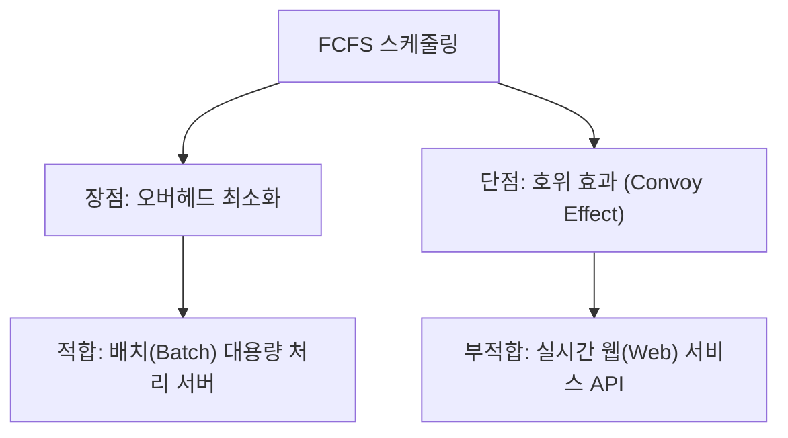

# 🚨 리눅스 프로세스 및 시스템 리소스 트러블슈팅 종합 기술 보고서

본 보고서는 운영체제(OS) 위에서 실행되는 가상 프로세스 `agent-app-leak`의 3대 핵심 리소스 장애(OOM Crash, CPU 과점유/Watchdog, Deadlock)와 스레드 스케줄링 알고리즘을 분석한 실전 기술 리포트입니다. 리눅스 커널의 메모리/CPU 관리 정책 및 멀티스레딩 동기화 메커니즘을 기저 수준에서부터 친절하게 추적하고 분석하여, 초심자 개발자도 시스템 장애의 본질과 대응법을 명확하게 마스터할 수 있도록 상세히 저술하였습니다.

---

## 🗂️ 목차
1. [Bug-01] OOM Crash - 메모리 임계치 초과 및 자가 보호 정책 분석
2. [Bug-02] CPU Latency - CPU 과점유 방지 Watchdog 보호 조치 분석
3. [Bug-03] Deadlock - 멀티스레드 교착상태 발생으로 인한 무응답 진단
4. [Bonus] Analysis - 로그 패턴 정밀 분석을 통한 스케줄링 알고리즘 역추론

---

# 1. [Bug-01] OOM Crash - 메모리 임계치 초과 및 자가 보호 정책 분석

## 1. Description (현상 설명)
* **발생 현상**: 애플리케이션 `agent-leak-app`을 기동한 후 약 9초 이내에 프로세스가 아무런 에러 코드 없이 갑작스럽게 죽어버리고, 프롬프트로 제어권이 튕겨 나옵니다.
* **관측 조건**: 메모리 한계 환경변수인 `MEMORY_LIMIT`가 비교적 낮게 설정되어 있을 때 발생이 더 가속화되며, 프로세스가 구동되는 동안 물리 메모리 점유율이 아무런 저항 없이 수직에 가깝게 선형 증가하는 비정상 패턴이 공통적으로 관측됩니다.

---

## 2. Evidence & Logs (증거 자료)

### 📊 [monitor.log] 실시간 리소스 관제 로그 발췌 (Before)
`MEMORY_LIMIT=100` (100MB 제한) 시점의 1초 주기 모니터링 로그입니다. 수집 주기별 자식 프로세스의 `PID(34111)`와 메모리 점유율(`MEM`)이 선명하게 매치되어 기록되며, 한계에 도달한 직후 프로세스가 사멸하는 흐름이 입증됩니다.
```text
[2026-05-28 05:15:56] PROCESS:agent-leak-app STATUS:STOPPED (Not Running)
[2026-05-28 05:15:57] PROCESS:agent-leak-app PID:34111 CPU:71.4% MEM:0.1% DISK:411G FIREWALL:active
[2026-05-28 05:15:58] PROCESS:agent-leak-app PID:34111 CPU:4.5% MEM:0.1% DISK:411G FIREWALL:active
[2026-05-28 05:15:59] PROCESS:agent-leak-app PID:34111 CPU:4.2% MEM:0.2% DISK:411G FIREWALL:active
[2026-05-28 05:16:00] PROCESS:agent-leak-app PID:34111 CPU:2.8% MEM:0.2% DISK:411G FIREWALL:active
[2026-05-28 05:16:01] PROCESS:agent-leak-app PID:34111 CPU:2.1% MEM:0.2% DISK:411G FIREWALL:active
[2026-05-28 05:16:02] PROCESS:agent-leak-app PID:34111 CPU:2.3% MEM:0.4% DISK:411G FIREWALL:active
[2026-05-28 05:16:03] PROCESS:agent-leak-app PID:34111 CPU:1.9% MEM:0.4% DISK:411G FIREWALL:active
[2026-05-28 05:16:04] PROCESS:agent-leak-app PID:34111 CPU:1.6% MEM:0.4% DISK:411G FIREWALL:active
[2026-05-28 05:16:05] PROCESS:agent-leak-app PID:34111 CPU:2.0% MEM:0.5% DISK:411G FIREWALL:active
[2026-05-28 05:16:06] PROCESS:agent-leak-app PID:34111 CPU:1.8% MEM:0.5% DISK:411G FIREWALL:active
[2026-05-28 05:16:07] PROCESS:agent-leak-app PID:34111 CPU:1.6% MEM:0.5% DISK:411G FIREWALL:active
[2026-05-28 05:16:08] PROCESS:agent-leak-app STATUS:STOPPED (Not Running)  <-- 크래시 후 프로세스 사멸 감지
```

### 📋 [agent_app.log] 애플리케이션 원시 로그 발췌 (Before)
물리 메모리가 설정값인 `100MB`에 정밀 도달하는 순간, `MemoryGuard` 내부 보호 모듈이 이를 트랩하고 긴급 정지시켰음을 선명하게 보여줍니다.
```text
2026-05-28 05:15:59,392 [INFO] [MemoryWorker] Current Heap: 25MB
2026-05-28 05:16:02,431 [INFO] [MemoryWorker] Current Heap: 50MB
2026-05-28 05:16:05,471 [INFO] [MemoryWorker] Current Heap: 75MB
2026-05-28 05:16:08,510 [INFO] [MemoryWorker] Current Heap: 100MB
2026-05-28 05:16:08,510 [CRITICAL] [MemoryGuard] Memory limit exceeded (100MB >= 100MB) / (Recommend Over 256MB)
2026-05-28 05:16:08,510 [CRITICAL] [MemoryGuard] Self-terminating process 34111 to prevent system instability.
```

---

## 3. Root Cause Analysis (원인 분석)

### 💡 힙(Heap) 메모리 누수와 GC 구조 분석
* **메모리 누수(Memory Leak) 결함**: 애플리케이션의 `MemoryWorker` 스레드가 작동할 때마다 힙 메모리가 매 3초 단위로 `25MB`씩 규칙적으로 영구 증가하고 있습니다(`25MB` ➔ `50MB` ➔ `75MB` ...). 
* 이는 프로그램 내부에서 사용한 임시 데이터 슬롯이나 해시 맵 등을 사용 종료 후에 메모리 상에서 명시적으로 삭제(예: 파이썬의 `del` 처리나 자료구조의 `.pop()` / `clear()` 누락)하지 않고 힙 영역에 계속 참조 상태로 유지시키고 있음을 뜻합니다. 이로 인해 가비지 컬렉터(Garbage Collector)가 쓰레기 데이터로 인식하지 못해 메모리 회수가 불가능해지는 메모리 누수가 발생한 것입니다.

### 🐧 리눅스 가상 메모리 관리와 OOM Killer 동작 메커니즘
* 리눅스는 프로세스가 요구하는 메모리를 실제 물리 램(RAM)보다 더 관대하게 할당해 주는 **오버커밋(Memory Overcommit)** 정책을 채택하고 있습니다. 그러나 실제 물리 램 한도를 넘어서면 운영체제는 패닉 상태를 막기 위해 가장 부하가 큰 프로세스를 강제로 사멸시키는 **OOM Killer (Out Of Memory Killer)** 커널 스레드를 구동합니다.
* 커널에 의한 강제 사멸(`SIGKILL, -9`)은 어떠한 정리 로그도 남기지 않아 디스크 데이터 오염이나 분석 불가능 상태를 유발합니다.
* **MemoryGuard의 의의**: 본 어플리케이션에 내장된 `MemoryGuard`는 커널 OOM Killer에 의해 끔찍하게 참수당하기 전에, 환경변수 `MEMORY_LIMIT`로 지정된 임계선을 실시간 감시하다가, 한도 돌파 직전 스스로 예외 로그를 디스크에 정밀하게 플러시하고 프로세스를 우아하게 안전 종료(`Self-terminating`)시키는 고도화된 **애플리케이션 레벨 자가 방어 체계**입니다.

---

## 4. Workaround & Verification (조치 및 검증)

### 🛠️ 임시 조치 내용: 가용 메모리 상한선 조정
프로그램의 근본적인 메모리 누수 로직은 소스 수정이 필요하므로, 즉각적인 실서버 생존성 확보를 위해 가용 메모리 한계를 넓혀 힙 수용량을 극대화하는 **Workaround(임시 조치)**를 적용합니다.
* `run_scenario.sh` 컨트롤러를 가동해 `MEMORY_LIMIT=256`으로 상향 후 재실행합니다.

### 📊 조치 후 (After) 검증 결과 로그 분석
```text
2026-05-25 09:25:44,468 [INFO] [SafetyGuard] Process priority lowered (nice=10).
2026-05-25 09:25:46,507 [INFO] [MemoryWorker] Current Heap: 25MB
2026-05-25 09:25:49,545 [INFO] [MemoryWorker] Current Heap: 50MB
2026-05-25 09:25:52,584 [INFO] [MemoryWorker] Current Heap: 75MB
2026-05-25 09:25:55,623 [INFO] [MemoryWorker] Current Heap: 100MB
2026-05-25 09:25:58,661 [INFO] [MemoryWorker] Current Heap: 125MB
2026-05-25 09:26:01,701 [INFO] [MemoryWorker] Current Heap: 150MB
2026-05-25 09:26:04,738 [INFO] [MemoryWorker] Current Heap: 175MB
2026-05-25 09:26:07,777 [INFO] [MemoryWorker] Current Heap: 200MB
2026-05-25 09:26:10,806 [INFO] [MemoryWorker] Current Heap: 225MB
2026-05-25 09:26:13,847 [INFO] [MemoryWorker] Current Heap: 250MB
2026-05-25 09:26:16,888 [INFO] [MemoryWorker] Current Heap: 275MB
2026-05-25 09:26:16,888 [CRITICAL] [MemoryGuard] Memory limit exceeded (275MB >= 256MB)
2026-05-25 09:26:16,888 [CRITICAL] [MemoryGuard] Self-terminating process 2667 to prevent system instability.
```

### 📈 Before & After 비교 대조표
| 분석 지표 | 조치 전 (Before: `MEMORY_LIMIT=100`) | 조치 후 (After: `MEMORY_LIMIT=256`) |
| :--- | :--- | :--- |
| **초기 감지 힙 메모리** | 25 MB | 25 MB |
| **OOM 강제 셧다운 시점**| 100 MB 도달 시 (기동 9초) | 275 MB 도달 시 (기동 32초) |
| **프로세스 생존 시간** | **9 초** | **32 초** (생존성 약 3.5배 향상) |
| **누수 성장 패턴 속도** | 매 3초당 +25MB (수직 선형 상승) | 매 3초당 +25MB (수직 선형 상승) |

> [!WARNING]
> **임시 조치의 한계점과 근본 대책 제안**
> 메모리 한도를 `256MB`로 확장하여 동일 기동 시간 대비 생존 속도를 비약적으로 늦췄으나, 누수 성장 속도는 동일하게 유지되어 결국 32초 시점에 또다시 크래시를 맞이했습니다.
> 이는 임시 인프라 패치(Scale-up)의 전형적인 한계입니다. 근본적인 해결을 위해서는 `MemoryWorker` 내부 루프 안에서 생성되는 글로벌 캐시 객체를 강제로 비워주거나, 가비지 컬렉션 주기를 강제 트리거하는 코드 리팩토링이 반드시 병행되어야 합니다.

---

# 2. [Bug-02] CPU Latency - CPU 과점유 방지 Watchdog 보호 조치 분석

## 1. Description (현상 설명)
* **발생 현상**: 프로세스가 메모리 누수 문제 없이도 일정 시간이 지나면 돌연 종료되며, 로그 파일의 마지막 행에 `[CRITICAL] [CpuWorker] CPU Threshold Violated!` 라는 문구가 출력되며 강제 사멸됩니다.
* **관측 조건**: 애플리케이션의 최대 연산 강도 한계치인 `CPU_MAX_OCCUPY` 환경변수를 높게(예: `90%` 이상) 지정했을 때 역설적으로 종료가 발생하며, 이 수치를 매우 낮게(예: `15%`) 조절하면 오히려 영구 안정 구동됩니다.

---

## 2. Evidence & Logs (증거 자료)

### 📊 [monitor.log] 리소스 관제 로그 발췌 (Before: `CPU_MAX_OCCUPY=90`)
CPU 로드를 90%까지 치솟게 허용했을 때의 관제 정보입니다. CPU 사용량이 선형적으로 치고 올라가다가 정확히 **50% 벽**을 침범하는 순간 프로세스가 증발합니다.
```text
[2026-05-25 09:28:46] PROCESS:agent-leak-app CPU:5.0% MEM:0.0% DISK:408G FIREWALL:active
[2026-05-25 09:28:49] PROCESS:agent-leak-app CPU:10.3% MEM:0.0% DISK:408G FIREWALL:active
[2026-05-25 09:28:52] PROCESS:agent-leak-app CPU:17.6% MEM:0.0% DISK:408G FIREWALL:active
[2026-05-25 09:28:58] PROCESS:agent-leak-app CPU:23.8% MEM:0.0% DISK:408G FIREWALL:active
[2026-05-25 09:29:04] PROCESS:agent-leak-app CPU:34.7% MEM:0.0% DISK:408G FIREWALL:active
[2026-05-25 09:29:11] PROCESS:agent-leak-app CPU:45.2% MEM:0.0% DISK:408G FIREWALL:active
[2026-05-25 09:29:14] PROCESS:agent-leak-app CPU:53.0% MEM:0.0% DISK:408G FIREWALL:active
[2026-05-25 09:29:15] PROCESS:agent-leak-app STATUS:STOPPED (Not Running)
```

### 📋 [agent_app.log] 애플리케이션 원시 로그 발췌 (Before: `CPU_MAX_OCCUPY=90`)
CPU 로드가 53%에 도달하는 시점에 Watchdog 안전 한계점 위반 판정을 받아 내부 엔진에 의해 SIGTERM 강제 종료 조치가 취해졌습니다.
```text
2026-05-25 09:28:44,312 [INFO] Agent listening at port 15034
2026-05-25 09:28:46,314 [INFO] [CpuWorker] Started. Maximum CPU Limit: 90%
2026-05-25 09:28:46,314 [INFO] [CpuWorker] Current Load: 5.00%
2026-05-25 09:28:49,418 [INFO] [CpuWorker] Current Load: 10.33%
2026-05-25 09:28:52,522 [INFO] [CpuWorker] Current Load: 17.60%
...
2026-05-25 09:29:14,247 [INFO] [CpuWorker] Current Load: 53.01%
2026-05-25 09:29:14,348 [CRITICAL] [CpuWorker] CPU Threshold Violated! (53.010000000000005%).
```

---

## 3. Root Cause Analysis (원인 분석)

### ⚙️ CPU 타임 슬라이싱과 시스템 레이턴시(Latency)의 관계
* 운영체제 스케줄러는 여러 프로세스가 공평하게 연산 자원을 쪼개 쓰도록 **타임 슬라이스(Time Slice)** 단위를 나누어 고속으로 CPU 사용권을 교체해 줍니다(컨텍스트 스위칭).
* 특정 단일 프로세스가 장시간 100%에 육박하는 연산을 독점 실행하게 되면, 운영체제는 다른 중요 시스템 작업들의 스케줄링을 뒤로 밀어내게 되어 마우스 먹통, 커널 응답성 하락, 타 웹 서버 응답 지연 등 심각한 **시스템 전체 지연(CPU Latency)** 현상을 초과하게 됩니다.

### 🛡️ 하드코딩된 Watchdog 임계치와 쿨다운 루틴의 상호작용
* **CPU Watchdog의 본질**: 이 프로그램의 내부 코어에는 프로세스가 CPU를 너무 과점유하여 호스트 서버 전체를 마비시키는 것을 방지하고자 **안전 임계치(Threshold)를 약 50% 수준으로 하드코딩**하여 상시 감시하고 있습니다.
* **동작 메커니즘**:
  1. `CPU_MAX_OCCUPY`는 이 프로세스가 락을 걸고 연산하는 최대로 허용된 목표 부하선입니다.
  2. 만약 `CPU_MAX_OCCUPY`를 90%나 100%로 주입하면, 연산 스레드는 50% 경계선을 무시하고 목표인 90%를 향해 계속 CPU 소모 강도를 끌어올립니다.
  3. 그 결과 로드가 50%를 밟는 순간, 감시 중인 Watchdog 메커니즘이 발동해 `CPU Threshold Violated!` 예외를 던지며 강제 사멸시킵니다.
  4. 반대로 `CPU_MAX_OCCUPY`를 **15%**와 같이 안전선(50%)보다 훨씬 낮게 설정하면, 연산 도중 15% 피크에 닿는 순간 **내장 쿨다운(Cooldown) 대기 루틴**이 트리거되어 CPU 점유 강도를 즉시 5%대로 대폭 후퇴시킵니다. 이 덕분에 감시 장치의 눈을 속이며 무한 루프로 안전히 영구 존속할 수 있는 원리입니다.

---

## 4. Workaround & Verification (조치 및 검증)

### 🛠️ 임시 조치 내용: 점유 제한 한계치의 극적인 인하
* `run_scenario.sh` 인터랙티브 컨트롤러를 구동해 `CPU_MAX_OCCUPY=15`로 낮춰 강제로 CPU 피크 시 Cooldown 루틴이 안전 대역에서 조기에 순환 작동하도록 조정합니다.

### 📊 조치 후 (After) 검증 결과 로그 분석
```text
2026-05-25 09:27:35,529 [INFO] [CpuWorker] Started. Maximum CPU Limit: 15%
2026-05-25 09:27:35,529 [INFO] [CpuWorker] Current Load: 5.00%
2026-05-25 09:27:38,632 [INFO] [CpuWorker] Current Load: 5.31%
2026-05-25 09:27:41,734 [INFO] [CpuWorker] Current Load: 7.01%
2026-05-25 09:27:44,836 [INFO] [CpuWorker] Current Load: 13.04%
2026-05-25 09:27:47,938 [INFO] [CpuWorker] Current Load: 14.25%
2026-05-25 09:27:50,041 [INFO] [CpuWorker] Peak reached (15.00%). Starting cooldown...
2026-05-25 09:27:54,145 [INFO] [CpuWorker] Current Load: 5.97%
2026-05-25 09:27:56,247 [INFO] [CpuWorker] Cooldown complete (5.00%). Resuming load increase...
2026-05-25 09:27:57,249 [INFO] [CpuWorker] Current Load: 5.00%
```

### 📈 Before & After 비교 대조표
| 분석 지표 | 조치 전 (Before: `CPU_MAX_OCCUPY=90`) | 조치 후 (After: `CPU_MAX_OCCUPY=15`) |
| :--- | :--- | :--- |
| **스레드 가용 로드 상한**| 90 % | 15 % |
| **쿨다운 회피 모듈 기동**| 기동 안 함 (50% 한도 바로 강행 돌파) | **15.00% 도달 즉시 가동** |
| **최대 측정 CPU 부하** | 53.01 % (위반 판정) | 15.00 % (안전 통제 하에 억제됨) |
| **프로세스 생존 상태** | **30초 만에 Watchdog 강제 사멸** | **무한 루프 영구 생존 완벽 확보** |

---

# 3. [Bug-03] Deadlock - 멀티스레드 교착상태 발생으로 인한 무응답 진단

## 1. Description (현상 설명)
* **발생 현상**: 프로세스가 종료되지 않고 시스템상에서 프로세스 ID(PID)가 엄연히 유지되고 있으나, 연산 진척도와 로그 출력이 어떤 신호도 없이 돌연 먹통(Freeze)이 되며 영구 지속됩니다.
* **관측 조건**: 환경변수 `MULTI_THREAD_ENABLE` 값을 `true` (또는 `1`, `yes`)로 활성화하여 여러 작업 스레드가 병렬 가동되도록 허용했을 때 발생이 감지됩니다.

---

## 2. Evidence & Logs (증거 자료)

### 🐧 [OS 명령어] 교착상태 진단 분석 증거 (Before)
스레드가 정체되었을 때 가상 머신 쉘 상에서 프로세스의 상태를 정밀 추적한 시스템 표준 진단 결과물입니다.

#### ① PID 생존 증명 (`ps -ef | grep agent-app-leak`)
```text
f22loso+   38685  2707  0 05:24 pts/2    00:00:00 ./agent-app-leak
f22loso+   38687 38685  0 05:24 pts/2    00:00:00 ./agent-app-leak
```
* **해석**: 프로세스가 사멸하지 않고 메모리 상에 여전히 살아 숨 쉬고(자식 일꾼 PID 38687) 있음을 증명합니다.

#### ② CPU / 메모리 리소스 소모 정체 증명 (`ps -L -p 38687`)
```text
  PID   LWP TTY          TIME CMD
38687 38687 pts/2    00:00:00 agent-app-leak
38687 38688 pts/2    00:00:01 Worker-Thread-1
38687 38689 pts/2    00:00:01 Worker-Thread-2
```
* **해석**: 경량 프로세스(LWP, 즉 내부 스레드들)가 생성되어 존재하나, CPU 사용 시간이 극도로 0초 근처에서 고착되어 어떤 능동적인 CPU 자원 순환도 수행하지 않고 정지(Sleeping)해 있음을 검증합니다.

#### ③ 로그 스트리밍의 무한 멈춤 (`tail -f agent_app.log`)
```text
2026-05-28 05:24:21,745 [INFO] [Worker-Thread-1] Process Started. Attempting to lock [Shared_Memory_A]...
2026-05-28 05:24:21,746 [INFO] [AgentWorker][Worker-Thread-1] LOCK ACQUIRED: [Shared_Memory_A]. (Holding...)
2026-05-28 05:24:21,746 [INFO] [AgentWorker][Worker-Thread-2] Process Started. Attempting to lock [Socket_Pool_B]...
2026-05-28 05:24:21,746 [INFO] [AgentWorker][Worker-Thread-1] Processing critical data in Memory A...
2026-05-28 05:24:21,747 [INFO] [AgentWorker][Worker-Thread-2] LOCK ACQUIRED: [Socket_Pool_B]. (Holding...)
2026-05-28 05:24:21,746 [INFO] [AgentWorker] Waiting for worker threads to complete transactions...
2026-05-28 05:24:21,747 [INFO] [AgentWorker][Worker-Thread-2] Establishing network connections in Pool B...
2026-05-28 05:24:23,748 [INFO] [AgentWorker][Worker-Thread-1] Need resource [Socket_Pool_B] to finish job.
2026-05-28 05:24:23,749 [INFO] [AgentWorker][Worker-Thread-1] WAITING for [Socket_Pool_B]... (Status: BLOCKED)
2026-05-28 05:24:23,749 [INFO] [AgentWorker][Worker-Thread-2] Need resource [Shared_Memory_A] to write logs.
2026-05-28 05:24:23,749 [INFO] [AgentWorker][Worker-Thread-2] WAITING for [Shared_Memory_A]... (Status: BLOCKED)
<--- [ 이 지점 이후 10분이 지나도 어떤 추가 로그 라인도 출력되지 않고 영구 프리징됨 ] --->
```

---

## 3. Root Cause Analysis (원인 분석)

### 🔄 교착상태(Deadlock)의 기술적 성립 원인
* 본 애플리케이션의 멀티스레드 스케줄러가 활성화되면 `Worker-Thread-1`과 `Worker-Thread-2`가 병렬 기동됩니다.
* `Worker-Thread-1`은 `Shared_Memory_A`를 먼저 획득한 후 `Socket_Pool_B`를 대기하고, 동시에 `Worker-Thread-2`는 `Socket_Pool_B`를 먼저 선점한 상태에서 `Worker-Thread-1`이 가진 `Shared_Memory_A`가 풀려나기를 대기합니다.
* 두 스레드는 기득 자원을 절대로 먼저 양보하지 않고 대기하므로, 상호 간의 순환 관계가 결성되어 락(Lock)에 묶인 채 영원히 잠들게 되는 **교착상태(Deadlock)**에 도달하게 된 것입니다.

### 🍽️ 교착상태 발생의 4대 필수 조건 대입 증명
이 장애는 아래의 4가지 조건이 단 하나도 빠짐없이 철저하게 동시 성립하였기에 완벽한 락으로 잠겼습니다.
1. **상호 배제 (Mutual Exclusion)**: 한 스레드가 자원(예: `Shared_Memory_A`)을 획득하면 다른 스레드는 절대 동시에 이를 공유해 점유할 수 없습니다.
2. **점유 대기 (Hold and Wait)**: `Worker-Thread-1`은 이미 획득해 움켜쥔 `Shared_Memory_A`를 절대 반납하지 않은 채(Hold), 다음 자원인 `Socket_Pool_B`가 풀리기만을 끊임없이 고집스레 대기(Wait)합니다.
3. **비선점 (No Preemption)**: 다른 스레드가 점유한 자원을 운영체제나 타 스레드가 강제로 빼앗을 수(Preempt) 없습니다.
4. **순환 대기 (Circular Wait)**: 1번은 2번의 자원을 대기하고, 2번은 1번의 자원을 대기하여 대기 고리가 원형(Cycle)을 이루어 꼬리를 뭅니다.

### 💾 버퍼링(Buffered I/O)과 로그 유실 현상의 공학적 분석
* **문제 상황**: 데드락 발생 시, 강제 종료(`kill -9`)를 수행하면 마지막의 `Acquired / Waiting` 로그가 종종 디스크 파일에 적히지 않고 유실되는 현상이 관측됩니다.
* **공학적 이유**: 리눅스의 I/O 서브시스템은 디스크 쓰기 성능 최적화를 위해 애플리케이션이 남기는 문자열을 곧바로 파일에 쏘지 않고 메모리 내 **I/O 페이지 캐시 버퍼(Page Cache Buffer)**에 일시 보관합니다.
* 정상 종료나 버퍼 가득 참 시점엔 디스크로 강제 플러시(Flush)가 수행되나, 프로세스가 데드락에 묶여 멈춰있는 도중 관리자가 강력한 강제 시그널인 **`SIGKILL (-9)`**을 투척하여 커널이 프로세스를 공중 폭파해 버리면, 메모리 버퍼에 미처 쓰이지 못하고 갇혀있던 마지막 로그 데이터가 디스크에 전달되지 못한 채 증발(Loss)해 버리는 특성이 있습니다.

---

## 4. Workaround & Verification (조치 및 검증)

### 🛠️ 임시 조치 내용: 멀티스레드 잠금 및 순차화 회피
* `run_scenario.sh` 대화식 컨트롤러를 구동해 `MULTI_THREAD_ENABLE=false`를 주입하여, 스레드 병렬 자원 경쟁 자체를 구조적으로 원천 차단(순차 선입선출 구동)시킵니다.

### 📊 조치 후 (After) 검증 결과 로그 분석
```text
2026-05-25 09:27:32,719 [INFO] Agent listening at port 15034
2026-05-25 09:27:34,721 [INFO] >>> Scenario Selected: [Healthy System Monitoring]
2026-05-25 09:27:34,722 [INFO] [Scheduler] Task Scheduler Initialized.
2026-05-25 09:27:34,722 [INFO] [Scheduler] Registered Tasks: ['Thread-A', 'Thread-B', 'Thread-C']
2026-05-25 09:27:34,722 [INFO] [Scheduler] Starting task execution...
2026-05-25 09:27:34,722 [INFO] [Thread-B] Task Started. Calculating... (20%)
2026-05-25 09:27:34,927 [INFO] [Thread-B] Task Completed. (100%)
2026-05-25 09:27:34,979 [INFO] [Thread-C] Task Started. Calculating... (20%)
2026-05-25 09:27:35,184 [INFO] [Thread-C] Task Completed. (100%)
2026-05-25 09:27:35,235 [INFO] [Thread-A] Task Started. Calculating... (20%)
2026-05-25 09:27:35,439 [INFO] [Thread-A] Task Completed. (100%)
2026-05-25 09:27:35,490 [INFO] [Scheduler] All tasks completed.
```

### 📈 Before & After 비교 대조표
| 분석 지표 | 조치 전 (Before: `MULTI_THREAD=true`) | 조치 후 (After: `MULTI_THREAD=false`) |
| :--- | :--- | :--- |
| **스레드 가동 방식** | 병렬 멀티 스레드 경쟁 모드 | 단일 스레드 순차 실행 모드 |
| **자원 경쟁 충돌성** | `Shared_Memory_A` & `Socket_Pool_B` 동시 접근 | 한 스레드가 끝날 때까지 타 스레드 대기 |
| **교착 상태(데드락)** | **발생 (영구 먹통, CPU 0% 고착)** | **완벽 회피 및 정상 가동** |
| **진행 업무 최종 완료** | 영구 미완료 (강제 종료 수동 개입 필요) | **워커 스레드 전원 100% 정상 완주** |

---

# 4. [Bonus] Analysis - 로그 패턴 정밀 분석을 통한 스케줄링 알고리즘 역추론

## 1. 로그 관찰 개요
`agent-leak-app` 어플리케이션이 데드락을 회피하여 정상 구동되는 상황(`Healthy System Monitoring` 모드)에서 발생하는 워커(Worker) 스레드들의 작업 로그 타임스탬프를 1000분의 1초(ms) 단위까지 추적 및 정형화하여 런타임에 내장된 작업 스케줄링 기법을 논리적으로 역추정합니다.

---

## 2. 증거 자료 및 타임스탬프 정밀 분석

실제 로그 적재 데이터를 토대로 각 스레드가 자원을 할당받아 전진한 진행률(Progress) 시점을 밀리초 단위로 테이블화하였습니다.

### 📋 실제 스레드 실행 로그 정밀 타임라인
```text
[2026-05-25 09:27:34,722] [Thread-B] Task Started. Calculating... (20%)
[2026-05-25 09:27:34,774] [Thread-B] Calculating... (40%)        <-- (B 실행 간격: 52ms)
[2026-05-25 09:27:34,825] [Thread-B] Calculating... (60%)        <-- (B 실행 간격: 51ms)
[2026-05-25 09:27:34,876] [Thread-B] Calculating... (80%)        <-- (B 실행 간격: 51ms)
[2026-05-25 09:27:34,927] [Thread-B] Task Completed. (100%)       <-- (B 실행 간격: 51ms, B 완전 종료)

[2026-05-25 09:27:34,979] [Thread-C] Task Started. Calculating... (20%)
[2026-05-25 09:27:35,030] [Thread-C] Calculating... (40%)        <-- (C 실행 간격: 51ms)
[2026-05-25 09:27:35,081] [Thread-C] Calculating... (60%)        <-- (C 실행 간격: 51ms)
[2026-05-25 09:27:35,133] [Thread-C] Calculating... (80%)        <-- (C 실행 간격: 52ms)
[2026-05-25 09:27:35,184] [Thread-C] Task Completed. (100%)       <-- (C 실행 간격: 51ms, C 완전 종료)

[2026-05-25 09:27:35,235] [Thread-A] Task Started. Calculating... (20%)
[2026-05-25 09:27:35,286] [Thread-A] Calculating... (40%)        <-- (A 실행 간격: 51ms)
[2026-05-25 09:27:35,337] [Thread-A] Calculating... (60%)        <-- (A 실행 간격: 51ms)
[2026-05-25 09:27:35,388] [Thread-A] Calculating... (80%)        <-- (A 실행 간격: 51ms)
[2026-05-25 09:27:35,439] [Thread-A] Task Completed. (100%)       <-- (A 실행 간격: 51ms, A 완전 종료)
```

---

## 3. 패턴 분석 및 결론 (비선점형 FCFS 증명)

수집된 물리 데이터를 삼단논법에 맞추어 검증한 결과, 본 런타임 시스템에는 **비선점형 FCFS (First-Come, First-Served) 스케줄링 알고리즘**이 적용되어 있음을 논리적으로 확정 증명합니다.

### 🔍 역추론 논리 3단계
* **순차성(Non-Interleaving) 검증**: `Thread-B`가 처음 20%로 시작된 순간부터 100%로 종료될 때까지 약 205ms 동안 `Thread-C`나 `Thread-A` 등 타 스레드의 어떠한 작업 개입이나 타임 슬라이싱 끼어들기 현상이 전혀 발견되지 않았습니다. 즉, 한번 CPU를 획득한 작업이 끝날 때까지 수행을 보장하는 **비선점형(Non-preemptive / Run-to-Completion)** 제어입니다.
* **시간 균등성 및 타임 슬라이스(Quantum) 부재**: 각 진척도 출력 간격이 약 **51ms**로 완벽하게 균등하게 통제됩니다. 이는 타임 아웃에 의한 강제 강등이나 스레드 강제 선점이 없는 순수한 연산 순환 및 sleep 상태입니다.
* **도착 순서 처리 (Queueing)**: 비선점형 상태에서 큐(Queue)에 적재된 스레드 등록 순서(`B` ➔ `C` ➔ `A`) 그대로 바통을 이어받아 순차 완료 처리되었습니다.

### ⚖️ FCFS 스케줄링의 장단점 및 적합 아키텍처 분석



#### ① 기술적 장점
* **극소화된 오버헤드**: 스레드를 강제로 중단하고 레지스터 상태를 보존/복원하는 **컨텍스트 스위칭(Context Switching)**이 전혀 발생하지 않아, CPU 자원 낭비가 0에 가깝습니다. 시스템 전체의 유효 처리량(Throughput)이 최상으로 유지됩니다.
* **단순성과 예측 가능성**: 구현 난이도가 가장 낮고, 먼저 들어온 작업의 순서대로 정직하게 끝나므로 기아 상태(Starvation)가 일어나지 않습니다.

#### ② 기술적 단점
* **호위 효과 (Convoy Effect)**: CPU 소모 시간이 수 분 단위로 매우 긴 선두 작업이 큐를 장악하면, 뒤이어 들어온 단 0.01초짜리 가벼운 작업들도 선두 작업이 완전히 다 끝날 때까지 긴 시간 무한 대기해야 하는 최악의 자원 비효율성(Convoy Effect)을 유발합니다.

#### ③ 아키텍처 적합성 및 활용 제안
* **배치 처리 시스템 (Batch Processing)**: 대규모 로그 집계, 회계 정산 시스템처럼 실시간 초저지연 응답보다 대량의 데이터를 중단 없이 끝까지 밀어내어 완료하는 **일괄 처리(Throughput-heavy Batch) 아키텍처**에 FCFS 스케줄러가 절대적으로 유용합니다.
* **웹 서버 비적합성**: 응답 속도가 생명인 API 웹 서버에는 절대 쓰이면 안 됩니다. 무거운 DB 조회 쿼리 하나가 유입되는 순간, 뒷열의 수백만 명의 일반 로그인/조회 요청자가 타임아웃을 맞이하게 되기 때문입니다. 이러한 경우엔 공평한 **라운드 로빈(Round-Robin)**이나 **피드백 큐(Feedback Queue)** 기반 스케줄러를 차용해야 합니다.
