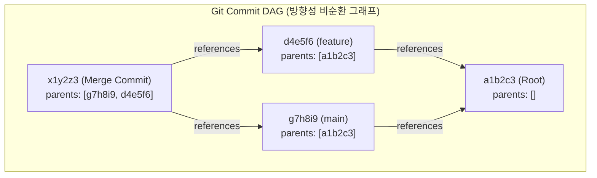

# 🚀 Mini Git (B3-2) 초상세 해설 & 피어리뷰 완벽 가이드

> **배포 페이지**: [https://feelosophysics.github.io/check/](https://feelosophysics.github.io/check/)  
> **미션 명**: 파일이 언제 어떻게 바뀌었는지 기록하는 작은 프로그램 만들기 (Codyssey B3-2 Mini Git)  
> **목적**: 10분 만에 Git의 핵심 구조를 완벽히 이해하고, 동료와의 피어리뷰에서 깊이 있는 기술적 티키타카를 나눌 수 있도록 구성한 보고서  
> **이전 레포트 백업**: [B2-1 용돈기입장 피어리뷰 레포트 (index_b2_1_backup.html)](index_b2_1_backup.html)

---

## ⚡ 1. [10분 속성] Mini Git 5대 핵심 개념 한눈에 보기

Git은 단순한 파일 백업 도구가 아니라 **그래프 이론(Graph Theory)**과 **해시 알고리즘**의 결정체입니다.

```mermaid
graph TD
    subgraph "Git Commit DAG (방향성 비순환 그래프)"
        C1["a1b2c3 (Root)<br>parents: []"]
        C2["d4e5f6 (feature)<br>parents: [a1b2c3]"]
        C3["g7h8i9 (main)<br>parents: [a1b2c3]"]
        C4["x1y2z3 (Merge Commit)<br>parents: [g7h8i9, d4e5f6]"]

        C2 -->|references| C1
        C3 -->|references| C1
        C4 -->|references| C3
        C4 -->|references| C2
    end
```

| 핵심 영역 | 선택한 자료구조 / 알고리즘 | 시간복잡도 | 핵심 이유 및 특징 |
|:---|:---|:---:|:---|
| **커밋 그래프** | **DAG (자식 → 부모 간선)** | $O(1)$ 조회 | 과거의 커밋만 부모로 참조 가능하므로 **사이클(Cycle)이 원천적으로 불가능** |
| **해시 식별자** | **SHA-1 (앞 6자리 Hex + 충돌 방지 카운터)** | $O(1)$ | 내용 기반 무결성 검증, 6자리 축약 시 충돌 시 `_1` 접미사로 100% 유일성 보장 |
| **로그 출력 (LOG)** | **Kahn's Algorithm (위상 정렬)** | $O(V + E)$ | 부모가 자식보다 먼저 출력. **반복문 큐 기반으로 파이썬 재귀 한계 극복 및 사이클 검증** |
| **최단 경로 (PATH)** | **BFS (너비 우선 탐색)** | $O(V + E)$ | **무방향(Undirected) 간선 처리**로 서로 다른 브랜치 간 공통 조상을 경유하는 최단 경로 탐색 |
| **조상 탐색 (ANCESTORS)** | **DFS (깊이 우선 탐색)** | $O(V + E)$ | 머지 커밋(부모 2개) 체인을 끝까지 거슬러 올라가 모든 역사적 조상 완전 수집 |
| **빠른 검색 (SEARCH)** | **역색인 (Inverted Index, `dict` + `set`)** | $O(1)$ 조회 | 순회 검색($O(N \times M)$) 대비 메모리를 투자하여 즉각적 키워드/작성자 조회 달성 |
| **커스텀 정렬** | **Merge Sort (머지 정렬)** | $O(N \log N)$ | `sorted()` 금지 제약 대응. **안정 정렬(Stable Sort)**로 동률 시 기존 커밋 순서 보존 |
| **파일 비교 (DIFF)** | **LCS (동적 프로그래밍 기반)** | $O(M \times N)$ | 두 텍스트의 최장 공통 부분수열을 찾아 추가(`+`), 삭제(`-`), 유지(` `) 줄 도출 |

---

## 🥊 2. 우리 구현체(`feelosophysics/check`) vs 동료 일반 구현체의 차이점

| 비교 포인트 | 일반적인 동료의 구현 방식 | 우리 레포(`feelosophysics/check`)의 구현 방식 | 피어리뷰 토론 포인트 |
|:---|:---|:---|:---|
| **1. 해시 생성** | 단순 `id_counter += 1` 또는 `uuid` | **SHA-1 내용 기반 해시 + 충돌 방지 엔진** | "실제 Git처럼 커밋 내용(메시지, 작성자, 타임스탬프, 부모)을 해싱하셨나요?" |
| **2. LOG 정렬** | 재귀 DFS 방문 순서 역순 또는 타임스탬프 정렬 | **Kahn's Algorithm (진입차수 기반 위상 정렬)** | "머지 커밋이 얽힌 복잡한 DAG에서 부모가 먼저 출력됨을 보장하는 위상 정렬을 어떻게 구현하셨나요?" |
| **3. PATH 간선** | 부모 방향만 탐색 (다른 브랜치 간 경로 탐색 실패 위험) | **양방향 인접 리스트 구축 + BFS 최단 경로 + 사전순 동점 처리** | "다른 브랜치에 있는 두 커밋 간 최단 경로를 찾기 위해 간선을 무방향으로 처리하셨나요?" |
| **4. 역색인 자료구조** | 리스트 기반 매핑 `dict[str, list]` | **`set` 기반 역색인 (`dict[str, set]`)** | "키워드/작성자 역색인에 set을 써서 중복 등록 방지와 $O(1)$ 멤버십 체크를 어떻게 챙기셨나요?" |
| **5. 정렬 알고리즘** | 퀵 정렬만 구현하거나 버블/선택 정렬 | **Merge Sort(안정 정렬) + Quick Sort(벤치마크) 이원화** | "동률인 커밋들의 순서 보존을 위해 안정 정렬(Stable Sort) 특성을 고려하셨나요?" |
| **6. 책임 분리** | `main.py`에 모든 로직 집중 (단일 파일) | **모듈별 엄격 분리 (`models`, `graph`, `sorting`, `index`, `diff`)** | "REPL 인터페이스와 비즈니스/알고리즘 로직을 어떤 기준으로 분리하셨나요?" |

---

## 💬 3. 피어리뷰 실전 티키타카 대화 스크립트 (5대 킬러 질문)

### 🗣️ 질문 1. "LOG 명령어 구현할 때 부모가 먼저 나오게 하는 건 어떻게 푸셨어요?"
- **동료의 예상 답변**: "타임스탬프로 정렬하거나 DFS로 부모 먼저 출력되게 재귀를 돌렸어요."
- **나의 인사이트 공유**:  
  > *"타임스탬프는 시스템 시간이 어긋나거나 리베이스할 때 역전될 수 있어서, 저는 순수 DAG 위상 정렬인 **Kahn's Algorithm**을 사용했어요. 진입차수(In-degree)를 자식이 없는 말단 커밋부터 큐로 줄여나가며 역순 정렬하니, 재귀 스택 오버플로우 걱정도 없고 그래프에 혹시 모를 사이클이 생겨도 즉시 감지할 수 있더라고요!"*

### 🗣️ 질문 2. "PATH 명령어에서 두 브랜치 사이의 최단 경로는 어떻게 찾으셨어요?"
- **동료의 예상 답변**: "BFS로 부모를 타고 올라가면서 찾았어요."
- **나의 인사이트 공유**:  
  > *"부모 방향(단방향)으로만 탐색하면 `feature` 브랜치 커밋과 `main` 브랜치 커밋처럼 공통 조상을 거쳐 다시 자식으로 내려가야 하는 경로를 못 찾더라고요. 그래서 저는 인접 리스트를 만들 때 **무방향(Undirected) 간선**으로 양방향을 모두 연결한 뒤 BFS를 돌리고, 최단 경로가 여러 개일 때를 대비해 **사전순(Lexicographical order) 정렬**을 걸어줬어요."*

### 🗣️ 질문 3. "파이썬 표준 `sorted()` 금지 제약은 어떤 정렬로 뚫으셨어요?"
- **동료의 예상 답변**: "퀵 정렬이나 버블 정렬을 만들어서 썼어요."
- **나의 인사이트 공유**:  
  > *"저는 **머지 정렬(Merge Sort)**을 기본으로 선택했어요. 작성자(`author`)나 날짜(`date`)가 동일한 커밋들이 있을 때, 원래 생성된 순서가 뒤집히지 않아야 하는 **'안정 정렬(Stable Sort)'**이 필수적이라고 생각했거든요. 퀵 정렬은 평균 속도는 빠르지만 피벗 선택에 따라 $O(N^2)$이 될 수 있고 불안정 정렬이라 벤치마크 비교용으로 따로 구현했어요."*

### 🗣️ 질문 4. "SEARCH 명령어의 역색인(Inverted Index)은 언제 갱신되게 하셨나요?"
- **동료의 예상 답변**: "검색할 때마다 인덱스를 만들거나, 커밋할 때마다 딕셔너리에 넣었어요."
- **나의 인사이트 공유**:  
  > *"검색 시 매번 만들면 순회 검색과 다를 바 없어서, 저는 **`COMMIT`이 일어나는 순간** 메시지를 소문자로 토큰화해서 `keyword_index`와 `author_index`의 `set`에 $O(1)$로 즉시 추가했어요. 쓰기(Write) 시점에 약간의 비용과 메모리를 쓰고, 읽기(Read) 성능을 극대화하는 전형적인 **공간-시간 트레이드오프(Space-Time Tradeoff)**를 의도했습니다."*

### 🗣️ 질문 5. "해시 충돌(Hash Collision)은 어떻게 대비하셨나요?"
- **동료의 예상 답변**: "카운터나 UUID를 쓰거나, SHA-1 앞 6자리를 그냥 썼어요."
- **나의 인사이트 공유**:  
  > *"SHA-1 앞 6자리(16진수 6자리 = 약 1,677만 개)는 비둘기집 원리에 의해 프로젝트가 커지면 충돌할 수 있잖아요? 그래서 저는 해시맵에 이미 존재하는 키면 `_1`, `_2`처럼 **충돌 해결 접미사 카운터**를 붙이도록 설계해서 세션 내 유일성을 100% 보장하도록 방어했습니다."*

---

## ⚖️ 4. 심화 트레이드오프 & 확장 질문 (평가 대비)

### Q1. 커밋 수가 100만 개로 10배~100배 증가한다면 어디가 가장 먼저 병목이 될까?
1. **메모리(RAM) 병목**:
   - 모든 커밋 객체와 역색인 `set`이 메모리에 상주하므로 메모리 사용량이 급증합니다.
   - **해결책**: 디스크 기반 B-Tree/LSM-Tree 인덱스(SQLite나 RocksDB) 도입, 필요할 때만 노드를 로드하는 Lazy Loading.
2. **전체 위상 정렬(LOG) 비용**:
   - 100만 개 커밋 전체를 매번 위상 정렬($O(V+E)$)하면 지연이 발생합니다.
   - **해결책**: 페이지네이션(Pagination, 예: `git log -n 20`) 및 부모 링크를 따라가는 온디맨드 이터레이터 패턴.

### Q2. 만약 PATH 간선을 "부모 방향만 허용(단방향)"으로 바꾸면 어떻게 될까?
- **결과 변화**: 오직 직계 조상-자손 관계(`ancestor ↔ descendant`) 사이의 경로만 탐색 가능해지며, 서로 갈라진 병렬 브랜치 간의 경로는 `No path`가 됩니다.
- **구현 수정**: 인접 리스트 생성 시 `parent → child` 역방향 간선 등록 로직을 제거하고 `child → parent` 단방향만 탐색하도록 수정.

### Q3. `LOG --sort-by=author`에서 "부모-자식 선후 관계"까지 동시에 유지해야 한다면?
- **해결 전략**: 단순 작성자 이름 정렬 대신, **위상 정렬의 큐(Kahn's Queue)를 작성자 이름 기준 우선순위 큐(Priority Queue / Min-Heap)**로 교체합니다.
- 이렇게 하면 **"부모가 자식보다 먼저 나온다"는 DAG 제약을 100% 만족하면서도, 선택 가능한 후보군 중에서 항상 작성자 이름이 사전순으로 앞서는 커밋이 먼저 선택**됩니다.
