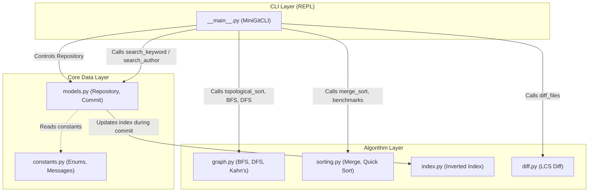
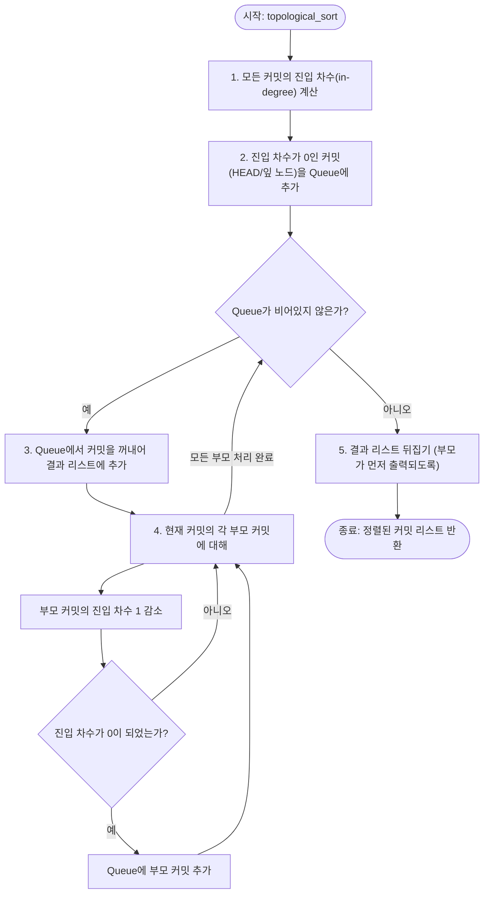
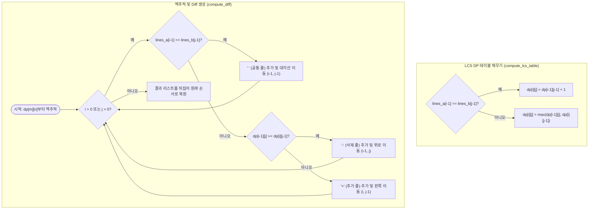
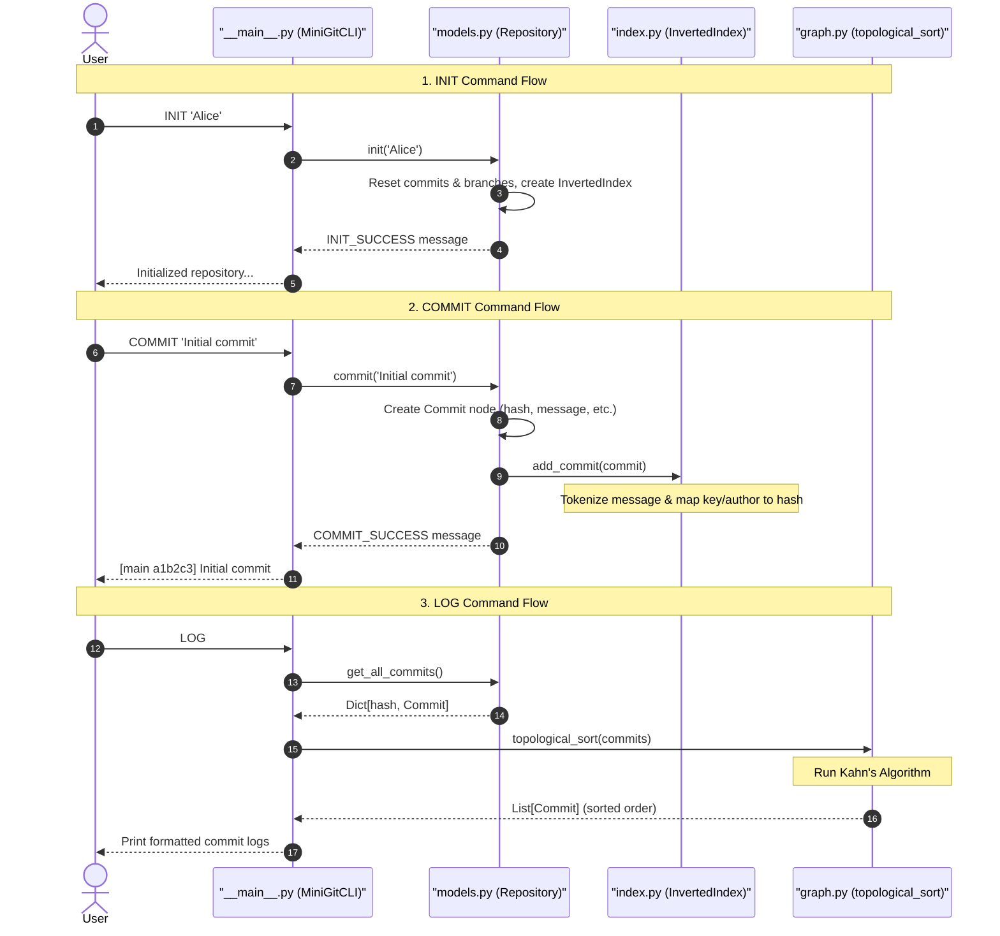

# 🔧 Mini Git — CLI 기반 버전 관리 시스템

Git의 핵심 자료구조(DAG, 해시맵, 역색인)와 알고리즘(BFS, DFS, 위상 정렬, 정렬)을
직접 구현하여 만든 교육용 Mini Git CLI 프로그램입니다.

## 📋 목차

- [실행 방법](#-실행-방법)
- [명령어 목록](#-명령어-목록)
- [아키텍처 및 설계 원칙](#-아키텍처-및-설계-원칙)
- [프로젝트 구조](#-프로젝트-구조)
- [구현된 알고리즘](#-구현된-알고리즘)
- [보너스 과제](#-보너스-과제)
- [사용 예시](#-사용-예시)

## 🚀 실행 방법

```bash
python3 -m minigit
```

> **요구 환경**: Python 3.10 이상  
> **외부 라이브러리**: 없음 (표준 라이브러리만 사용)

## 📝 명령어 목록

### 기본 명령어

| 명령어 | 설명 | 사용법 |
|--------|------|--------|
| `INIT` | 저장소 초기화 | `INIT <user_name>` |
| `COMMIT` | 새 커밋 생성 | `COMMIT <message>` |
| `BRANCH` | 새 브랜치 생성 | `BRANCH <branch_name>` |
| `SWITCH` | 브랜치 전환 | `SWITCH <branch_name>` |
| `LOG` | 커밋 로그 출력 (위상 정렬) | `LOG` |
| `LOG --sort-by` | 정렬 기준 지정 | `LOG --sort-by=date\|author` |
| `PATH` | 두 커밋 간 최단 경로 | `PATH <hash1> <hash2>` |
| `ANCESTORS` | 특정 커밋의 모든 조상 | `ANCESTORS <commit_hash>` |
| `SEARCH` | 키워드로 커밋 검색 | `SEARCH <keyword>` |
| `SEARCH --author` | 작성자로 커밋 검색 | `SEARCH --author=<name>` |
| `STATUS` | 저장소 상태 확인 | `STATUS` |
| `HELP` | 도움말 출력 | `HELP` |
| `EXIT` / `QUIT` | 프로그램 종료 | `EXIT` |

### 보너스 명령어

| 명령어 | 설명 | 사용법 |
|--------|------|--------|
| `MERGE` | 브랜치 병합 (머지 커밋 생성) | `MERGE <branch_name>` |
| `DIFF` | 두 파일 비교 (LCS 기반) | `DIFF <file1> <file2>` |
| `BENCHMARK` | 정렬 알고리즘 성능 비교 | `BENCHMARK` |

### CLI 규칙

- 명령어는 **대소문자를 구분하지 않습니다** (예: `INIT`, `init`, `Init` 모두 가능)
- 공백이 포함된 인자는 **따옴표로 감쌉니다** (예: `COMMIT "Add login feature"`)
- 잘못된 입력 시 표준 에러 메시지를 출력합니다

## 🏛 아키텍처 및 설계 원칙

본 프로젝트는 철저한 소프트웨어 엔지니어링 원칙에 기반하여 리팩토링 및 패키지화되었습니다.

### 📊 시스템 아키텍처 및 모듈 흐름


```mermaid
flowchart TD
    subgraph CLI ["CLI Layer (REPL)"]
        Main["__main__.py (MiniGitCLI)"]
    end

    subgraph Core ["Core Data Layer"]
        Models["models.py (Repository, Commit)"]
        Constants["constants.py (Enums, Messages)"]
    end

    subgraph Algos ["Algorithm Layer"]
        Graph["graph.py (BFS, DFS, Kahn's)"]
        Sorting["sorting.py (Merge, Quick Sort)"]
        Index["index.py (Inverted Index)"]
        Diff["diff.py (LCS Diff)"]
    end

    Main -->|Controls Repository| Models
    Main -->|Calls topological_sort, BFS, DFS| Graph
    Main -->|Calls merge_sort, benchmarks| Sorting
    Main -->|Calls diff_files| Diff
    Main -->|Calls search_keyword / search_author| Models

    Models -->|Updates index during commit| Index
    Models -.->|Reads constants| Constants
```

- **OOP 기반 캡슐화 및 단일 책임 원칙 (SRP)**: `MiniGitCLI` 클래스 객체 안으로 캡슐화하여 REPL 상태와 라우팅 로직을 독립시켰습니다.
- **데이터 파이프라인 (3-Step Data Flow)**: 핵심 비즈니스 로직은 오류 방지와 가독성을 위해 반드시 `1. Data Refinement (정제)`, `2. Validation (유효성 검사)`, `3. Logic Execution (실행)`의 명확한 3단계 흐름으로 분리되어 있습니다.
- **매직 스트링 중앙화**: 애플리케이션 내의 모든 명령어 문자열, 시스템 메시지, 에러 출력 등은 하드코딩되지 않고 `constants.py`에 Enum 및 텍스트 클래스로 중앙 집중화되어 관리됩니다.
- **타입 힌트 적용**: 명세서로서 기능하는 코드를 지향하여 모든 변수, 파라미터, 반환값에 Python `typing` 모듈을 엄격하게 적용했습니다.

## 📁 프로젝트 구조

```text
glad/
 ├── minigit/
 │    ├── __init__.py      # 패키지 초기화
 │    ├── __main__.py      # CLI 진입점 (MiniGitCLI 캡슐화)
 │    ├── constants.py     # 매직 스트링 및 Enum 중앙 관리
 │    ├── models.py        # 핵심 데이터 모델 (Commit, Repository)
 │    ├── graph.py         # 그래프 알고리즘 (위상 정렬, BFS, DFS)
 │    ├── sorting.py       # 정렬 알고리즘 (Merge, Quick Sort)
 │    ├── index.py         # 역색인 (키워드/작성자 기반 검색)
 │    └── diff.py          # Diff 기능 (LCS 기반 파일 비교)
 ├── README.md             # 이 문서
 └── study_guide.md        # 초상세 학습 가이드
```

## 🧠 구현된 알고리즘

### 자료구조

| 자료구조 | 용도 | 위치 |
|----------|------|------|
| **DAG (방향성 비순환 그래프)** | 커밋 히스토리 구조 | `minigit/models.py` |
| **해시맵 (dict)** | O(1) 커밋 조회 | `minigit/models.py` |
| **역색인 (Inverted Index)** | O(1) 키워드/작성자 검색 | `minigit/index.py` |

### 알고리즘

| 알고리즘 | 용도 | 시간복잡도 | 위치 |
|----------|------|-----------|------|
| **SHA-1 해싱** | 커밋 고유 식별자 생성 | O(1) | `minigit/models.py` |
| **Kahn's Algorithm** | LOG 위상 정렬 | O(V+E) | `minigit/graph.py` |
| **BFS (너비 우선 탐색)** | PATH 최단 경로 | O(V+E) | `minigit/graph.py` |
| **DFS (깊이 우선 탐색)** | ANCESTORS 조상 탐색 | O(V+E) | `minigit/graph.py` |
| **Merge Sort (머지 정렬)** | LOG --sort-by 안정 정렬 | O(n log n) | `minigit/sorting.py` |
| **Quick Sort (퀵 정렬)** | 벤치마크용 불안정 정렬 | O(n log n) avg | `minigit/sorting.py` |
| **LCS (최장 공통 부분수열)** | DIFF 파일 비교 | O(m×n) | `minigit/diff.py` |

### 📊 핵심 알고리즘 흐름도

#### 1. 위상 정렬 (Kahn's Algorithm)
`LOG` 명령어 실행 시 커밋 히스토리(DAG)를 부모-자식 순서대로 정렬하기 위해 사용됩니다.


```mermaid
flowchart TD
    Start(["시작: topological_sort"]) --> InitInDegree["1. 모든 커밋의 진입 차수(in-degree) 계산"]
    InitInDegree --> FindZero["2. 진입 차수가 0인 커밋(HEAD/잎 노드)을 Queue에 추가"]
    FindZero --> Loop{"Queue가 비어있지 않은가?"}
    Loop -->|예| Pop["3. Queue에서 커밋을 꺼내어 결과 리스트에 추가"]
    Pop --> Foreach["4. 현재 커밋의 각 부모 커밋에 대해"]
    Foreach --> Decrement["부모 커밋의 진입 차수 1 감소"]
    Decrement --> CheckZero{"진입 차수가 0이 되었는가?"}
    CheckZero -->|예| Push["Queue에 부모 커밋 추가"]
    Push --> Foreach
    CheckZero -->|아니오| Foreach
    Foreach -->|모든 부모 처리 완료| Loop
    Loop -->|아니오| Reverse["5. 결과 리스트 뒤집기 (부모가 먼저 출력되도록)"]
    Reverse --> End(["종료: 정렬된 커밋 리스트 반환"])
```

#### 2. LCS Diff (최장 공통 부분수열)
`DIFF` 명령어 실행 시 두 파일 간의 차이점을 줄 단위로 비교하기 위해 사용되는 동적 계획법(DP) 알고리즘입니다.


```mermaid
flowchart TD
    subgraph LCS_Table ["LCS DP 테이블 채우기 (compute_lcs_table)"]
        Match{"lines_a[i-1] == lines_b[j-1]?"}
        Match -->|예| Diagonal["dp[i][j] = dp[i-1][j-1] + 1"]
        Match -->|아니오| Max["dp[i][j] = max(dp[i-1][j], dp[i][j-1])"]
    end

    subgraph Backtracking ["역추적 및 Diff 생성 (compute_diff)"]
        StartBacktrack(["시작: dp[m][n]부터 역추적"]) --> LoopCond{"i > 0 또는 j > 0?"}
        LoopCond -->|예| Equal{"lines_a[i-1] == lines_b[j-1]?"}
        
        Equal -->|예| Keep["' ' (공통 줄) 추가 및 대각선 이동 (i-1, j-1)"]
        Equal -->|아니오| Compare{"dp[i-1][j] >= dp[i][j-1]?"}
        
        Compare -->|예| Del["'-' (삭제 줄) 추가 및 위로 이동 (i-1, j)"]
        Compare -->|아니오| Add["'+' (추가 줄) 추가 및 왼쪽 이동 (i, j-1)"]
        
        Keep --> LoopCond
        Del --> LoopCond
        Add --> LoopCond
        
        LoopCond -->|아니오| ReverseDiff["결과 리스트를 뒤집어 원래 순서로 복원"]
    end
```

## 🌟 보너스 과제

### 5.1 Diff (파일 비교)
- LCS(Longest Common Subsequence) 알고리즘을 직접 구현
- 동적 프로그래밍(DP) 기반 O(m×n) 시간복잡도
- 추가(`+`), 삭제(`-`), 공통(` `) 줄을 구분하여 출력

### 5.2 Merge (브랜치 병합)
- 부모가 2개인 머지 커밋을 생성
- DAG에서 "두 경로가 만나는 지점" 구현

### 5.3 정렬 알고리즘 성능 비교
- Merge Sort vs Quick Sort 벤치마크
- 다양한 입력 크기(10~5000)에서 실행 시간 측정
- 안정 정렬 vs 불안정 정렬 비교

## 💡 사용 예시

### 🔄 주요 명령어 실행 흐름 (INIT -> COMMIT -> LOG)


```mermaid
sequenceDiagram
    autonumber
    actor User as User
    participant CLI as "__main__.py (MiniGitCLI)"
    participant Repo as "models.py (Repository)"
    participant Index as "index.py (InvertedIndex)"
    participant Graph as "graph.py (topological_sort)"

    Note over User, Graph: 1. INIT Command Flow
    User->>CLI: INIT 'Alice'
    CLI->>Repo: init('Alice')
    Repo->>Repo: Reset commits & branches, create InvertedIndex
    Repo-->>CLI: INIT_SUCCESS message
    CLI-->>User: Initialized repository...

    Note over User, Graph: 2. COMMIT Command Flow
    User->>CLI: COMMIT 'Initial commit'
    CLI->>Repo: commit('Initial commit')
    Repo->>Repo: Create Commit node (hash, message, etc.)
    Repo->>Index: add_commit(commit)
    Note over Index: Tokenize message & map key/author to hash
    Repo-->>CLI: COMMIT_SUCCESS message
    CLI-->>User: [main a1b2c3] Initial commit

    Note over User, Graph: 3. LOG Command Flow
    User->>CLI: LOG
    CLI->>Repo: get_all_commits()
    Repo-->>CLI: Dict[hash, Commit]
    CLI->>Graph: topological_sort(commits)
    Note over Graph: Run Kahn's Algorithm
    Graph-->>CLI: List[Commit] (sorted order)
    CLI-->>User: Print formatted commit logs
```

### 💻 CLI 실행 예시

```text
mini-git> init "Alice"
Initialized repository.
Current branch: main
Current user: Alice

mini-git> commit "Initial commit"
[main a1b2c3] Initial commit

mini-git> branch feature
Created branch: feature

mini-git> switch feature
Switched to branch: feature

mini-git> commit "Add login feature"
[feature d4e5f6] Add login feature

mini-git> switch main
Switched to branch: main

mini-git> commit "Add payment feature"
[main g7h8i9] Add payment feature

mini-git> log
commit a1b2c3 (Alice, 2026-05-24 07:30:00)
  Initial commit

commit g7h8i9 (Alice, 2026-05-24 07:30:02) [main] (HEAD)
  Add payment feature

commit d4e5f6 (Alice, 2026-05-24 07:30:01) [feature]
  Add login feature

mini-git> search "login"
Found 1 commit(s) for keyword 'login':

  - d4e5f6: Add login feature

mini-git> merge feature
Merged 'feature' into 'main'.
[main x1y2z3] Merge branch 'feature' into main

mini-git> exit
Goodbye!
```

## 🔑 제약 사항

- `sorted()`, `list.sort()` 등 Python 표준 정렬 API **사용 금지** → 직접 구현
- 그래프 전용 라이브러리 **사용 금지** → 인접 리스트 직접 구축
- 파일 내용 추적 **미구현** (커밋 메타데이터 중심)
- 네트워크 통신 **미구현**
- 데이터 영속성 **미구현** (메모리 상 동작)