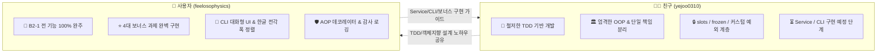
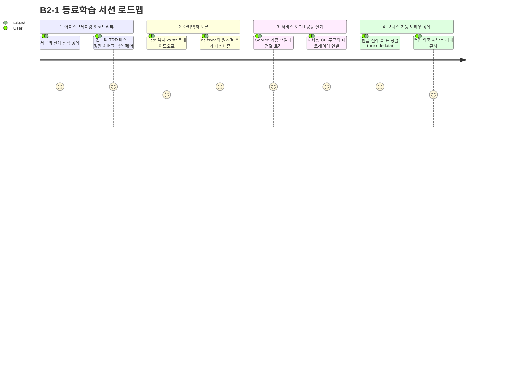

# 📊 Codyssey B2-1 동료학습(Peer Learning) 비교 분석 및 스터디 전략 레포트

> **미션명**: Codyssey AI/SW 기초 B2-1 - 나만의 용돈 기입장 콘솔 프로그램 만들기  
> **비교 대상**: 🧑‍💻 [yejoo0310/codyssey-b2-1](https://github.com/yejoo0310/codyssey-b2-1) vs 🚀 [feelosophysics (glad/budget_app)](https://github.com/feelosophysics)  
> **작성 목적**: 학습 동료와 코드 미팅 시 상호 설계 철학 교환, 강점 벤치마킹, 코드 리뷰(버그 픽스) 및 비즈니스/CLI 계층 공동 설계를 위한 실전 스터디 가이드

---

## 📌 1. 총평 및 현황 요약 (Executive Summary)

두 사람의 코드베이스는 **접근 방식과 강점의 결이 완전히 달라 동료학습 시 상호 보완적인 시너지가 극대화될 수 있는 최상의 조합**입니다.


```mermaid
flowchart LR
    subgraph Friend ["🧑‍💻 친구 (yejoo0310)"]
        F_TDD["🧪 철저한 TDD 기반 개발"]
        F_OOP["🏛️ 엄격한 OOP & 단일 책임 분리"]
        F_Type["🔒 slots / frozen / 커스텀 예외 계층"]
        F_Status["⏳ Service / CLI 구현 예정 단계"]
    end

    subgraph User ["🚀 사용자 (feelosophysics)"]
        U_Full["🎯 B2-1 전 기능 100% 완주"]
        U_Bonus["⭐ 4대 보너스 과제 완벽 구현"]
        U_UI["💬 CLI 대화형 UI & 한글 전각 폭 정렬"]
        U_AOP["🛡️ AOP 데코레이터 & 감사 로깅"]
    end

    Friend -.->|TDD/객체지향 설계 노하우 공유| User
    User -.->|Service/CLI/보너스 구현 가이드| Friend
```

| 비교 항목 | 🧑‍💻 친구 (`yejoo0310`) | 🚀 나 (`feelosophysics`) | 스터디 & 토론 포인트 |
| :--- | :--- | :--- | :--- |
| **개발 스타일** | **Bottom-Up (하위 레이어 집중형)** | **Full-Stack Top-to-Bottom (완성형)** | TDD 접근법 vs 전체 아키텍처 관점 |
| **구현 진척도** | Models, Validators, Repositories, Unit Tests 완성<br>*(Service, CLI, Decorators 구현 예정)* | 미션 1~10번 전 기능 + 보너스 1~4번 전 항목 완성 | 비즈니스 로직 및 CLI 인터페이스 공동 설계 |
| **도메인 모델** | `slots=True`, `frozen=True`, `Date` 객체 변환, 엄격한 `__post_init__` 정규화 | 실용적 `dataclass`, 날짜 `str` 유지, `RecurringRule`(반복 규칙) 지원 | 객체 불변성과 직렬화/역직렬화 비용 트레이드오프 |
| **예외 설계** | `errors.py` 기반 5대 계층형 커스텀 예외 (`BudgetAppError`) + `hint` 주입 | 표준 예외 + `decorators.py` 기반 통합 예외 안전 처리 | AOP 데코레이터와 도메인 커스텀 예외 결합 |
| **저장소 I/O** | `NamedTemporaryFile` + `fsync` + 제너레이터 스트리밍 교체 | `BaseRepository` + `.tmp` + `os.replace` 원자적 쓰기 | OS 커널 레벨 디스크 버퍼 플러시(`fsync`)의 중요성 |
| **테스트 코드** | `unittest` + `TemporaryDirectory` 격리 단위 테스트 완비 | 통합 E2E 테스트 및 대화형 CLI 루프 검증 | TDD 단위 테스트 스위트 벤치마킹 |
| **문서화** | 5줄 뼈대 상태 | 1,000줄 이상의 상세 README (아키텍처 다이어그램 포함) | 프로젝트 문서화 및 설계 의도 전달법 |

---

## 🔍 2. 모듈별 심층 비교 분석 (Deep Code Comparison)

### 2.1 도메인 모델 및 유효성 검증 계층 (`models.py`, `validators.py`, `types.py`)

#### 🧑‍💻 친구의 설계 (`yejoo0310`)
* **엄격한 불변성과 단일 책임 원칙 (SRP)**:
  * `@dataclass(slots=True)`를 적용하여 메모리 오버헤드를 최소화하고 런타임 동적 속성 할당을 원천 차단했습니다.
  * `Category`에 `frozen=True`를 부여하여 도메인 불변 객체(Value Object)로 안전하게 다룹니다.
  * `types.py`(`TransactionType = Literal["income", "expense"]`)와 `validators.py`를 독립 모듈로 분리하여 모델 클래스가 순수 데이터 구조에만 집중하도록 분리했습니다.
  * 날짜 데이터를 단순 문자열이 아닌 Python 내장 `datetime.date` 객체로 엄격히 관리합니다.

#### 🚀 나의 설계 (`feelosophysics`)
* **실용성과 도메인 확장성**:
  * 날짜를 `YYYY-MM-DD` 문자열로 유지하여 JSONL 직렬화/역직렬화 오버헤드를 줄이고 CLI 입력/출력 간의 변환 비용을 최소화했습니다.
  * 보너스 과제인 매달 고정 지출/수입 규칙(`RecurringRule`) 모델을 선제적으로 정의하여 자동화 확장이 가능합니다.

---

### 2.2 예외 처리 아키텍처 (`errors.py` vs `decorators.py`)

#### 🧑‍💻 친구의 계층형 커스텀 예외 구조
```python
class BudgetAppError(Exception):
    """budget app 프로그램에서 예상 가능한 오류의 최상위 예외"""
    def __init__(self, message: str, *, hint: str | None = None) -> None:
        super().__init__(message)
        self.message = message
        self.hint = hint

class DataAccessError(BudgetAppError): ...
class DataFormatError(BudgetAppError): ...
class NotFoundError(BudgetAppError): ...
class DuplicateError(BudgetAppError): ...
class CategoryInUseError(BudgetAppError): ...
```
* 에러 메시지뿐만 아니라 사용자가 취해야 할 조치인 `hint`를 객체 속성으로 함께 주입할 수 있도록 훌륭하게 설계되어 있습니다.

#### 🚀 나의 관점 지향(AOP) 데코레이터 구조
* `@handle_errors_gracefully` 데코레이터를 통해 비즈니스 로직과 UI 컨트롤러 어디서든 발생하는 예외를 한곳에서 가로채 친절한 한글 박스 힌트와 비정상 종료 코드(`sys.exit(1)`)를 출력합니다.
* **💡 토론 시너지**: 친구의 `BudgetAppError` 계층(원인 + `hint`)을 데코레이터에서 포획하여 콘솔에 렌더링하면 가장 이상적인 에러 핸들링 파이프라인이 완성됩니다.

---

### 2.3 저장소 계층 및 원자적 쓰기 (`repositories.py` vs `repository.py`)

#### 🧑‍💻 친구의 저장소 I/O 메커니즘
```python
with tempfile.NamedTemporaryFile(..., delete=False) as temp_file:
    temp_path = Path(temp_file.name)
    for data in records:
        temp_file.write(json_line + "\n")
    temp_file.flush()
    os.fsync(temp_file.fileno())  # OS 디스크 버퍼 물리 플러시!
os.replace(temp_path, self.file_path)
```
* **장점**: `os.fsync`를 호출하여 OS 커널 레벨 디스크 버퍼까지 완전히 디스크에 쓰이도록 보장하는 정석적인 POSIX 원자적 쓰기를 구현했습니다.
* **스트리밍 쓰기**: `replacement_records()` 제너레이터를 `_rewrite_dicts()`에 넘겨 메모리 스트리밍 방식으로 파일 교체를 처리합니다.

#### 🚀 나의 저장소 I/O 메커니즘
* `BaseRepository`를 기반으로 `_atomic_write_lines`를 공통화하고 `.tmp` 파일 생성 후 `os.replace`로 교체합니다.
* `find_all_stream()` 제너레이터로 대용량 거래를 한 줄씩 스트리밍 로드합니다.
* `update`, `delete` 시 성공 여부를 `bool` (`True`/`False`)로 명확하게 반환하여 상위 Service 계층에서 직관적인 분기 처리가 가능합니다.

---

### 2.4 단위 테스트 및 품질 관리 (`tests/`)

* **친구의 독보적 강점**:
  * `unittest.TestCase`를 기반으로 `TemporaryDirectory()`를 활용한 격리 테스트 환경 구축 (`test_repositories.py`, `check_models.py`).
  * 잘못된 JSONL 포맷(`DataFormatError`), 빈 줄 무시, 파일 순서 보장, 임시 파일 쓰기 실패 시 원본 보존 여부까지 단위 테스트로 촘촘히 검증하는 모범적인 TDD 스타일을 보여줍니다.

---

## 🎁 3. 친구를 위한 코드 리뷰 선물 (버그 & 린트 개선 포인트)

동료학습 시 친구에게 친절하게 공유해줄 수 있는 실제 코드 개선 포인트들입니다:

### 1) `repositories.py` 키워드 인자 오타 (Line 33)
```python
# 현재 코드
raise DataAccessError(
    f"저장 파일을 준비하지 못했습니다: {self.file_path}",
    hind="저장 경로와 파일 접근 권한을 확인해 주세요."  # 'hind' 오타 발생!
)

# 수정 제안
raise DataAccessError(
    f"저장 파일을 준비하지 못했습니다: {self.file_path}",
    hint="저장 경로와 파일 접근 권한을 확인해 주세요."
)
```

### 2) `repositories.py` 임시 파일 정리 조건 오류 (Line 136)
```python
# 현재 코드
finally:
    if temp_path is None:  # temp_path가 생성되었을 때(not None) 삭제해야 하는데 조건이 반대임!
        try:
            temp_path.unlink(missing_ok=True)
        except OSError:
            pass

# 수정 제안
finally:
    if temp_path is not None and temp_path.exists():
        try:
            temp_path.unlink(missing_ok=True)
        except OSError:
            pass
```

### 3) `repositories.py` 메서드 시그니처 및 반환값 보완
* `TransactionRepository.update()`: 반환 타입 힌트가 `-> bool`로 되어 있으나 실제 `return` 문이 없어 `None`이 반환됩니다.
* `TransactionRepository.exists()`: 파라미터명 오타 `transactioin_id` -> `transaction_id`.
* `TransactionRepository.delete(self, transaction_id)`: `transaction_id: str` 매개변수 타입 힌트 누락.

---

## 🗺️ 4. 동료학습(Peer Learning) 4단계 실전 스터디 아젠다


```mermaid
journey
    title B2-1 동료학습 세션 로드맵
    section 1. 아이스브레이킹 & 코드리뷰
      서로의 설계 철학 공유: 5: User, Friend
      친구의 TDD 테스트 칭찬 & 버그 픽스 페어프로그래밍: 5: User, Friend
    section 2. 아키텍처 토론
      Date 객체 vs str 트레이드오프: 4: User, Friend
      os.fsync와 원자적 쓰기 메커니즘: 5: User, Friend
    section 3. 서비스 & CLI 공동 설계
      Service 계층 책임과 정렬 로직: 5: User, Friend
      대화형 CLI 루프와 데코레이터 연결: 5: User, Friend
    section 4. 보너스 기능 노하우 공유
      한글 전각 폭 표 정렬 (unicodedata): 5: User, Friend
      백업 압축 & 반복 거래 규칙: 4: User, Friend
```

### ☕ 세션 1: 아이스브레이킹 & 저장소/테스트 코드 리뷰 (약 20분)
* **주제**: "친구의 TDD와 단위 테스트 구조 배워보기 + 버그 픽스 페어프로그래밍"
* **대화 가이드**:
  > *"네가 작성한 `TemporaryRepositoryTestCase`랑 `slots=True` 모델 검증 구조 보니까 진짜 객체지향적이고 테스트가 탄탄해서 감탄했어! 특히 `fsync`까지 챙긴 원자적 쓰기 로직이 인상 깊더라. 저장소 쪽 보다가 `hind` 오타랑 `temp_path` 정리 부분 사소한 거 몇 개 찾았는데 같이 볼래?"*

---

### 🧠 세션 2: 데이터 모델 & 아키텍처 트레이드오프 토론 (약 25분)
1. **날짜 타입 결정**:
   * `datetime.date` 객체로 들고 있을 때의 장점(월 계산, 날짜 비교 용이) vs `str`로 유지할 때의 장점(직렬화 단순화, CLI 입력과의 일치).
2. **원자적 쓰기 & `os.fsync`의 필요성**:
   * 단순히 `open('w')`로 덮어쓸 때 정전이 나면 파일이 0바이트로 깨지는 문제.
   * `tempfile` 생성 -> `fsync` -> `os.replace` 파이프라인의 OS 커널 동작 원리.
3. **제너레이터 스트리밍 vs 정렬의 모순**:
   * 최신순 정렬을 하려면 결국 전체 데이터를 메모리에 올려야 하는가? 대용량 파일에서 스트리밍을 유지하며 정렬하는 최선의 전략은?

---

### 🛠️ 세션 3: Service 계층 및 대화형 CLI 설계 페어링 (약 35분)
* **주제**: "친구가 구현할 `services.py`, `cli.py`, `decorators.py`의 뼈대 함께 잡기"
* **내가 전수해줄 수 있는 핵심 노하우**:
  * **대화형 입력 헬퍼 (`prompt_interactive`)**: 잘못 입력했을 때 프로그램이 바로 꺼지지 않고 친절한 힌트와 함께 재입력을 유도하는 루프 패턴.
  * **데코레이터 활용법**: `@handle_errors_gracefully`가 친구의 `errors.py` 커스텀 예외들을 받아서 예쁜 한글 박스로 출력해주는 구조.
  * **거래 ID 자동 채번 알고리즘**: `TX-000001` 일련번호 부여 로직.

---

### 🌟 세션 4: 보너스 과제 노하우 공유 (약 20분)
1. **터미널 한글 정렬 문제 해결 (`unicodedata.east_asian_width`)**:
   * 한글(전각 2칸)과 영문(반각 1칸)의 터미널 렌더링 폭 차이를 해결하는 알고리즘 공유.
2. **데이터 안전 백업 (`zipfile`)**:
   * `backups/` 폴더에 타임스탬프 기반 압축 파일 자동 생성.
3. **반복 거래 규칙 (`RecurringRule`)**:
   * 매달 특정일에 고정 지출/수입을 자동 생성해주는 스케줄링 로직.

---

## 🎯 5. 핵심 토론 질문 카드 (질문 리스트)

동료학습 중 자연스럽게 질문을 던질 때 활용하세요:

1. *"카테고리 모델에 `frozen=True`를 적용했던데, 이렇게 불변 객체로 설계했을 때 비즈니스 로직에서 어떤 이점이 있어?"*
2. *"`_rewrite_dicts`에 제너레이터를 넘겨서 한 줄씩 직렬화하면서 쓰는 방식이 인상적인데, 중간에 제너레이터에서 예외가 발생하면 임시 파일은 어떻게 처리되는 구조야?"*
3. *"`errors.py`에 `hint` 필드를 따로 둔 설계가 너무 좋던데, CLI나 데코레이터에서 이 힌트를 사용자에게 어떻게 보여주면 제일 깔끔할까?"*
4. *"거래 목록을 `list --limit N`으로 최신순 조회할 때, 파일이 순차 기록되어 있으면 역순 정렬과 제너레이터 스트리밍을 어떻게 조화시키는 게 좋을까?"*
