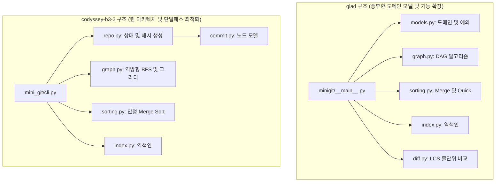

# 🚀 Mini Git (B3-2) 피어 학습 및 아키텍처 비교 심층 보고서

> **배포 페이지**: [https://feelosophysics.github.io/check/](https://feelosophysics.github.io/check/)  
> **미션 명**: 파일이 언제 어떻게 바뀌었는지 기록하는 작은 프로그램 만들기 (Codyssey B3-2 Mini Git)  
> **비교 대상**: `glad` 구현체 vs `codyssey-b3-2` 구현체  
> **목적**: 두 가지 서로 다른 설계 철학과 알고리즘 구현 방식을 1:1로 비교 분석하여, 피어 리뷰 세션에서 생산적이고 깊이 있는 기술적 토론을 나누기 위함.

---

## ⚡ 1. [제1원리] Mini Git은 왜 만들어졌는가?

### ① 모든 비극의 시작: 파일 덮어쓰기와 최종_진짜최종.py
소프트웨어 개발에서 협업 시 발생하는 가장 본질적인 문제는 **"동일한 파일을 여러 작업자가 동시에 수정할 때 누구의 변경사항이 덮어씌워져 유실되는가"**입니다. 단순히 파일을 복사해 두는 방식(`v1`, `v2`, `진짜최종`)은 변경 이력의 인과관계를 추적하지 못합니다.

### ② Git의 본질: 스냅샷에 부모 꼬리표 달기 (DAG)
Git은 변경 순간마다 커밋 노드를 생성하고, **'직전 작업(부모 커밋)'의 해시를 포인터로 매다는 연결 구조**를 취합니다.
- 부모가 0개인 노드: 최초의 커밋 (Root)
- 부모가 1개인 노드: 일반적인 순차 커밋
- 부모가 동일한 두 자식 노드: 브랜치 갈림길 (Branching, Y자 분기)
- 부모가 2개 이상인 노드: 병합 커밋 (Merge Commit, 다이아몬드 합류)

이 구조는 미래의 커밋이 과거를 가리킬 뿐 과거가 미래를 가리킬 수 없으므로, **물리적으로 사이클(순환)이 불가능한 방향성 비순환 그래프(DAG, Directed Acyclic Graph)**를 이룹니다.

### ③ 코디세이 미션의 진짜 출제 의도
실제 Git의 방대한 파일 I/O와 네트워크 통신 껍데기를 걷어내고, **컴퓨터 과학의 4대 핵심 알고리즘(그래프 모델링, 위상 정렬, BFS 최단 경로, 역색인 검색, 수제 분할정복 정렬)**이 하나의 소프트웨어 안에서 어떻게 유기적으로 맞물리는지 체득시키는 것이 이 미션의 본질입니다.

---

## 🏛️ 2. 두 구현체(`glad` vs `codyssey-b3-2`) 아키텍처 1:1 비교

두 저장소는 동일한 미션 요구사항을 해결했으나, **설계 책임 분리와 최적화 접근 방식**에서 흥미로운 차이점을 보입니다.

```mermaid
flowchart TD
    subgraph "glad 구조 (풍부한 도메인 모델 및 기능 확장)"
        G_CLI[minigit/__main__.py] --> G_MOD[models.py: 도메인 및 예외]
        G_CLI --> G_GRA[graph.py: DAG 알고리즘]
        G_CLI --> G_SRT[sorting.py: Merge 및 Quick]
        G_CLI --> G_IDX[index.py: 역색인]
        G_CLI --> G_DIF[diff.py: LCS 줄단위 비교]
    end

    subgraph "codyssey-b3-2 구조 (린 아키텍처 및 단일패스 최적화)"
        C_CLI[mini_git/cli.py] --> C_REP[repo.py: 상태 및 해시 생성]
        C_CLI --> C_GRA[graph.py: 역방향 BFS 및 그리디]
        C_CLI --> C_SRT[sorting.py: 안정 Merge Sort]
        C_CLI --> C_IDX[index.py: 역색인]
        C_REP --> C_COM[commit.py: 노드 모델]
    end
```

| 비교 항목 | `glad` 구현체 | `codyssey-b3-2` 구현체 | 핵심 시사점 및 토론 포인트 |
| :--- | :--- | :--- | :--- |
| **모듈 분리 구조** | `models`, `graph`, `sorting`, `index`, `diff`, `constants` (도메인 분리) | `cli`, `repo`, `graph`, `sorting`, `index`, `commit` (상태-엔진 분리) | `glad`는 풍부한 도메인 모델 중심, `codyssey-b3-2`는 Repository 패턴 중심의 린(Lean) 구성 |
| **해시 생성 전략** | SHA-1 기반 내용 해싱 + 중복 방지 접미사 카운터 | `sha1(순번:salt:message:timestamp)` 앞 6자리 + salt 증가 재시도 | 두 구현체 모두 세션 내 유일성을 보장하며 충돌 회피 메커니즘을 견고하게 탑재 |
| **PATH 최단경로** | **양방향 BFS + 경로 큐 유지** (모든 최단 경로 수집 후 사전순 문자열 정렬) | **목적지 역방향 BFS + 탐욕적(Greedy) 전진** ($O(V+E)$ 단일 패스로 사전순 최소 경로 도출) | **★ 핵심 토론 포인트!** 경로 열거 정렬 vs 목적지 거리 기반 그리디 탐색의 공간/시간 복잡도 트레이드오프 |
| **정렬 알고리즘** | **Merge Sort + Quick Sort 듀얼 구현** (비교 벤치마크 기능 제공) | **Merge Sort 단일 구현** (최악 $O(N^2)$ 회피 및 `<=` 연산자로 안정 정렬 보장) | 정렬 알고리즘 선택 시 최악 시간복잡도($O(N \log N)$)와 안정 정렬(Stable Sort)의 중요성 |
| **위상 정렬 (LOG)** | **Kahn In-degree 반복문 큐 탐색** | **Kahn In-degree 반복문 인덱스 포인터 탐색** | 둘 다 재귀 한계를 극복하고 $O(V+E)$ 반복문 Kahn 알고리즘을 채택하여 부모 우선 출력 보장 |
| **역색인 (SEARCH)** | `set` 기반 토큰-커밋 매핑 (중복 방지 및 $O(1)$ 멤버십 체크) | `list` 기반 토큰-커밋 매핑 (`by_keyword`, `by_author`) | 역색인 딕셔너리의 값으로 `set` vs `list`를 사용했을 때의 메모리 및 검색 순서 보존 특성 |
| **보너스 기능** | **LCS(최장 공통 부분수열) 기반 DIFF 기능 구현** | **단위 테스트 스위트(`test_mini_git.py`) 및 구술 대비 문서화** | `glad`는 알고리즘 기능 확장(DP), `codyssey-b3-2`는 테스트 주도 검증 및 설계 근거 문서화에 강점 |

---

## 🔍 3. 5대 핵심 알고리즘별 접근 방식 딥다이브

### ① PATH (최단 경로 탐색 및 사전순 타이브레이킹)
- **공통 기반**: 커밋의 원래 간선(자식 $	o$ 부모)만 따라가면 갈라진 브랜치 간 경로를 찾을 수 없으므로, 두 구현체 모두 **무방향(Undirected) 양방향 인접 리스트**를 구축하여 탐색합니다.
- **알고리즘적 차이점**:
  - `glad`: 정석적인 BFS 큐에 경로 리스트(`[node1, node2, ...]`)를 담아 전진하며, 타겟에 도달한 최단 경로들을 모은 뒤 최종적으로 사전순 문자열 정렬을 수행합니다.
  - `codyssey-b3-2`: 목적지(`end`)에서 출발하여 모든 노드까지의 홉 거리(`dist_to_end`)를 먼저 계산해 둡니다. 그 후 출발점(`start`)에서 매 걸음마다 **"거리가 1 줄어드는 이웃 노드 중 해시가 사전순으로 가장 작은 노드"를 그리디하게 선택**합니다. 모든 최단 경로는 홉 수가 같으므로 첫 홉의 사전순 최소가 전체 경로의 사전순 최소와 일치한다는 원리를 레버리지하여, 전체 경로를 열거하지 않고 $O(V+E)$ 안에 끝냅니다.

### ② LOG (위상 정렬, Topological Sort)
- **요구조건**: 일반적인 Git log(최신순)와 달리, 본 미션은 **"부모 커밋이 항상 자식 커밋보다 먼저 출력"**되어야 합니다.
- **두 구현체의 공통점**:
  - `indegree` 딕셔너리를 구성하여 부모가 0개인 루트 커밋부터 큐에 넣고, 하나씩 꺼내며 자식들의 진입차수를 1씩 감소시키는 **Kahn 알고리즘**을 정석 구현했습니다.
  - 단순 커밋 생성 순서(`order`)에 의존하지 않고 실제 그래프 위상 정렬을 수행함으로써, 추후 외부 커밋 히스토리를 병합/가져올 때도 순서 무결성을 보장하도록 설계되었습니다.

### ③ 정렬 엔진 (`sorted()` 표준 API 전면 배제)
- **요구조건**: Python 내장 정렬(`sorted()`, `list.sort()`)을 일체 쓰지 않고 직접 정렬 엔진을 구축해야 합니다.
- **설계 철학 대조**:
  - `glad`: 병합 정렬(Merge Sort)과 퀵 정렬(Quick Sort)을 모두 구현하여 알고리즘별 특성을 비교할 수 있도록 구조화했습니다.
  - `codyssey-b3-2`: 퀵 정렬의 최악 시간복잡도($O(N^2)$) 퇴화 위험을 원천 차단하고, `LOG --sort-by=author` 시 동일 작성자의 커밋 순서가 역전되지 않도록 병합 함수에서 `<` 대신 `<=`를 사용하여 **안정 정렬(Stable Sort)** 특성을 엄밀하게 챙겼습니다.

### ④ SEARCH (역색인 검색 엔진)
- **요구조건**: 커밋 메시지를 순회($O(N)$)하지 않고, 단어와 작성자 기반으로 즉시 검색할 수 있어야 합니다.
- **구현 메커니즘**:
  - 두 구현체 모두 커밋 생성(`COMMIT`) 시점에 메시지를 소문자로 정규화(`lower()`)하고 공백으로 분리(`split()`)하여 `keyword -> [commit_hash]` 해시맵을 구축합니다.
  - 이로써 검색 시에는 $O(1)$의 딕셔너리 키 조회로 즉각 후보 커밋을 도출합니다.

### ⑤ DIFF (보너스: 최장 공통 부분수열 LCS)
- `glad` 구현체는 동적 계획법(Dynamic Programming) 기반의 LCS 알고리즘(`diff.py`)을 추가 탑재하여, 두 텍스트 파일 간의 줄 단위 추가(`+`), 삭제(`-`), 유지(` `)를 완벽하게 시각화 비교할 수 있도록 확장했습니다.

---

## 🎙️ 4. 피어 세션 1시간 실전 대화 가이드 (함께 보며 논의할 주제)

컴퓨터 화면에 이 보고서를 띄워두고 아래 순서로 대화를 나누면 1시간 동안 가장 밀도 높은 피어 러닝이 가능합니다.

### [Phase 1: 00~15분] 아키텍처 개요 및 CLI 시연
- 각자의 REPL 인터페이스에서 기본 브랜치 생성, 커밋, 스위치 시연.
- **논의 주제**: "Repository 상태 관리 클래스와 CLI 컨트롤러의 책임을 어떻게 나누셨나요?"

### [Phase 2: 15~35분] PATH 최단경로 알고리즘 비교 (★ 하이라이트)
- **`glad`의 접근**: 경로 큐 기반 BFS vs **`codyssey-b3-2`의 접근**: 목적지 역방향 거리 + 그리디 홉 선택.
- **토론 질문**:
  > *"목적지에서 역방향 거리를 구해두고 매번 거리가 1 감소하는 이웃 중 최소 해시를 그리디하게 고르는 방식이 항상 전역 사전순 최소 경로를 보장하는 이유에 대해 어떻게 생각하시나요?"*  
  > *(경로의 모든 홉 수가 동일하므로, 앞선 노드의 사전순 우위가 전체 문자열의 사전순 우위를 결정한다는 증명 논의)*

### [Phase 3: 35~50분] 정렬의 안정성과 위상 정렬 엣지 케이스
- **안정 정렬(Stable Sort)**: `_merge` 함수에서 `<=` 연산자가 동점(동일 작성자) 커밋의 시간 순서를 보존하는 메커니즘 확인.
- **위상 정렬**: 머지 커밋(부모 2개)이 존재하는 다이아몬드 그래프 환경에서 Kahn 알고리즘의 동작 검증.

### [Phase 4: 50~60분] 확장성 및 상호 피드백
- `glad`의 LCS 기반 DIFF 보너스 구현 공유.
- `index.py`의 토큰화 확장성(특수문자, 구두점 정규식 처리 방안) 논의.
- 상호 학습 회고 및 상호 평가 완료.
