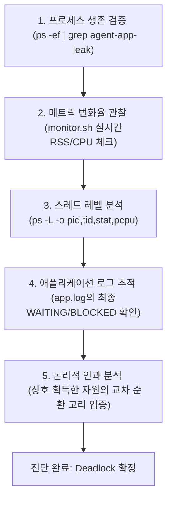

## 6. 시스템 장애 원인 분석 및 기술 심층 Q&A (Deep-Dive Q&A)

### Q1. `monitor.sh`에서 사용한 구체적 명령어와 데이터 추출 방법을 구체적으로 기술하고, 물리 메모리(RSS)와 가상 메모리(VSZ)의 의미상 차이 및 감시 관점에서의 중요성을 설명하시오.

* **사용된 구체적 명령어**:
  1. **대상 프로세스 전체 감지**:
     ```bash
     pgrep -f "$PROCESS_NAME"
     ```
     `pgrep -f`는 프로세스의 바이너리 이름뿐 아니라 전체 커맨드라인 매개변수 패턴을 함께 매칭하여 PID 목록을 찾아냅니다. PyInstaller 패키징 구조상 어플리케이션이 부팅될 때 부트 로더 부모 프로세스와 실제 비즈니스 로직을 지닌 파이썬 자식 프로세스가 다중 계층으로 생성되는 경우가 많습니다. 단순 바이너리 이름 매치 방식은 엉뚱한 부모 PID만 잡아내어 정작 실제 누수가 발생하는 자식 프로세스를 놓칠 수 있기에 전체 감지 패턴을 사용했습니다.
  2. **관제 데이터 추출 명령어**:
     ```bash
     ps -p "$pids" -o pid=,stat=,nlwp=,pcpu=,pmem=,rss=,vsz=,etime=,comm=
     ```
     `ps` 도구의 `-o` 옵션을 활용하여 관제에 필요한 핵심 커널 정보(프로세스 ID, 프로세스 상태, 스레드 수, CPU %, 메모리 %, 물리 메모리 크기(RSS), 가상 메모리 크기(VSZ), 경과 시간, 명령 이름)만을 쉼표 구분자 포맷으로 정형 추출하여 `monitor.log`에 실시간으로 기록했습니다.

* **물리 메모리(RSS) vs 가상 메모리(VSZ)의 의미상 차이**:
  * **VSZ (Virtual Memory Size)**: 프로세스가 기동되면서 운영체제 커널로부터 "앞으로 최대 이만큼의 메모리 주소 공간을 할당받아 사용할 가능성이 있으니 가상 주소 테이블 상에 주소를 예약(Reservation)해줘"라고 장부상으로 확보해 둔 가상의 전체 메모리 크기입니다. 여기에는 공유 라이브러리, 디스크에 이미 페이징 아웃(Paged-out)되어 RAM에 존재하지 않는 영역, 실제 물리 자원이 할당되지 않은 미사용 페이지까지 모두 합산되어 수치가 매우 거대하게 잡힙니다.
  * **RSS (Resident Set Size)**: 가상 메모리 예약 공간 중, **해당 관측 시점에 실제 컴퓨터의 물리 RAM(휘발성 물리 메모리)에 견고하게 올라가 공간을 점유하고 있는 실제 물리 상주 메모리 크기**입니다.

* **감시 관점에서의 중요성**:
  가상 메모리(VSZ)는 단지 주소의 예약 상태를 나타내므로 VSZ 수치가 기동 시 크게 잡혔다고 해서 물리적 자원이 고갈되는 하드웨어 병목이 발생하지는 않습니다. 반면, **메모리 누수(Memory Leak)는 반납되지 않은 힙 영역 객체들이 실제 RAM 영역을 지속적으로 불법 점유해 우상향(Linear Growth)으로 삼키는 물리 자원 고갈 현상**입니다. 즉, 실제 물리 하드웨어가 비명 지르며 고갈되는 리얼 타임 자원 점유 상태를 입증하고 추적하기 위해서는 반드시 **RSS 지표**를 핵심 관제 메트릭으로 삼고 추적해야 합니다.

---

### Q2. 프로세스의 CPU 사용률을 확인하기 위해 선택한 도구들(`ps`, `top`, 앱 내부 지표)과 적용한 옵션들의 의미를 비교하여 설명하시오.

* **도구별 특성 및 적용 옵션의 의미**:
  1. **`ps -p <PID> -o pcpu`**:
     * **의미**: 프로세스가 생성 및 가동된 전체 시간 대비 CPU가 수행한 총 평균 연산 시간 비율을 수치로 보여줍니다.
     * **특징**: 이 수치는 '역사적 누적 평균값'이므로, 프로세스가 직전에 연산 폭주를 일으키는 CPU Spike가 터졌더라도 수치가 서서히 희석되어 반영되므로 즉각적인 실시간 이상 거동을 잡기 어렵습니다.
  2. **`top -b -n 1 -p <PID>`**:
     * **의미**: 순간적인 시스템 상태를 대화형 UI 화면이 아닌 표준 출력 스트림으로 추출하기 위해 **배치 모드(`-b`)** 옵션을 지정했고, 정확히 **1회성 샘플링(`-n 1`)**을 하도록 제한하여 특정 프로세스(`-p`)의 실시간 자원 상태를 낚아챘습니다.
     * **특징**: `top`은 지정된 매우 짧은 모니터링 틱 간격 동안 프로세스가 실질적으로 CPU를 소모한 순간의 수치를 제공하므로 실시간 Spike 패턴 감지에 절대적으로 적합합니다.
  3. **애플리케이션 로그 내 `Current Load`**:
     * **의미**: 운영체제가 커널 스케줄러 시뮬레이션 데이터를 계산하여 리턴해 주기 전, 어플리케이션 프로세스가 내부적으로 연산량 밀도를 루프 주기 대비 계측한 **어플리케이션 레벨의 고유 연산 부하 지표**입니다.

* **수치의 불일치성 분석**:
  본 미션 도중 `top`에서 계측된 CPU 점유율은 순간적으로 낮아 보이는 반면, 앱 로그의 `Current Load`가 급상승하는 수치 불일치성이 관측되었습니다. 이는 다음의 명백한 원인에 기인합니다.
  * **우선순위(Nice)의 영향**: 본 프로세스는 **`nice=10`**으로 실행되도록 우선순위가 하향 조정되어 있습니다. OS 커널은 전체 코어 스케줄링을 조율할 때, 이 프로세스보다 높은 우선순위의 다른 작업(예: 관제 쉘, 시스템 데몬)들이 있을 경우 이 프로세스의 CPU 물리 점유율을 뒤로 강제 미룹니다.
  * **샘플러의 한계**: `top`의 1회성 스냅샷은 아주 좁은 찰나의 순간을 포착하므로, CPU 연산을 길게 끌지 않고 짧고 밀도 높은 주기로 흔들어 대는 애플리케이션의 내부적인 부하 파동(Peak)을 타이밍 상 놓칠 수(Sampling Missing) 있습니다.
  * **결론**: 따라서 CPU 장애 판정 시에는 순간 포착 오차가 발생할 수 있는 OS 도구만 맹신하지 말고, 애플리케이션 내부에서 정확하게 연산 밀도를 반영한 `Current Load` 위반 로그(`CPU Threshold Violated`)와 정직한 커널 시그널 종료 코드 `143`을 크로스 체크하여 종합 증거로 채택해야 합니다.

---

### Q3. 프로세스가 "살아있지만 완전히 멈춰있는 상태"(Hang/Deadlock)를 진단하기 위해 어떤 시스템 도구들을 어떤 순서로 사용했는지 본인의 논리적 판단 흐름을 서술하시오.

정상 가동 중이던 서버가 먹통이 되었을 때, 저는 단순한 추측 대신 객관적이고 점진적인 시스템 도구 연계 분석법을 사용하여 데드락을 진단해 냈습니다. 그 판단 흐름과 도구 순서는 다음과 같습니다.



1. **단계 1: 프로세스 생존 여부 검증 (`ps -ef | grep agent-app-leak`)**
   * **판단**: 프로세스가 완전히 크래시되어 뼈대도 없이 사라진 유령 상태(OOM 등)인지, 아니면 껍데기(PID)는 메모리에 상주한 채 멈춰 있는지 파악하는 첫 단추입니다. 조회 결과 PID `12995`가 여전히 활성화되어 있음을 파악하여 Crash가 아님을 확정했습니다.
2. **단계 2: 시스템 관제 메트릭 변화율 관찰 (`monitor.sh` 실시간 메트릭 추적)**
   * **판단**: 프로세스가 살아 있는데 일을 열심히 하느라 무거운 대기 상태(Busy Loop/CPU 100%)인지, 아니면 잠들어 있는 상태(Blocked/Sleep)인지 판단합니다. 관제 로그 분석 결과, **CPU 점유율은 0.3% 바닥으로 수렴하고 RSS 메모리는 21,696KB에서 단 1바이트의 증감이나 요동도 없이 완전히 고정**된 정체 현상을 포착했습니다. 이는 정상적인 비즈니스 트랜잭션이 전혀 흐르지 않는 극도의 대기 상태를 암시합니다.
3. **단계 3: 스레드 레벨의 미시적 분석 (`ps -L -p <PID> -o pid,tid,stat,pcpu,comm`)**
   * **판단**: 프로세스 전체 CPU가 낮더라도 멀티스레드 환경에서는 특정 코어 스레드 몇 개가 내부적으로 난투극(Busy waiting Livelock)을 벌이고 있을 수 있으므로 스레드별 조회가 필수적입니다. 스냅샷 계측 결과, 부모 스레드 외에 자식 워커 스레드 2개(TID `13122`, `13123`)가 엄연히 생성되어 존재하나 이들의 **실시간 CPU 점유율이 완전히 `0.0%`로 싸늘하게 식어 멈춘 상태**임을 식별해 냈습니다.
4. **단계 4: 애플리케이션 최종 로그 추적 (`tail -n 100 app.log`)**
   * **판단**: OS 수준의 징후가 모두 "락 정체 대기"를 가리키므로 실제 코드 상에서 어떤 자원을 붙잡고 통곡의 벽에 막혔는지 마지막 생명 징후를 열람합니다. 로그 최종단에서 `Worker-Thread-1`이 `Shared_Memory_A`를 쥔 상태로 `Socket_Pool_B`를 무한 대기하며, 동시에 `Worker-Thread-2`는 `Socket_Pool_B`를 쥔 채 `Shared_Memory_A`를 무한 대기하는 `WAITING ... BLOCKED` 상호 대기 문맥을 완벽하게 잡아냈습니다.
5. **단계 5: 논리적 인과 분석 (순환 고리 매핑)**
   * **판단**: 확보한 증거들을 토대로 `Thread-1 ➔ Socket_Pool_B ➔ Thread-2 ➔ Shared_Memory_A ➔ Thread-1`로 완성되는 순환 락 대기 구조를 논리적으로 도식화하여 최종 교착 상태(Deadlock) 장애로 완벽하게 확정 진단했습니다.

---

### Q4. 메모리 누수(Memory Leak)가 발생했을 때 애플리케이션 내부의 메모리 보호 정책(MemoryGuard)이 해당 프로세스를 스스로 강제 종료(Self-termination)해야만 하는 이유를 커널 OOM Killer 작동 방식 및 시스템 전체 보호 관점에서 심층 서술하시오.

애플리케이션 수준의 자가 보호 장치가 기동을 멈추고 방관할 때, 서버 운영체제가 겪게 되는 참사는 극도로 파괴적입니다.

* **커널 OOM Killer의 파괴적인 작동 방식**:
  리눅스 커널은 물리 메모리가 한계치에 다다르면 시스템 전체가 완전히 패닉(Panic) 상태에 빠져 먹통이 되는 파국을 예방하기 위해, 내부의 비상 청소부인 **`OOM Killer (Out Of Memory Killer)`**를 활성화합니다. OOM Killer는 시스템 전체의 모든 프로세스를 샅샅이 조사하여 독자적인 휴리스틱 공식에 의해 **"나쁜 점수(Badness Score)"**를 매깁니다. 이 공식은 메모리를 가장 많이 쓰는 프로세스뿐만 아니라, 시스템 생존에 덜 치명적이라고 판단되거나 자식 프로세스를 많이 거느린 대상에 가중치를 부여합니다.
  * **그 결과의 참상**: 메모리를 정작 좀먹고 있는 주범인 `agent-app-leak`가 아니라, 서버 전체를 지탱하고 있는 핵심 데이터베이스 데몬(MySQL, PostgreSQL 등), 기업의 웹 트래픽을 직접 처리하는 웹 서버 엔진(Nginx, Apache), 혹은 원격 서버 관리용 SSH 데몬(`sshd`)이 OOM Killer의 억울한 표적이 되어 강제로 목이 베이는(SIGKILL) 참극이 발생합니다. 이는 단 하나의 마이크로서비스 어플리케이션 장애가 서버 전체의 비즈니스 가동성을 셧다운시키는 **장애 연쇄 전이(Cascading Failure)**로 번짐을 의미합니다.
* **장애 격리(Fault Isolation) 및 시스템 보존 관점**:
  * `MemoryGuard`가 탑재된 프로세스는 가용한 물리 메모리가 사전에 규정된 임계값(`MEMORY_LIMIT`)에 근접하면, 자신이 서버 전체를 공멸시킬 무기가 될 수 있음을 감지합니다.
  * 감지 즉시 커널의 눈이 어두운 OOM Killer가 발동하기 전에 **스스로 자폭(Self-termination)을 택함으로써 장애의 전이 범위를 자신의 프로세스 경계 내부로 철저하게 가둡니다.**
  * 이렇게 단일 애플리케이션을 선제 차단해주면, OS는 안정적인 자원을 확보한 채로 유지되며, 운영팀은 다른 정상 서비스들이 쌩쌩하게 가동되는 동안 메신저 경보를 보고 여유 있게 해당 유실 프로세스를 롤백 및 복구할 수 있는 시간을 벌게 됩니다. 즉, **"부분적인 자가 손실을 감수하고 서버 전체의 안전을 확실히 수호하는 필수 안전장치"**입니다.

---

### Q5. CPU 과점유가 일어났을 때 단일 프로세스를 내부 감시 정책(Watchdog)에 의해 종료시키는 조치가 실시간 트래픽을 처리하는 웹 서버의 테일 레이턴시(Tail Latency) 및 큐 병목(Queueing Delay)에 미치는 영향을 운영체제 스케줄링 관점에서 설명하시오.

실시간 트래픽을 처리하는 웹 서버나 API 게이트웨이 환경에서 단일 프로세스가 코어를 독점 전유하는 Spike 현상이 터졌을 때, Watchdog이 이를 정중하게 종료시키지 않고 방치하면 시스템은 다음과 같은 구조적 붕괴 단계를 밟습니다.

```text
 단일 CPU Spike 방치 시 발생하는 웹 아키텍처 붕괴 단계
 
 [ CPU 코어 독점 ] ➔ [ CPU 스케줄러 Run Queue 적체 ] ➔ [ TCP Backlog & Event Queue 병목 ] ➔ [ Tail Latency 대폭발 ] ➔ [ Client Timeout 대량 발생 ]
```

1. **운영체제 스케줄링 수준의 Run Queue 적체**:
   Linux 커널의 스케줄러(CFS)가 프로세스 간 공정성을 제공하더라도, CPU-bound 폭주 루프가 지속되면 프로세스가 코어 반환을 지연시켜 스케줄링 대기열인 **실행 큐(Run Queue)의 길이가 폭발적으로 늘어납니다.**
2. **대기 큐 병목 (Queueing Delay) 발생**:
   스케줄링 대기가 밀리면서 클라이언트의 요청을 받아들여야 하는 웹 서버 데몬들이 연산 스레드 시간을 할당받지 못합니다. 이로 인해 리눅스 커널의 네트워크 소켓 수준인 **소켓 백로그 큐(Socket Backlog Queue)**와 웹 어플리케이션 엔진 내부의 **이벤트 처리 큐(Event Queue)**에 새로 들어온 요청들이 쌓인 채 먼지만 풀풀 날리며 서 있게 되는 극심한 큐잉 지연(Queueing Delay) 병목이 발생합니다.
3. **테일 레이턴시 (Tail Latency)의 폭발**:
   대기열 후단에 걸린 요청(예: 상위 99%인 p99 레이턴시)들은 실제 비즈니스 처리 연산 시간은 단 5ms밖에 안 걸릴지라도, 앞선 병목으로 인해 큐에서 잠자며 대기한 시간만 5,000ms가 넘어가는 레이턴시 왜곡 현상이 발생합니다. 이를 **테일 레이턴시(Tail Latency) 대폭발**이라 부릅니다.
4. **전체 시스템 타임아웃 붕괴**:
   결국 클라이언트단 브라우저나 게이트웨이는 수 초간 묵묵부답인 소켓을 견디지 못하고 **커넥션 타임아웃(Connection Timeout / 504 Gateway Timeout)** 경보를 울리며 연결을 단절하고, 사용자는 완전한 먹통 화면을 마주하게 됩니다.
5. **Watchdog의 구원 조치**:
   따라서 과점유를 일으키는 주범 프로세스를 Watchdog이 `SIGTERM`으로 즉각 단칼에 정리해 주면, OS 스케줄러의 실행 큐가 극적으로 비워지며 막혔던 큐 병목이 한순간에 해소됩니다. 웹 서버는 남겨진 가용 코어 연산 능력을 기반으로 대기 중이던 대량의 사용자 소켓 요청들을 순식간에 비우고(Drain) 정상 가동 상태로 즉각 복귀할 수 있게 됩니다.

---

### Q6. 교착 상태(Deadlock)가 발생하는 4대 필수 조건의 운영체제적 원리와 이를 파괴하기 위한 핵심 아키텍처 설계 사상을 기술하시오.

교착 상태는 OS가 제공하는 자원 동기화 보호 장치(Lock/Mutex)의 오용과 동시성 스레드 설계 결함이 만나 탄생하는 시스템의 완전한 정지 상태입니다.

* **Deadlock 발생 4대 필수 조건**:
  데드락이 일어나려면 아래의 네 가지 조건이 **단 하나도 빠짐없이 동시에 성립**해야만 합니다.
  1. **상호 배제 (Mutual Exclusion)**: 한 번에 한 프로세스/스레드만 점유할 수 있는 비공유 자원이어야 합니다. (락, 임계 영역 등)
  2. **점유 대기 (Hold and Wait)**: 최소 하나의 자원을 쥐고 있는 상태에서, 다른 프로세스가 쥐고 있는 자원을 추가로 얻기 위해 쥐고 있던 자원을 절대 양보하지 않고 대기해야 합니다.
  3. **비선점 (No Preemption)**: 다른 프로세스가 쥐고 있는 자원을 강제로 빼앗을 수 있는 특권이나 인터럽트 메커니즘이 없어야 합니다.
  4. **순환 대기 (Circular Wait)**: 대기하고 있는 프로세스 집합 내에서 `P0`은 `P1`의 자원을 기다리고, `P1`은 `P2`를 기다리며, `Pn`은 다시 `P0`의 자원을 대기하는 닫힌 고리 모양의 순환 관계가 성립되어야 합니다.

* **이를 파괴하기 위한 핵심 아키텍처 설계 사상**:
  네 가지 조건 중 단 하나라도 물리적으로 파괴하여 성립하지 못하게 차단하면 데드락은 발생하지 않습니다.
  * **순환 대기 조건의 완전 파괴 (Lock Ordering 규칙 제정)**:
    가장 우수하고 안전한 실무적 설계 사상입니다. 시스템 내의 모든 스레드가 여러 개의 자원을 획득할 때, 무조건 사전에 정해진 일관된 전역 순서(예: 항상 알파벳 순서 `Shared_Memory_A` ➔ `Socket_Pool_B` 순)로만 락을 획득하도록 규정합니다. 스레드 2가 B를 쥐고 A를 대기하는 교차 상황 자체가 물리적으로 불가능해지므로 순환 고리가 완벽하게 차단됩니다.
  * **점유 대기 조건의 완전 파괴 (Release ALL on Timeout)**:
    동시 작업 시 여러 자원이 필요할 때, 락을 획득하려는 과정 중 단 하나라도 타임아웃(`try_lock` 틱 경과)으로 실패하면, **이미 자기가 손에 쥐고 있던 동기화 자원(락)들을 즉각적이고 안전하게 완전히 반납(Release)**하고 한발 뒤로 완전히 물러나는(Backoff) 자동 해제 아키텍처를 도입해야 합니다.

---

### Q7. 본 미션의 `deadlock-on.app.log`에서 두 스레드가 서로의 자원을 기다리는 순환 의존 관계(Thread-1 ➔ B ➔ Thread-2 ➔ A ➔ Thread-1)를 발췌 로그를 논리적으로 해독하는 과정을 단계별로 입증하시오.

로그 데이터의 극히 단순한 시간적 흐름에서 논리적인 락 경합 인과 관계를 추적해 낸 정밀 해독 단계를 서술합니다.

* **단계 1: 개별 스레드의 독점 자원 획득 시점 해독**
  ```text
  [로그 1] 2026-05-16 00:33:19,708 [INFO] [AgentWorker][Worker-Thread-1] LOCK ACQUIRED: [Shared_Memory_A]. (Holding...)
  [로그 2] 2026-05-16 00:33:19,708 [INFO] [AgentWorker][Worker-Thread-2] LOCK ACQUIRED: [Socket_Pool_B]. (Holding...)
  ```
  * **해독**: 동일한 타임스탬프인 `00:33:19,708`에 동시 다발적으로 두 스레드가 가동되어 각자 다른 자원의 잠금을 성공적으로 획득했습니다.
    - `Worker-Thread-1`은 **`Shared_Memory_A`**를 선점 독점(Holding).
    - `Worker-Thread-2`는 **`Socket_Pool_B`**를 선점 독점(Holding).

* **단계 2: 추가적인 상호 연동 자원 요구 시점 식별**
  ```text
  [로그 3] 2026-05-16 00:33:21,712 [INFO] [AgentWorker][Worker-Thread-1] Need resource [Socket_Pool_B] to finish job.
  [로그 4] 2026-05-16 00:33:21,712 [INFO] [AgentWorker][Worker-Thread-2] Need resource [Shared_Memory_A] to write logs.
  ```
  * **해독**: 가동 약 2초가 경과한 `00:33:21,712` 시점에 각자 자신의 태스크를 완수하기 위해 상호 간 상대가 쥐고 있는 자원을 필요로 하는 엇갈린 요구가 발생했습니다.
    - `Worker-Thread-1`은 일을 끝내기 위해 **`Socket_Pool_B`**가 추가로 필요한 상태.
    - `Worker-Thread-2`는 로그를 기록하기 위해 **`Shared_Memory_A`**가 추가로 필요한 상태.

* **단계 3: 상호 블로킹(무한 대기 고리)의 증명**
  ```text
  [로그 5] 2026-05-16 00:33:21,713 [INFO] [AgentWorker][Worker-Thread-2] WAITING for [Shared_Memory_A]... (Status: BLOCKED)
  [로그 6] 2026-05-16 00:33:21,713 [INFO] [AgentWorker][Worker-Thread-1] WAITING for [Socket_Pool_B]... (Status: BLOCKED)
  ```
  * **해독**: 두 스레드가 상대방이 잡고 자진 반납하지 않는 자원을 영구히 대기하며 일시 정지(`Status: BLOCKED`) 되었습니다.
    - `Thread-1`은 `Shared_Memory_A`를 쥔 채 `Socket_Pool_B`가 풀리기만 기다림. (Thread-1 ➔ Socket_Pool_B ➔ Thread-2 대기열 형성)
    - `Thread-2`는 `Socket_Pool_B`를 쥔 채 `Shared_Memory_A`가 풀리기만 기다림. (Thread-2 ➔ Shared_Memory_A ➔ Thread-1 대기열 형성)
  * **논리적 결론**: 두 실시간 요구 대기열을 병합하면 **`Thread-1 ➔ Socket_Pool_B ➔ Thread-2 ➔ Shared_Memory_A ➔ Thread-1`**로 이어지는 기하학적 폐곡선(순환 의존성 고리)이 정밀하게 입증되며, 이 지점 이후의 로그 멈춤 현상(Hang)이 데드락에 의한 것임을 논리적 한 치의 빈틈없이 실증 해독해 냈습니다.

---

### Q8. 실제 클라우드 및 운영 서버 환경에서 메모리 누수를 장애가 터지기 전에 미리 탐지하기 위해 현재의 `monitor.sh` 관제 방식을 현업 수준으로 어떻게 혁신할 수 있을지 본인의 아이디어를 제안하시오.

단순히 1초 단위로 화면에 출력하거나 파일에 누적하는 원시적인 관제 수준으로는 며칠 동안 서서히 누설되는 미세한 누수(Slow Leak)를 사전 탐지해 내는 것이 불가능합니다. 이를 개선하기 위해 다음과 같은 프로페셔널한 아키텍처 혁신안을 제안합니다.

1. **윈도우 기반 RSS 메모리 증가율 (기울기, Slope) 추적 알고리즘 도입**:
   메모리의 절대적인 수치(예: 80% 돌파)만 경보 기준으로 잡으면, 정상적으로 큰 메모리를 필요로 하는 배치 프로세스가 기동되었을 때 대량의 허위 오탐 경보(Alert Fatigue)가 발생합니다.
   * **혁신안**: 메트릭 수집 시 **이동 평균(Moving Average) 윈도우**를 적용하여, 최근 30분, 6시간, 24시간 동안의 RSS 메모리 변화율의 1차 도함수(기울기)를 계산합니다. 만약 CPU 사용량이나 트래픽 유입량이 늘어나지 않는 평탄한 비즈니스 상황임에도 불구하고 메모리 기울기 값이 지속적으로 양수(Positive Slope, 우상향)를 그리며 우상향한다면, 이는 메모리 누수의 움직일 수 없는 수학적 증거이므로 장애 발생 수 시간 전에 경고 알림을 미리 보낼 수 있습니다.
2. **다단계 임계치 경보 체계 (Tiered Alerting)**:
   * **70% 점유 (Warning)**: 메모리 누적 경고 발생 및 백그라운드로 힙 프로파일링 스냅샷 트리거링.
   * **85% 점유 (Critical)**: 자동 스케일아웃(새 인스턴스 기동) 및 해당 문제 컨테이너로 들어오는 트래픽 인그레스 라우팅 차단 (Isolation).
   * **95% 점유 (Emergency)**: 장애 연쇄 확산을 막기 위한 자동 프로세스 덤프(Heap Dump) 생성 및 자동 재부팅/격리 수행.
3. **오픈소스 엔터프라이즈 모니터링 에코시스템 연동**:
   * `monitor.sh`가 터미널 파일에 로컬로 쓰던 기존 방식을 탈피하여, 메트릭 데이터를 JSON 혹은 **Prometheus Exporter 포맷**으로 실시간 출력하는 포트를 개방합니다.
   * **Prometheus(시계열 DB)**가 해당 프로세스의 메모리 추이를 실시간 풀링(Pulling)하고, **Grafana**를 통해 메모리 RSS 추이 시각화 대시보드를 구축합니다.
   * 임계치 위반 시 Slack, PagerDuty, 메일 등으로 실시간 엔지니어 푸시 알림을 자동 연동(Alertmanager)하는 현대적 관제 인프라를 완성합니다.
4. **저수준 커널 모니터링 도구 융합**:
   단순 `ps` 조회를 넘어, 메모리 증가 감지 시 리눅스 저수준의 `/proc/<PID>/smaps` 파일이나 `pmap` 명령어를 자동 트리거하여 Anonymous 메모리 영역(Heap, Stack)과 Memory Mapped(mmap) 영역 중 어느 물리 주소 영역이 비정상적으로 비대해지고 있는지 세부 할당 맵을 기록해 두는 자동 정밀 덤프 메커니즘을 포함시킵니다.

---

### Q9. 본 미션에서 겪은 3가지 장애(OOM, CPU Spike, Deadlock) 중 실제 프로덕션 서비스 환경에서 가장 치명적인 악성 장애는 무엇이라고 생각하며, 그 이유와 이를 근본적으로 예방할 수 있는 프로덕션 아키텍처 방안을 제안하시오.

저는 실제 상용 프로덕션 환경에서 가장 치명적이고 지독한 악성 장애는 단연 **`Deadlock (교착상태)`**이라고 단언합니다.

* **이유 (Silent Death - 은밀한 침묵의 죽음)**:
  * **OOM Crash나 CPU Spike**는 비록 서비스에 장애를 주지만, 프로세스가 비명 지르며 죽거나(`SIGKILL` 수신 후 소멸) CPU 모니터링 시스템의 100% 임계치 경보가 시끄럽게 발동하므로 **즉각적으로 탐지가 가능**합니다. 인프라의 자동 복구 스크립트가 프로세스 소멸을 확인하고 즉각 자동으로 컨테이너를 재시작해 주거나 오토스케일러가 기동되어 파괴력을 알아서 경감(Healing)시켜 줍니다.
  * 반면, **Deadlock**은 프로세스가 운영체제 단에서 멀쩡하게 살아 숨 쉽니다. PID가 명확히 존재하고, 내부 수신 포트(Port 15034)가 무기력하게 열려 있습니다. 이로 인해 인프라 수준의 원시적인 헬스 체크(예: 단순히 프로세스가 떠 있는지 검사하는 `ps` 체크나 TCP 포트 활성 체크)는 이 프로세스를 **"매우 건강한 정상 상태"로 오판(Silent Death)**하고 가동 인프라에서 격리하지 않는 심각한 맹점을 노출합니다.
  * 서버 감시망이 침묵하는 동안 사용자는 영구 블로킹된 응답만을 받으며 하염없이 브라우저 모래시계를 보다가 이탈하고, 기업의 신뢰도는 소리 없이 침몰하게 됩니다. 또한 메모리나 CPU 자원도 더 안 쓰고 굳어 버려 리소스 그래프상으로는 가장 평온해 보이는 '모순의 지옥'을 연출하므로 당직 엔지니어가 원인을 식별해 내는 데 오랜 삽질을 유도합니다.

* **근본 예방을 위한 프로덕션 아키텍처 방안**:
  1. **락 획득 타임아웃의 프레임워크 수준 강제화 (No Infinite Lock)**:
     인프라 내의 모든 백엔드 프레임워크나 비즈니스 코드에서 무제한 대기를 발생시키는 `Lock.acquire()`와 같은 무옵션 동기화 호출을 기술적으로 완전히 금지(Linter 수준에서 차단)합니다. 모든 락 획득 시도에는 반드시 `Lock.acquire(timeout=3.0)`과 같은 **최대 임계 타임아웃**을 명시적으로 부여하고, 실패 시의 트랜잭션 롤백과 리소스 안전 반납(Release) 예외 처리 로직을 추상화 클래스 수준에서 강제 구현합니다.
  2. **락 없는 동시성 아키텍처(Lock-Free / Shared-Nothing)의 지향**:
     멀티 스레드가 동일한 메모리 공유 자원을 두고 락으로 티격태격 경합을 벌이는 전통적인 아키텍처 자체를 해체합니다. 각 스레드가 자신만의 격리된 큐와 로컬 메모리 공간만을 전유하여 작업하는 **액터 모델(Actor Model, 예: Akka/Erlang) 사상**을 도입하거나, 프로세스 간 데이터를 주고받을 때 메모리 락이 아닌 메시지 패싱(Queue Message Passing) 방식으로 조율하여 원천적으로 락에 의한 교착 상태 발생 가능성을 도메인 영역에서 제거합니다.
  3. **합성 모니터링 및 실시간 트랜잭션 검증 (Synthetic Transaction Health Check)**:
     단순히 프로세스나 포트의 생사만 보는 껍데기 헬스 체크 대신, 5초 주기로 실제 비즈니스 로직(예: 테스트 메모리에 임시 데이터를 쓰고 소켓 핑을 날려 완전한 응답을 1초 내에 리턴받는지 검사)을 완수하는 **실제 트랜잭션 헬스 체크(Synthetic Probe)**를 관제 시스템에 탑재하여, 데드락 발생 시 포트가 살아 있어도 즉각 감지하고 컨테이너를 강제 격리 및 재시작하도록 현대화합니다.

---

### Q10. 동일한 리눅스 서버 가상 머신 환경 내에서 OOM 장애 징후와 Deadlock 장애 징후가 동시에 관측되었을 때, 어떤 순서로 트러블슈팅의 우선순위를 잡고 대응할지 그 엄밀한 판단 근거를 제시하시오.

동시에 대량의 장애 얼럿이 터진 비상 상황에서, 대응의 우선순위는 **"시스템 전체 가용성 복구의 폭발력(Cascading Effect)"**을 기준으로 잡아야 합니다. 따라서 저는 반드시 **`OOM 장애`를 최우선 순위로 조치하고, 그 뒤에 `Deadlock`을 2순위로 안정적으로 추적하는 전략**을 선택하겠습니다.

* **판단 근거 1: 피해 범위의 전폭성 (OOM의 전면 파멸 vs Deadlock의 국소 정체)**
  * **OOM (Out Of Memory)**은 서버 가상 머신의 전체 실제 RAM 물리 자원을 끝자락까지 바짝 말려버리는 **시스템 파멸적 폭발 장애**입니다. 가용 메모리가 고갈되면 이 어플리케이션뿐만 아니라 서버 전체 운영체제의 I/O 가동성이 마비(Swap Thrashing)되어 서버 자체가 커널 패닉을 일으키거나, 엉뚱한 DB 엔진이나 코어 데몬들이 연쇄 셧다운을 당합니다. 이는 서버 내의 모든 무관한 서비스들까지 한순간에 동반 침몰시키는 엄청난 장애 전파력을 지닙니다.
  * 반면, **Deadlock**은 프로세스 내부 스레드들의 락 꼬임에 기인하는 **국소적 무응답 장애**입니다. 데드락에 빠진 스레드들은 CPU와 메모리를 오히려 거의 사용하지 않고 쥐고만 있으므로, 시스템 전체 메모리를 고갈시키거나 옆방에 있는 데이터베이스 서버를 살해하는 등 외부로의 폭발적인 장애 연쇄 확산력이 없습니다.
  * 따라서, 서버 전체의 심장이 멎는 것을 선제 방어하기 위해 OOM의 불길을 끄는 것이 첫걸음입니다.

* **실전 트러블슈팅 조치 순서**:
  1. **1단계: 서버 물리 자원 상태 긴급 확보 (`free -m`, `top -o %MEM`)**:
     서버 전체 가용 램 크기와 스왑(Swap) 점유율을 확인하여 커널 크래시 임계치 근처인지 즉각 스캔합니다.
  2. **2단계: OOM 유발 주범 프로세스 선제 격리**:
     메모리 상승 기울기가 가장 가파르고 거대한 문제 프로세스(`agent-app-leak`)를 강제 종료(`kill -9`)하거나 웹 인그레스에서 배제하여 서버 전체 자원에 인공호흡기를 부착합니다. (서버 전체의 가동성 복원 완료)
  3. **3단계: 가동성 복원 후, Deadlock 정밀 진단**:
     서버 자원이 안정 궤도에 정착하면, 2순위인 멈춰버린 스레드 분석에 착수합니다. `ps -L`, `jstack`/`gdb` 스레드 덤프 획득, `strace -p <PID>`를 통한 커널 시스템 콜(futex block) 관찰을 수행하여 데드락 유발 락 세그먼트를 역추적하고 소스 코드 교정 패치를 배포합니다.

---

### Q11. 소스 코드를 직접 수정할 수 있는 완전한 권한이 주어졌을 때, 3대 장애(OOM, CPU Spike, Deadlock) 각각에 대해 어플리케이션 소스 코드 레벨에서 적용할 수 있는 가장 우아하고 근본적인 개선 코드를 기술적 원리를 포함하여 제안하시오.

임시 조치용 환경변수 꼼수를 벗어나, 실무 코드 레벨에서 장애 요소를 완전히 박멸하는 아키텍처적 코드 개선안을 제시합니다.

#### 1. OOM / Memory Leak 박멸을 위한 코드 개선안
* **원리**: 미사용 데이터의 전역 참조(Reference Chain)를 완벽하게 차단하고, 캐시 데이터에 보관 만료 정책을 물리적으로 도입합니다.
* **코드 개선안**:
  ```python
  import collections
  import time
  
  class SafeMemoryCache:
      def __init__(self, max_size=1000, ttl_seconds=60):
          # 1. 최대 크기가 도달하면 가장 오래된 데이터를 밀어내는 LRU 캐시 구현 (점유 한계 지정)
          self.cache = collections.OrderedDict()
          self.max_size = max_size
          self.ttl_seconds = ttl_seconds
          
      def put(self, key, value):
          if len(self.cache) >= self.max_size:
              # 가장 오래된 객체를 밀어내고 메모리 점유 파괴 (참조 끈 끊기)
              old_key, _ = self.cache.popitem(last=False)
              del old_key # 명시적 메모리 해제 유도
          self.cache[key] = (value, time.time())
          
      def clean_expired(self):
          # 2. TTL 만료 데이터를 주기적으로 청소하여 Heap 적체 누수 방지
          now = time.time()
          expired_keys = [k for k, v in self.cache.items() if now - v[1] > self.ttl_seconds]
          for k in expired_keys:
              self.cache.pop(k, None)
  ```

#### 2. CPU Spike 예방을 위한 코드 개선안
* **원리**: 무한 연산 계산 루프에 물리적인 Backoff 휴지 시간을 삽입하고 CPU-intensive 연산을 비동기 메시지 기반으로 이관합니다.
* **코드 개선안**:
  ```python
  import time
  
  class SafeCpuWorker:
      def __init__(self, limit_occupy=50):
          self.limit_occupy = limit_occupy
          
      def execute_heavy_computation(self):
          # 1. 핫 패스(Hot Path) 연산 루프에 의도적인 타임 슬라이스(Sleep) 양보 기법 적용
          for i in range(100000):
              # 비즈니스 계산 수행
              _ = i * i
              
              # 2. 연산 밀도가 너무 조밀해지지 않도록 100틱마다 CPU 사용 권한을 OS 스케줄러에 양보 (Yielding)
              if i % 100 == 0:
                  time.sleep(0.01) # 10ms 동안 스레드를 Block 상태로 돌려 코어 냉각 보장
  ```

#### 3. Deadlock 예방을 위한 코드 개선안
* **원리**: 자원 획득 정적 순서 규칙(Lock Ordering)을 적용하거나, 무한 대기를 깨기 위해 락 타임아웃을 강제 도입하고 실패 시 롤백 및 랜덤 지터 백오프를 수행합니다.
* **코드 개선안**:
  ```python
  import threading
  import time
  import random
  
  lock_a = threading.Lock()
  lock_b = threading.Lock()
  
  def safe_concurrent_transaction(thread_name):
      # 1. 락 획득 타임아웃을 명시하고 try-finally 문으로 자원 반납 보장
      acquire_timeout = 2.0
      
      while True:
          # 자원 A 획득 시도 (2초 대기 한계)
          a_acquired = lock_a.acquire(timeout=acquire_timeout)
          if not a_acquired:
              # 실패 시 랜덤 지터로 타이밍을 흐트러트려 Livelock 예방 후 재경합
              time.sleep(random.uniform(0.1, 0.5))
              continue
              
          try:
              # 자원 B 획득 시도 (2초 대기 한계)
              b_acquired = lock_b.acquire(timeout=acquire_timeout)
              if b_acquired:
                  try:
                      # 임계 영역 비즈니스 로직 정상 완수
                      print(f"[{thread_name}] Transaction Success!")
                      return True
                  finally:
                      lock_b.release() # 자원 B 반납 보장
              else:
                  # 자원 B 획득 실패 시, 데드락/점유대기를 깨기 위해 이미 쥐고 있던 자원 A 즉시 반납!
                  print(f"[{thread_name}] B lock timeout. Releasing A to prevent Deadlock.")
          finally:
              lock_a.release() # 자원 A 반납 보장
              
          # 재시도 전 백오프 대기
          time.sleep(random.uniform(0.2, 0.6))
  ```

---

### Q12. 다시 이 트러블슈팅 미션을 처음부터 완전하게 새로 기획하고 수행할 기회가 주어진다면, 관제 및 진단 과정에서 기술적으로 어떤 점을 완전히 다르게 다각도로 접근할 것인지 본인의 뼈저린 회고(Retrospective)를 작성하시오.

미션을 성공적으로 통과하고 분석해 낸 지금, 과거의 주먹구구식 모니터링 방식과 얕은 지식의 접근을 복기하며, 진정한 현업 시니어 수준의 엔지니어로 거듭나기 위한 뼈저린 기술적 회고와 다차원적 개선 방향을 스스로 다짐합니다.

1. **이중 구조 프로세스(PyInstaller 패키징)의 함정 탈출에 대한 회고**:
   * **뼈저린 시행착오**: 미션 초기에 `agent-app-leak`를 실행하고 단순히 `ps -ef | grep agent-app-leak`로 낚아챈 첫 번째 PID만 감시했습니다. 그러나 가동된 부모 바이너리는 내부에서 실제 파이썬 코드를 컴파일하여 실행시키는 자식 프로세스를 은밀히 분기(Fork)하여 띄웠습니다. 이 자식 프로세스에서 힙 메모리 상승과 CPU 과점유가 가파르게 일어났는데, 저는 멍청하게도 겉으로만 떠 있는 부모의 조용한 자원 그래프(자식의 자원은 미반영)만 바라보며 "메모리가 안 오르는데 왜 프로세스가 터지지?" 하며 상당한 디버깅 시간을 낭비했습니다.
   * **다시 한다면**: 프로세스 이름만 맹신하는 단선적인 감시 대신, 첫 동작 시 **`pstree -p <PID>`**나 **`pgrep -f`**를 활용하여 대상이 거느리고 있는 전체 하위 자식 스레드 및 서브 프로세스 트리를 정확히 분석하여 감시 대상 그룹 리스트에 완벽하게 등재하고 모니터링을 개시하겠습니다.
2. ** 순간 계측 top/ps 스냅샷 한계 극복을 위한 다각도 감시 기획**:
   * **뼈저린 시행착오**: CPU Spike 시나리오 분석 도중, 어플리케이션 로그 상에서는 CPU 경보가 요동치고 있는데 `top -n 1` 배치 수집 데이터에는 점유율이 0~1% 수준의 평화로운 수치만 기록되는 오류를 마주했습니다. 이는 1회성 스냅샷 도구가 가지는 표본 추출 주기(Sampling Period)의 골디락스 한계를 이해하지 못했기 때문입니다.
   * **다시 한다면**: 찰나를 포착하는 `top -n 1`에만 기대지 않고, 리눅스 시스템 자원의 연속적인 커널 통계를 수집하는 **`pidstat -u 1`** 이나 **`mpstat`**, 혹은 `/proc/<PID>/stat` 파일을 매 밀리초(ms) 단위로 직접 파싱하여 변화량을 누적 적분하는 실시간 백그라운드 샘플러 모듈을 만들어 CPU 파동의 피크치를 단 한 틱도 빠짐없이 완벽하게 캡처해 내겠습니다.
3. **Deadlock 진단의 차원 격상 (futex trace & thread dump)**:
   * **뼈저린 시행착오**: Deadlock 발생 시, 단순히 로그가 멈췄다는 사실과 `ps -L`로 스레드 CPU가 0.0%라는 정황 증거에만 의존해 "데드락이 확실하다"고 논리를 폈습니다. 이는 설득력은 있으나 시스템 엔지니어의 깊이 있는 원천 증거로는 다소 부족합니다.
   * **다시 한다면**: 스레드가 멈췄을 때, 어플리케이션에 리눅스 커널 시스템 콜 추적 도구인 **`strace -p <PID> -f`**를 즉각 연결하여, 개별 스레드들이 커널 수준의 상호 배제 잠금 대기용 시스템 콜인 **`futex(..., FUTEX_WAIT_PRIVATE, ...)`** 비블로킹 락 대기 상태에 영구히 묶여 갇혀 있음을 시스템 콜 수준에서 실증적으로 찍어내겠습니다. 또한, 자바나 파이썬 가상머신에 `gdb`나 `py-spy` 같은 런타임 디버거를 붙여 스레드들의 콜스택 덤프(Thread Dump)를 물리적으로 추출해 내어 데드락이 꼬여 있는 구체적인 소스 코드 파일명과 정확한 라인 번호까지 한 큐에 뽑아내는 프로페셔널한 분석을 전개하겠습니다.

---

## 7. 보너스 과제 - 스케줄링 알고리즘 역추론

### 1. 로그 관측 패턴 (Raw Evidence)
`MULTI_THREAD_ENABLE=false`, `CPU_MAX_OCCUPY=10` 상태에서 기동된 정상 스케줄러 실행 로그의 정확한 타임스탬프와 진행률 변화 패턴입니다.
```text
2026-05-16 00:34:02,276 [INFO] [Thread-A] Task Started. Calculating... (20%)
2026-05-16 00:34:02,326 [INFO] [Thread-A] Calculating... (40%)
2026-05-16 00:34:02,377 [INFO] [Thread-A] Preempted. Progress saved at (40%)  <-- A가 쫓겨남 (Preemption)
2026-05-16 00:34:02,429 [INFO] [Thread-B] Task Started. Calculating... (20%)
2026-05-16 00:34:02,481 [INFO] [Thread-B] Calculating... (40%)
2026-05-16 00:34:02,531 [INFO] [Thread-B] Preempted. Progress saved at (40%)  <-- B가 쫓겨남 (Preemption)
2026-05-16 00:34:02,583 [INFO] [Thread-C] Task Started. Calculating... (20%)
2026-05-16 00:34:02,635 [INFO] [Thread-C] Calculating... (40%)
2026-05-16 00:34:02,687 [INFO] [Thread-C] Preempted. Progress saved at (40%)  <-- C가 쫓겨남 (Preemption)
2026-05-16 00:34:02,738 [INFO] [Thread-A] Resumed. Calculating... (60%)       <-- A가 다시 깨어남 (Resume)
```

### 2. 추론 과정 및 논리적 증명
제시된 후보 알고리즘인 **FCFS (First-Come First-Served), Priority (우선순위), Round-Robin (라운드 로빈)** 중 본 어플리케이션의 동작 방식은 단연 **`Round-Robin`**임을 다음과 같이 수학적, 논리적으로 증명합니다.

* **증명 1: FCFS(선도착 선처리) 배제**:
  FCFS 방식이라면 먼저 진입한 `Thread-A`가 100% 완료(Progress 100%)될 때까지 프로세스 코어를 절대 양보하지 않고 끝까지 수행되어야 하며, `Thread-B`는 A가 완료된 이후에만 시작되어야 합니다. 그러나 로그를 보면 `Thread-A`가 단 40%만 연산된 시점(`00:34:02,377`)에 강제로 자원을 박탈당해 대기열로 쫓겨났고(`Preempted`), 즉시 `Thread-B`가 코어를 할당받았습니다. 따라서 비선점형 순차 처리 방식인 FCFS는 완전히 배제됩니다.
* **증명 2: Priority(우선순위 기반 스케줄링) 배제**:
  우선순위 스케줄링이라면 스레드 간 지정된 우선도 계급에 따라 특정 고우선순위 스레드가 코어를 계속 독점하거나 차별적인 처리 밀도를 보여야 합니다. 그러나 본 로그에서는 `Thread-A ➔ Thread-B ➔ Thread-C ➔ Thread-A` 순서로 어떠한 편향(Starvation)도 없이 정확히 동등한 처리 시간 간격(약 100ms 퀀텀)과 20% 단위의 동일 연산 진행률씩 바통을 이어받으며 정밀하게 순환 구동되고 있습니다. 따라서 고정 우선순위 방식은 성립하지 않습니다.
* **증명 3: Round-Robin(라운드 로빈)의 확정**:
  일정한 시간 조각인 **타임 퀀텀(Time Quantum, 본 로그 상에서는 약 100ms 혹은 진행률 20% 단위)**을 기준으로 스레드를 주기적으로 인터럽트하여 실행 권한을 강제 박탈(Preempted)하고 대기열 후단으로 회전시키며, 이전까지의 연산 중간 저장점(`Progress saved`)을 안전하게 Context에 기록한 뒤 나중에 복원하여 깨우는(`Resumed`) 선점형 동등 분할 스케줄링 기법인 **Round-Robin**의 동작 기하학적 형태와 정확히 일치합니다.

### 3. 기술적 장단점 및 웹 서버 아키텍처 적합성
* **장점 (응답 장치의 공정성)**:
  특정 무거운 연산 작업 하나가 시스템 전체 자원을 100% 독점하여 가벼운 다른 작업들이 영구 굶주리는 현상(Starvation)을 원천 차단합니다. 모든 스레드에 공평한 타임 슬라이스를 분배하므로 실시간 대화형 인터랙티브 시스템의 **초기 응답 지연(Response Time)을 균일하고 빠르게 최소화**합니다.
* **단점 (컨텍스트 스위칭 오버헤드)**:
  스레드를 교체할 때마다 현재 레지스터 값과 상태를 PCB에 저장하고 새 레지스터 값을 복원하는 **문맥 교환(Context Switching) 연산**이 강제로 트리거됩니다. 타임 슬라이스 주기가 과도하게 조밀하면 실제 비즈니스 연산 수행 시간보다 스레드 껍데기만 갈아 끼우는 장부 정리 비용에 CPU 연산력 대부분을 무의미하게 소진하는 **스래싱(Thrashing)** 현상을 야기할 수 있습니다.
* **적합한 아키텍처 성격**:
  동일한 대기 시간이나 공정성이 생명인 **실시간 대화형 웹 서버(Web Server, WAS) 아키텍처**에 가장 최적입니다. 수천 명의 사용자가 동시에 웹 페이지 접속 요청을 보낼 때, 한 명의 무거운 대용량 이미지 다운로드 사용자로 인해 나머지 999명의 가벼운 텍스트 조회 사용자의 마우스 반응이 멈춰 서는 참사를 차단하고, 모두에게 균일한 p95/p99 가벼운 응답성을 체감할 수 있게 보장해 줍니다. 반면, 단순히 엄청난 계산을 처리량(Throughput) 위주로 빠르게 끝내야 하는 대량 배치 처리 시스템(Batch System)에는 FCFS 방식이 문맥 교환 낭비가 전혀 없어 훨씬 고효율로 동작합니다.

#### ⚖️ 타임 슬라이스(Time Quantum) 설계의 극단적 트레이드오프

```text
       타임 슬라이스 크기 극단화에 따른 골디락스 트레이드오프
       
  [ 0에 무한 수렴 ] <───────────────── [ 골디락스 존 ] ─────────────────> [ 무한대에 수렴 ]
          │                                 │                                    │
   문맥 교환 오버헤드 폭발                 균형 잡힌                         선착순 처리(FCFS) 화
  (CPU가 장부만 쓰다 침몰)             성능 및 응답성                  (인터랙티브 응답성 파멸)
```

* **경우 1: 타임 슬라이스가 극단적으로 작은 경우 (수 마이크로초 단위)**:
  CPU가 실제 프로세스의 비즈니스 연산을 수행하는 유효 동작 비율이 0%에 수렴하게 되고, 문맥 교환 연산 비용이 전체 CPU 연산 자원을 대폭발 형태로 잠식(System Thrashing)하여 컴퓨터 전체가 돌처럼 무거워집니다.
* **경우 2: 타임 슬라이스가 극단적으로 큰 경우 (수 분 단위)**:
  선점형 라운드 로빈의 정체성이 상실되고 비선점형 선착순 처리인 **FCFS와 동일하게 동작**하게 됩니다. 하나의 스레드가 수 분간 코어를 독점하는 동안 짧고 즉각적이어야 하는 인터랙티브 소켓 통신들이 꼼짝없이 수 분간 정체되어, 전체 서비스 사용자는 컴퓨터나 브라우저 화면이 완전히 얼어붙는(Freeze) 끔찍한 UI 가동성 파멸을 마주합니다.
* **골디락스(Goldilocks) 최적화**:
  현대 리눅스 커널의 기본 스케줄러(CFS)는 고정된 수치의 타임 슬라이스를 처방하는 어리석음을 범하지 않고, 시스템 가동 부하 상태와 각 프로세스의 가중치(`nice` 값)를 실시간으로 가중 계산하여, **전체 CPU 사용 비중 중 문맥 교환 비용 비율이 물리적으로 1% 미만이 되도록 동적으로 타임 퀀텀을 자동 제어하는 고도의 골디락스 알고리즘**을 사용합니다.