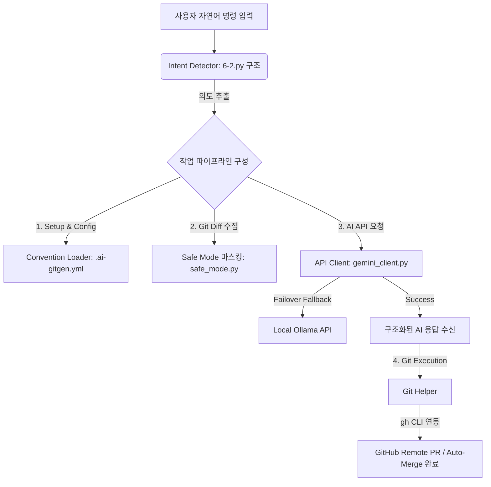

# 🤝 AI 기반 Git 커밋 & PR 자동 생성기 동료학습 보고서 (Peer Learning Report)

본 보고서는 동일한 학습 미션(AI 기반 Git 커밋 & PR 자동 생성 CLI 도구 개발)을 수행한 **나(me)**와 **동료(friend)**의 작업물을 상세히 비교하고 분석한 학습 자료입니다. 아키텍처, AI API 설계, 보안 마스킹 로직, 그리고 Git 흐름 제어 등 각 영역의 장단점을 대조하고, 이를 결합한 궁극적인 **Best Practice** 설계를 도출하여 시너지를 내는 동료학습을 목적으로 작성되었습니다.

---

## 1. 프로젝트 개요 및 학습 목표
두 프로젝트 모두 **개발자의 Git 작업 생산성을 높이기 위해 AI를 결합한 CLI 도구**를 지향하고 있습니다. 

*   **나의 프로젝트 (`me`)**: 구조적 설계와 설정 유연성, 환경 셋업의 견고함에 초점을 맞추어 **실제 팀 프로젝트 환경에 즉시 적용 가능한 생산성 도구**를 지향합니다.
*   **동료의 프로젝트 (`friend`)**: 깃허브 원격 연동의 완전 자동화와 자연어 인터페이스에 초점을 맞추어 **대화형으로 막힘없는 Git 파이프라인**을 제공하는 데 강점이 있습니다.

---

## 2. 아키텍처 및 디렉토리 구조 비교

두 작업물은 코드 구조화 수준과 설계 지향점에서 극명한 차이를 보입니다.

### 📊 아키텍처 요약 비교표

| 비교 항목 | 나의 코드 (`me`) | 동료의 코드 (`friend`) |
| :--- | :--- | :--- |
| **디렉토리 구조** | 모듈화 패키지 구조 (`gitgen` 패키지 분리) | 단일 파일 스크립트 구조 ([6-2.py](file:///Users/f22losophysics1091/Desktop/check/friend/6-2.py)) |
| **의존성 관리** | `requirements.txt` + `setup.sh` 자동 가상환경 빌드 | 개별 환경 수동 설치 유도 |
| **주요 장점** | 높은 가독성, 우수한 유지보수성 및 확장성, 협업 용이 | 단일 파일 배포 및 빠른 실행 편의성 |
| **주요 단점** | 상대적으로 파일 개수가 많아 초기 구조 파악 필요 | 코드가 길어져(800+ lines) 스파게티 코드 위험성 존재 |

### 📂 디렉토리 구조 대조

#### 나의 구조 (`me`)
로직별로 단일 책임을 부여하여 모듈로 분리하였습니다.
```text
me/
├── main.py                 # CLI 진입점 및 흐름 제어
├── setup.sh                # 파이썬 가상환경 자동 빌드 스크립트
├── requirements.txt        # 필요 의존성 패키지 명시
├── ai-gitgen.yml           # 팀 컨벤션 설정 파일
└── gitgen/                 # 핵심 비즈니스 로직 패키지
    ├── __init__.py
    ├── config.py           # YAML 설정 로더
    ├── gemini_client.py    # Google Gemini API 클라이언트
    ├── git_helper.py       # Git 명령 실행 도구
    ├── prompt_templates.py # 프롬프트 템플릿 모음
    └── safe_mode.py        # 민감 정보 필터링 및 전송 제한
```

#### 동료의 구조 (`friend`)
모든 구성 요소를 하나의 파일에 집약하여 배포성을 높였습니다.
```text
friend/
└── 6-2.py                  # CLI, Git 제어, API 연동, 자연어 처리 통합 스크립트
```

> [!NOTE]
> **아키텍처 관점 분석**  
> `me`는 객체지향 및 모듈화 원칙에 충실하여 확장성이 높고, 특정 로직(예: 마스킹 룰)을 수정할 때 독립된 모듈([safe_mode.py](file:///Users/f22losophysics1091/Desktop/check/me/gitgen/safe_mode.py))만 변경하면 되므로 협업에 매우 적합합니다. 반면, `friend`의 구조는 프로토타입 작성에는 유용하나 코드가 비대해질수록 유지보수 비용이 급증할 우려가 있습니다.

---

## 3. 핵심 기능별 기술 심층 비교

### A. AI API 연동 및 예외 처리

AI 모델 호출의 설계적 접근과 네트워크 예외 상황을 처리하는 방식에서 큰 기술적 차이가 존재합니다.

#### 1) 나의 구현: Google Gemini REST API 직접 연동 & 상세 에러 핸들링
*   **특징**: 별도의 프레임워크 라이브러리 없이 표준 라이브러리인 `urllib.request`만을 사용하여 Google Gemini REST API 서버에 직접 요청을 보냅니다. 또한, `thinkingConfig` 옵션을 활용하여 Gemma 4 모델의 사고 수준(thinking budget)을 세부 조절할 수 있습니다.
*   **코드 분석 ([gemini_client.py:L109-130](file:///Users/f22losophysics1091/Desktop/check/me/gitgen/gemini_client.py#L109-L130))**:
    ```python
    except urllib.error.HTTPError as e:
        # 오류 발생 시 구글 API 응답 JSON에서 code, status, message를 추출하여 담백하게 보여줍니다.
        error_code = e.code
        error_status = "UNKNOWN_ERROR"
        error_message = e.reason
        
        try:
            error_body = e.read().decode('utf-8')
            error_json = json.loads(error_body)
            if "error" in error_json:
                err_detail = error_json["error"]
                error_code = err_detail.get("code", error_code)
                error_status = err_detail.get("status", error_status)
                error_message = err_detail.get("message", error_message)
        except Exception:
            pass
            
        print("[ERROR] API HTTP 오류가 발생하였습니다.")
        print(f"        상태 코드(Code): {error_code}")
        print(f"        에러 유형(Status): {error_status}")
        print(f"        상세 내용(Message): {error_message}")
        sys.exit(1)
    ```

#### 2) 동료의 구현: SAKANA API → 로컬 Ollama 자동 폴백 (Fallback) 체인
*   **특징**: 상용 클라우드 API(Sakana AI) 호출에 실패하거나 API 키가 유효하지 않은 경우, 로컬 환경에서 구동 중인 Ollama API로 자동으로 폴백하여 오프라인 환경에서도 무중단으로 서비스가 작동하도록 설계했습니다.
*   **코드 분석 ([6-2.py:L230-265](file:///Users/f22losophysics1091/Desktop/check/friend/6-2.py#L230-L265))**:
    ```python
    def call_ai(
        system_prompt: str,
        user_message: str,
        model: str = DEFAULT_MODEL,
        temperature: float = DEFAULT_TEMPERATURE,
        max_tokens: int = DEFAULT_MAX_TOKENS,
    ) -> str:
        # 1차: Sakana API
        try:
            result = call_sakana_api(system_prompt, user_message,
                                     model=model, temperature=temperature, max_tokens=max_tokens)
            return result
        except RuntimeError as e:
            sakana_err_msg = str(e)
            print(f"  [WARN] Sakana API 실패: {sakana_err_msg}")
            print(f"  [INFO] 로컬 Ollama ({OLLAMA_MODEL})로 폴백합니다...")
    
        # 2차: 로컬 Ollama
        try:
            result = call_ollama_api(system_prompt, user_message,
                                     temperature=temperature, max_tokens=max_tokens)
            print(f"  [INFO] Ollama ({OLLAMA_MODEL}) 응답 수신 완료")
            return result
        except RuntimeError as ollama_err:
            raise RuntimeError(
                f"Sakana와 Ollama 모두 실패했습니다.\n"
                f"  - Sakana:  {sakana_err_msg}\n"
                f"  - Ollama:  {ollama_err}\n"
                "hint: 'ollama serve' 로 Ollama를 먼저 실행하세요."
            ) from ollama_err
    ```

> [!TIP]
> **API 연동 인사이트**  
> `me`는 REST API 오류 발생 시 Google API의 표준 오류 규격(`code`, `status`, `message`)을 파싱하여 디버깅 편의성을 극대화한 것이 장점입니다.  
> `friend`는 클라우드 크레딧 소진 또는 네트워크 단절에 대비한 **자동 폴백 체인(Sakana ➔ Ollama)**을 구현해 시스템의 장애 허용성(Fault Tolerance)을 획기적으로 향상시켰습니다.

---

### B. 보안 및 안전 모드 (Safe Mode) 마스킹

코드 변경 사항(`git diff`)에는 비밀번호나 개인 키와 같은 민감 정보가 포함될 위험이 매우 큽니다. 이에 대응하는 마스킹 설계에서도 차이를 보입니다.

#### 1) 나의 구현: 정밀하고 유연한 개인정보 마스킹 및 전송 제한
*   **특징**: 이메일, IP 주소, OpenAI API 키와 같은 고유 패턴 뿐만 아니라, 비밀번호 대입식(`password = "..."`)을 정확하게 감지하여 문자열 길이에 따라 앞자리 일부만 보존하고 나머지를 `*` 기호로 치환하는 디테일을 갖추었습니다. 또한 최대 전송 라인을 파라미터화(`max_lines`)하여 과다한 토큰 낭비를 차단합니다.
*   **코드 분석 ([safe_mode.py:L5-24](file:///Users/f22losophysics1091/Desktop/check/me/gitgen/safe_mode.py#L5-L24))**:
    ```python
    def mask_secret(match):
        """정규표현식에 매칭된 비밀번호 정보 중 일부만 남기고 마스킹합니다."""
        key = match.group(1)
        val = match.group(2)
        
        if len(val) > 4:
            masked_val = val[:2] + '*' * (len(val) - 2)
        else:
            masked_val = '****'
            
        if ':' in match.group(0):
            delimiter = ':'
        else:
            delimiter = '='
            
        return f'{key}{delimiter}"{masked_val}"'
    ```

#### 2) 동료의 구현: 다양한 패턴의 일괄 `[MASKED]` 치환
*   **특징**: 정규 표현식을 사용하여 Base64 인코딩으로 추정되는 40자 이상의 긴 토큰형 문자열 및 API 키 등을 `[MASKED]`로 일괄 치환합니다.
*   **코드 분석 ([6-2.py:L63-69](file:///Users/f22losophysics1091/Desktop/check/friend/6-2.py#L63-L69))**:
    ```python
    SAFE_MODE_PATTERNS = [
        r"(?i)(password|passwd|pwd)\s*=\s*\S+",
        r"(?i)(api[_-]?key|apikey|secret|token)\s*=\s*\S+",
        r"(?i)(auth|credential)\s*=\s*\S+",
        r"[A-Za-z0-9+/]{40,}={0,2}",          # base64-like 긴 문자열
        r"(?i)Bearer\s+[A-Za-z0-9\-._~+/]+=*",
    ]
    ```

> [!IMPORTANT]
> **보안성 비교 요약**  
> *   **패턴 범위**: `friend`는 Base64형의 긴 문자열(`[A-Za-z0-9+/]{40,}`)까지 탐지 범위를 넓게 가져간 점이 우수합니다.
> *   **마스킹 품질**: `me`는 비밀번호의 경우 최소한의 흔적(앞 2글자)을 남겨 디버깅 정보를 일부 보존하되, IP 주소(`***.***.***.***`)나 이메일(`***@***.***`)의 구조를 마스킹하여 유출을 확실히 막는 점이 정밀합니다. 또한 `max_lines`를 통해 대량의 파일 추가 시 토큰 비용 폭탄을 물리적으로 제어합니다.

---

### C. Git 자동화 및 자연어 인터페이스

AI가 작성한 결과물을 어떻게 실제 Git 저장소에 반영할 것인가에 대한 사용자 경험(UX) 관점의 설계 대조입니다.

#### 1) 나의 구현: 팀 컨벤션 기반 대화형 흐름
*   **특징**: `.ai-gitgen.yml` 설정 파일에서 Prefix 룰과 요구사항을 읽어와 프롬프트에 동적으로 반영합니다. 로컬 CLI 인터페이스에서 `git add` 유무를 정교하게 감지하고 사용자에게 의사를 묻는 대화형 파이프라인을 지원합니다.
*   **코드 분석 ([main.py:L125-131](file:///Users/f22losophysics1091/Desktop/check/me/main.py#L125-L131))**:
    ```python
    # Unstaged 변경 사항이 있을 경우 사용자에게 staging 여부를 물어봅니다.
    if has_unstaged_changes():
        user_input = input("unstaged 변경 사항이 있습니다. 모두 stage(git add .)하고 진행할까요? (y/n): ").strip().lower()
        if user_input == 'y' or user_input == 'yes':
            git_add_all()
            just_staged = True
        else:
            staged_only = True
    ```

#### 2) 동료의 구현: 자연어 의도 분석 & GitHub CLI 연동 완전 자동화
*   **특징**: 단순 커밋 메시지 출력을 넘어 **자연어 분석**을 수행하여 사용자의 의도(Intent)를 분석하고, `gh CLI`를 연동하여 Pull Request 생성 및 병합(Merge)까지 끝단 자동화를 구현했습니다.
*   **코드 분석 - 자연어 의도 분석 ([6-2.py:L476-499](file:///Users/f22losophysics1091/Desktop/check/friend/6-2.py#L476-L499))**:
    ```python
    def detect_intents(prompt: str) -> list[str]:
        """자연어 프롬프트에서 수행할 git 작업 목록을 순서대로 반환한다."""
        p = prompt.lower()
        intents: list[str] = []
        
        # full 키워드가 있으면 전체 플로우
        for kw in INTENT_KEYWORDS["full"]:
            if kw in p:
                return ["stage", "commit", "push", "pr"]
    
        for action in ["branch", "stage", "commit", "push", "pr"]:
            for kw in INTENT_KEYWORDS[action]:
                if kw in p:
                    if action not in intents:
                        intents.append(action)
                    break
        ...
        return intents
    ```
*   **코드 분석 - gh CLI PR 및 자동 머지 ([6-2.py:L394-420](file:///Users/f22losophysics1091/Desktop/check/friend/6-2.py#L394-L420))**:
    ```python
    def do_create_pr(repo: str, title: str, body: str, base: str = "main") -> None:
        result = subprocess.run(
            ["gh", "pr", "create", "--title", title, "--body", body, "--base", base],
            capture_output=True, text=True, cwd=repo,
        )
        # 생략 ... PR 생성 후 자동으로 머지 수행
        pr_url = result.stdout.strip()
        print(f"  ✓ PR 생성 완료 → {pr_url}")
        _auto_merge_pr(repo, pr_url, base)
    ```

> [!IMPORTANT]
> **Git 및 자동화 흐름 분석**  
> `me`는 **협업을 위한 룰 관리**가 우수합니다. 팀 컨벤션을 YAML 파일로 관리하므로 일관된 Git 커밋 품질을 유도할 수 있습니다.  
> `friend`는 **1인 개발 생산성 극대화**에 적합합니다. "커밋 푸시 PR 다 해줘" 한마디로 브랜치 생성, 스테이징, 커밋, 푸시, PR 발송, 자동 머지, 원본 브랜치 최신화까지 한 방에 끝냅니다. 이 자연어 의도 기반 체이닝 기술은 매우 창의적입니다.

---

### D. 개발 환경 및 설치 편의성

초기 실행 환경 구축 시 유연성을 제공하는 부분에 대한 분석입니다.

#### 나의 구현 (`me`): setup.sh 자동화 가상환경 구축
*   **특징**: 전역 패키지 설치 권한이 없는 환경(예: 교육장 공용 PC)을 고려하여 시스템 내 적합한 파이썬 버전을 자동 판별하고, 가상환경(`.venv`) 활성화 시 발생할 수 있는 Alias 문제를 스크립트 패치로 우회하는 등 고도의 인프라 셋업 스크립트([setup.sh](file:///Users/f22losophysics1091/Desktop/check/me/setup.sh))를 제공합니다.
*   **동료의 구현 (`friend`)**: 별도의 인프라 셋업 툴을 제공하지 않아 시스템의 글로벌 파이썬과 gh CLI 상태에 전적으로 의존하게 됩니다.

---

## 4. 동료학습 결론 및 베스트 프랙티스(Best Practice) 제안

두 프로젝트의 장점을 융합하면, **업계 최고 수준의 실무용 AI Git 자동화 도구**를 설계할 수 있습니다.

### 🌟 두 작업물의 시너지를 결합한 Best Practice 아키텍처 제안



### 💡 상호 보완 핵심 벤치마킹 포인트

1.  **동료가 나에게 배울 점 (To Friend)**:
    *   **코드 구조 개선**: 단일 파일 [6-2.py](file:///Users/f22losophysics1091/Desktop/check/friend/6-2.py)를 `me` 프로젝트처럼 `gemini_client`, `git_helper`, `safe_mode` 모듈로 재구조화하여 유지보수성을 확보해야 합니다.
    *   **컨벤션의 동적 적용**: 프롬프트의 요구사항을 하드코딩하지 말고 `.ai-gitgen.yml` 같은 설정 파일로부터 읽어오도록 개선하여 팀별 컨벤션 유연성을 제공해야 합니다.
    *   **안전한 환경 셋업**: 로컬 환경 변수 꼬임이나 권한 차단을 방어하는 [setup.sh](file:///Users/f22losophysics1091/Desktop/check/me/setup.sh) 구축 방식을 도입해야 합니다.

2.  **내가 동료에게 배울 점 (To Me)**:
    *   **자연어 명령 인터페이스 도입**: argparse CLI 옵션만 제공하는 것을 넘어, 동료의 `detect_intents` 로직을 흡수하여 자연어로도 Git 파이프라인을 동작시킬 수 있게 업그레이드합니다.
    *   **GitHub CLI (`gh`) 긴밀한 통합**: 커밋 작성 단계에서 멈추지 않고, 원격 리포지토리에 PR을 자동 생성하고 머지(Merge)하는 일련의 완전한 협업 워크플로우를 자동화 툴 옵션으로 제공합니다.
    *   **로컬 LLM 폴백 전략**: 오프라인 상태나 클라우드 API 호출 에러에 방어할 수 있도록 로컬 Ollama 모델 호출 코드를 연동 체인으로 탑재합니다.
