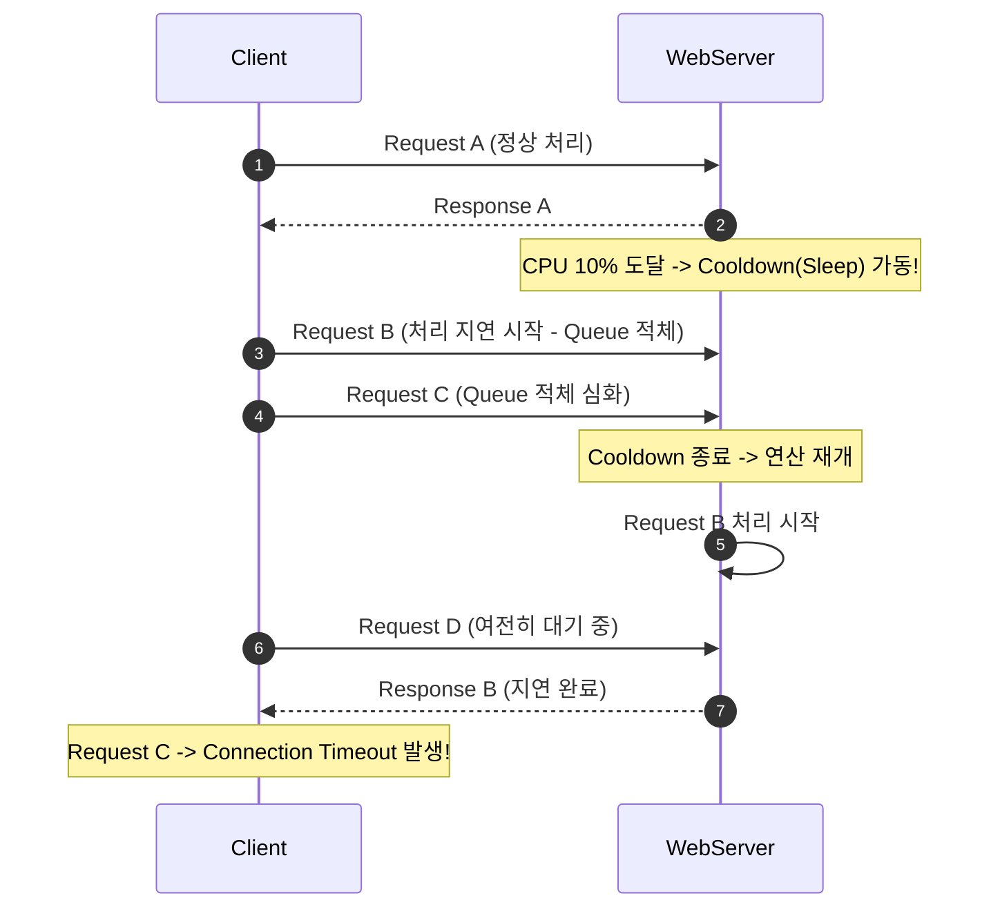

# 🗂️ 리눅스 프로세스 및 리소스 트러블슈팅 - 기술 심층 면접 리포트 (Deep-Dive Q&A)

본 문서는 `/grill-me` 인터뷰 세션을 통해 진행된 시스템 리소스 트러블슈팅 관련 핵심 질문들과 상세 피드백, 그리고 이에 대응하는 OS(운영체제) 관점의 모범 해설을 체계적으로 정리한 기술 면접 대치 서적 및 자가 진단 노트입니다.

---

## 📌 목차
1. [Q1. 메모리 관제 분석 (RSS vs VSZ)](#1-q1-메모리-관제-분석-rss-vs-vsz)
2. [Q2. CPU 아키텍처 분석 (Cooldown의 역설)](#2-q2-cpu-아키텍처-분석-cooldown의-역설)
3. [Q3. 데드락 & 라이브락 분석 (Lock Timeout & Hold and Wait 깨기)](#3-q3-데드락--라이브락-분석-lock-timeout--hold-and-wait-깨기)
4. [Q4. 스케줄링 심층 분석 (Round-Robin 타임 슬라이스의 골디락스)](#4-q4-스케줄링-심층-분석-round-robin-타임-슬라이스의-골디락스)

---

## 1. Q1. 메모리 관제 분석 (RSS vs VSZ)

### ❓ 질문
> **`monitor.sh`에서 프로세스의 메모리 누수를 확인하기 위해 추적한 수치(RSS)는 무엇이며, 가상 메모리(VSZ)와의 차이와 중요성은 무엇인가요?**

### 💡 모범 답변 및 핵심 이론
* **핵심 지표**: **RSS (Resident Set Size, 물리 메모리 상주 크기)**
* **VSZ (Virtual Memory Size, 가상 메모리 크기)**와의 차이점:
  * **VSZ**: 프로세스가 기동되거나 실행되면서 "최대 이만큼의 주소 공간을 할당할 가능성이 있으니 확보해줘"라고 OS 커널에 예약(Reservation)한 서류상의 전체 가상 메모리 크기입니다. 여기에는 공유 라이브러리 및 실제 사용되지 않고 페이징 아웃된 영역까지 전부 포함됩니다.
  * **RSS**: 해당 시점에 프로세스가 **실제 RAM(물리 메모리)에 로드하여 점유하고 있는 실제 상주 크기**입니다.

> [!IMPORTANT]
> **왜 메모리 누수 분석에서 RSS가 중요할까요?**
> 메모리 누수(Memory Leak) 결함은 사용이 끝난 Heap 영역의 객체들이 참조 관계가 해제되지 않아 GC(Garbage Collector)의 청소 대상에서 제외되고 물리 RAM을 누적해서 계속 잠식하는 현상입니다. 
> VSZ는 단순한 주소 공간의 예약이므로 실제 하드웨어 자원의 고갈을 의미하지 않지만, **RSS의 우상향 선형 증가는 실시간 물리 자원의 잠식을 의미하므로 반드시 RSS 변화 추이를 감시해야 실제 누수를 입증**할 수 있습니다.

---

## 2. Q2. CPU 아키텍처 분석 (Cooldown의 역설)

### ❓ 질문
> **CPU 과점유를 막기 위해 연산을 주기적으로 제어(Cooldown/Sleep)하는 방식이 실시간 웹 서버의 응답 속도(Latency)에 어떤 악영향을 줄 수 있으며, 이를 극복하기 위한 근본적인 아키텍처 대안은 무엇일까요?**

### ⚠️ 인터뷰 경합 피드백
> **[유저 답변 요약]**: *쿨다운이 발생하면 부하 파동이 평탄화(Smoothing)되므로 오히려 레이턴시가 균등하게 보장되어 안정성이 높아질 것이다.*

> [!WARNING]
> **시스템 관점의 팩트 체크 (Tail Latency와 Queueing 병목):**
> 단일 배치(Batch) 작업이나 백그라운드 데몬의 경우 부하 평탄화 기법이 유효할 수 있습니다. 하지만 **실시간 트래픽을 처리하는 웹 서버의 경우, CPU 연산을 인위적으로 멈추는(Sleep) 순간 매우 심각한 병목 현상이 발생합니다.**
>
> 1. **대기 큐 적체 (Queueing Delay)**: CPU가 쿨다운을 위해 연산을 멈춘(Sleep) 시간 동안에도 외부 네트워크 클라이언트의 요청은 계속 밀려옵니다. 이 요청들은 OS 소켓 백로그 큐나 애플리케이션의 이벤트 큐에 고스란히 적체됩니다.
> 2. **테일 레이턴시(Tail Latency) 급증**: 쿨다운이 끝난 직후 쌓여있던 엄청난 요청들이 일시에 CPU 처리를 요구하면서 지연 시간이 폭발적으로 늘어나며, 결국 클라이언트 측에서는 커넥션 타임아웃(Connection Timeout) 장애로 번지게 됩니다.



### 🛠️ 근본적인 아키텍처 대책
* **비동기 워커 위임 (Celery, RabbitMQ)**: CPU-bound 집약형 무거운 연산 작업은 클라이언트 요청을 직접 받는 웹 API 서버 스레드 루프 내에서 수행해서는 안 됩니다. 해당 연산을 메시지 브로커(Message Broker)를 통해 **별도의 연산 전문 분산 워커 노드**로 이관(Offloading)하고, 웹 서버는 비블로킹(Non-blocking) I/O 방식으로 빠르게 응답을 리턴하는 구조로 리팩토링해야 합니다.

---

## 3. Q3. 데드락 & 라이브락 분석 (Lock Timeout & Hold and Wait 깨기)

### ❓ 질문
> **데드락을 회피하기 위해 락 획득 타임아웃(Timeout) 기법을 적용할 때, 타임아웃을 감지한 스레드가 안전하게 물러나고 재경합 시 발생할 수 있는 라이브락(Livelock)을 예방하려면 어떤 조치가 수반되어야 할까요?**

### ⚠️ 인터뷰 경합 피드백
> **[유저 답변 요약]**: *자원 무결성을 지키기 위해 이미 점유한 자원은 그대로 유지하고, 실패한 락만 계속해서 획득할 때까지 빠른 루프(Busy Wait/Polling)로 재시도해야 한다.*

> [!CAUTION]
> **시스템 관점의 팩트 체크 (Livelock 및 영구 정체):**
> 락 획득에 실패했을 때 이미 잡고 있던 자원을 그대로 움켜쥔 채(Hold) 실패한 락만 바쁘게 계속 획득 시도(Busy Waiting)를 하게 되면 **교착상태를 전혀 해결할 수 없습니다.**
> 
> 1. **점유 대기(Hold and Wait) 유지**: Thread-1이 `Shared_Memory_A`를 쥔 상태로 `Socket_Pool_B`에 대한 락 폴링을 무한 시도하고, 동시에 Thread-2가 `Socket_Pool_B`를 쥔 채 `Shared_Memory_A`에 대한 폴링을 돌면, 두 스레드 모두 자원을 절대 양보하지 않으므로 무한 루프에 빠집니다.
> 2. **CPU 파멸**: 폴링 루프(Active Loop)가 돌면서 CPU 사용률만 100%로 치솟게 되며, 컴퓨터의 열 배출과 연산 능력이 무의미하게 낭비되는 **라이브락(Livelock)** 상태가 고착화됩니다.

### 🛠️ 근본적인 아키텍처 대책
1. **점유 대기 조건 파괴 (Release ALL on Timeout)**: 락 획득 시도 중 하나라도 타임아웃이 발생하면, **자신이 기점유하고 있던 모든 자원(락)을 즉각적이고 안전하게 완전히 반납(Release)**하고 물러나야 상대 스레드가 락을 확보하고 작업을 끝마칠 수 있습니다.
2. **무작위 백오프(Randomized Backoff)**: 락 해제 후 곧바로 재시도를 시도하면 두 스레드가 정확히 동일한 시간 간격으로 "자원 점유 ➔ 대기 ➔ 타임아웃 ➔ 락 해제 ➔ 재점유"라는 일종의 동기화된 댄스(Livelock Dance)를 무한 반복할 수 있습니다. 재시도 타이밍에 **지수 백오프 및 랜덤 지터(Randomized Jitter)**를 가미하여 타이밍을 엇갈리게 만들어 경합을 자연스럽게 해소해야 합니다.

---

## 4. Q4. 스케줄링 심층 분석 (Round-Robin 타임 슬라이스의 골디락스)

### ❓ 질문
> **라운드 로빈(Round-Robin) 알고리즘에서 타임 슬라이스(Time Quantum) 크기의 설계(너무 작거나, 너무 큰 경우)가 운영체제의 응답성과 전반적인 처리 성능에 각각 어떤 극단적인 부정적 영향을 끼칠 수 있나요?**

### 💡 모범 답변 및 핵심 이론

```text
    Time Slice 크기 극단화에 따른 운영체제적 트레이드오프
   
    [ 0에 근사 ] ------------------- [ 적정 골디락스 ] ------------------- [ 무한대에 근사 ]
          │                                 │                                    │
   문맥 교환 오버헤드 폭발                 균형 잡힌                         선착순 처리(FCFS) 화
  (CPU가 장부만 쓰다 침몰)             성능 및 응답성                  (인터랙티브 응답성 파멸)
```

* **경우 1. 타임 슬라이스가 너무 극단적으로 작은 경우 (수 마이크로초 단위)**:
  * **오버헤드 대폭발**: CPU가 실제 프로세스의 유효한 연산 작업을 진행하는 시간보다, 레지스터 상태를 PCB(Process Control Block)에 저장하고 다음 프로세스의 컨텍스트를 CPU에 로딩하는 **문맥 교환(Context Switching) 연산**에 대부분의 자원을 소모하게 됩니다. 
  * 결국 처리량(Throughput)이 0에 가깝게 폭락하는 스래싱(Thrashing)과 유사한 가상 지연에 걸립니다.
* **경우 2. 타임 슬라이스가 너무 극단적으로 큰 경우 (수 초 단위)**:
  * **독점 및 응답성 파멸**: 라운드 로빈의 본질인 '공정성'이 상실되고 선착순 방식인 **FCFS(First-Come, First-Served)와 동일하게 동작**하게 됩니다.
  * 하나의 CPU-bound 작업이 수 초 동안 코어를 독점하는 동안, 마우스 클릭 반응이나 웹 요청 같은 짧고 즉각적이어야 하는 대화형 인터랙티브 작업들이 꼼짝없이 수 초 동안 정체되어 컴퓨터 및 UI 화면이 심각하게 멈추는 느낌을 주게 됩니다.

> [!TIP]
> **골디락스(Goldilocks) 타임 슬라이스 찾기:**
> 현대 운영체제 커널(Linux CFS 등)은 단순히 고정된 수치를 적용하는 대신, 시스템 부하와 프로세스 우선순위(Nice)에 따라 타임 슬라이스의 길이를 동적으로 조절하여 **문맥 교환 비용 비율이 전체 CPU 연산의 1% 미만이 되도록 유지하는 최적화 알고리즘**을 사용합니다.
