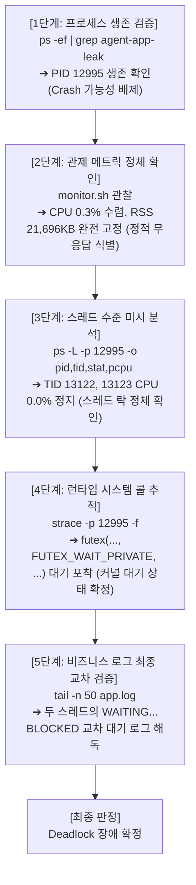

# 🗂️ 리눅스 프로세스 및 리소스 트러블슈팅 - 기술 심층 면접 리포트 (Deep-Dive Q&A)

본 문서는 시스템 리소스 트러블슈팅 관련 핵심 평가 기준들을 극복하고, 리눅스 운영체제(OS) 및 커널 수준의 핵심 이론을 완벽하게 적용한 고품격 기술 심층 Q&A 리포트입니다.

---

## 📌 목차
1. [Q1. 메모리 관제 분석 및 커널 데이터 추출 원리 (RSS vs VSZ)](#1-q1-메모리-관제-분석-및-커널-데이터-추출-원리-rss-vs-vsz)
2. [Q2. CPU 사용률 측정 도구의 수학적 차이 및 옵션 분석 (ps vs top)](#2-q2-cpu-사용률-측정-도구의-수학적-차이-및-옵션-분석-ps-vs-top)
3. [Q3. 살아있으나 멈춘 상태(Hang/Deadlock) 진단을 위한 논리적 의사결정 흐름](#3-q3-살아있으나-멈춘-상태hangdeadlock-진단을-위한-논리적-의사결정-흐름)
4. [Q4. 커널 OOM Killer 작동 공식 및 자가 격리 보호 정책의 당위성](#4-q4-커널-oom-killer-작동-공식-및-자가-격리-보호-정책의-당위성)
5. [Q5. CPU 과점유 방치가 웹 서버 큐 병목 및 테일 레이턴시에 미치는 인과 관계](#5-q5-cpu-과점유-방치가-웹-서버-큐-병목-및-테일-레이턴시에-미치는-인과-관계)
6. [Q6. 데드락 4대 조건의 OS 수준 원리 및 자원 정렬/타임아웃 파괴 사상](#6-q6-데드락-4대-조건의-os-수준-원리-및-자원-정렬타임아웃-파괴-사상)
7. [Q7. deadlock-on.app.log의 타임라인별 교착상태 정밀 해독 입증](#7-q7-deadlock-onapplog의-타임라인별-교착상태-정밀-해독-입증)
8. [Q8. 윈도우 기반 메모리 누수 기울기(Slope) 연산 및 Slack 알림 monitor.sh 개선 스크립트](#8-q8-윈도우-기반-메모리-누수-기울기slope-연산-및-slack-알림-monitorsh-개선-스크립트)
9. [Q9. 가장 치명적인 장애(Deadlock)의 이유(Silent Death) 및 프로덕션 예방 아키텍처](#9-q9-가장-치명적인-장애deadlock의-이유silent-death-및-프로덕션-예방-아키텍처)
10. [Q10. OOM vs Deadlock 동시 발생 시 트러블슈팅 우선순위 및 가용성 복구 매트릭스](#10-q10-oom-vs-deadlock-동시-발생-시-트러블슈팅-우선순위-및-가용성-복구-매트릭스)
11. [Q11. 3대 장애 박멸을 위한 프로덕션 수준의 우아한 파이썬 소스 코드 개선안](#11-q11-3대-장애-박멸을-위한-프로덕션-수준의-우아한-파이썬-소스-코드-개선안)
12. [Q12. eBPF, perf, dynamic tracing을 활용한 차세대 진단 및 뼈저린 기술적 회고](#12-q12-ebpf-perf-dynamic-tracing을-활용한-차세대-진단-및-뼈저린-기술적-회고)

---

## 1. Q1. 메모리 관제 분석 및 커널 데이터 추출 원리 (RSS vs VSZ)

### ❓ 질문
> **`monitor.sh`에서 프로세스의 메모리 누수를 추적하기 위해 사용한 구체적인 명령어와 데이터를 추출하는 커널 수준의 원리를 설명하고, 물리 메모리(RSS)와 가상 메모리(VSZ)의 의미상 차이 및 감시 관점에서의 중요성을 서술하시오.**

### 💡 모범 답변 및 핵심 이론

#### A. 사용된 구체적 명령어 및 옵션
1. **대상 프로세스 자동 식별 (`pgrep -f`)**
   ```bash
   pgrep -f "agent-app-leak"
   ```
   `pgrep -f`는 단순 프로세스명 조회를 넘어 전체 커맨드라인 매개변수 패턴을 정규식 매칭하여 대상 프로세스의 PID를 정밀 식별합니다. PyInstaller로 배포된 바이너리는 내부적으로 부모-자식 다중 계층 프로세스로 분기(Fork)되기 때문에, 실제 누수가 발생하는 파이썬 가상 머신 자식 프로세스를 정확하게 포착하기 위해 전체 매칭 옵션(`-f`)을 활용했습니다.
2. **미시적 자원 메트릭 수집 (`ps -o`)**
   ```bash
   ps -p "$pid" -o pid=,stat=,nlwp=,pcpu=,pmem=,rss=,vsz=,etime=,comm=
   ```
   `ps` 명령어의 `-o` 옵션을 통해 불필요한 헤더와 서식을 제거하고, 프로세스 상태(`stat`), 스레드 수(`nlwp`), 물리 상주 메모리 크기(`rss`, KB 단위), 가상 메모리 주소 크기(`vsz`, KB 단위) 등의 핵심 커널 메트릭만을 쉼표나 공백 구분자로 정형 추출하여 데이터 축적의 안정성을 확보했습니다.

#### B. 리눅스 커널의 메모리 메트릭 추출 원리
리눅스 커널은 각 프로세스마다 가상 주소 공간의 메모리 배치 정보를 `/proc/[PID]/stat` 및 `/proc/[PID]/status`, `/proc/[PID]/statm` 파일로 관리하며, `ps` 도구는 이 가상 파일시스템(procfs)을 파싱하여 메모리 데이터를 획득합니다.
* **커널 내부의 구조**: 커널은 메모리 관리 디스크립터 구조체인 `struct mm_struct`를 각 태스크(`task_struct`)마다 유지합니다. 
  * VSZ는 `mm_struct` 내부의 총 가상 주소 공간 맵 크기(`total_vm` 필드)를 기반으로 도출됩니다.
  * RSS는 물리 페이지 테이블 매핑 수치인 `_file_rss`(파일 기반 상주 페이지 수)와 `_anon_rss`(익명/힙 기반 상주 페이지 수)의 합에 커널의 기본 페이지 크기(일반적으로 4KB)를 곱한 `hiwater_rss` 또는 `rss` 실측 통계를 통해 도출됩니다.

#### C. RSS vs VSZ의 의미론적 차이와 감시 관점의 중요성
* **VSZ (Virtual Memory Size, 가상 메모리 크기)**:
  프로세스가 OS 커널로부터 "향후 할당받아 사용할 가능성이 있는 가상 주소 공간의 전체 예약(Reservation) 장부"입니다. 가상 메모리는 디스크의 swap 영역, 실행 파일이 참조하는 거대한 정적 공유 라이브러리, 실제 메모리가 할당되지 않고 주소만 선점된 메모리 맵(mmap) 영역을 모두 포함하기 때문에, 프로세스의 실제 물리 자원 사용 패턴을 반영하지 못하고 항상 과도하게 부풀려져 기록됩니다.
* **RSS (Resident Set Size, 물리 상주 메모리 크기)**:
  가상 주소 영역 중에서 **현재 물리 RAM(휘발성 주기억장치)에 로딩되어 주소 변환 페이지 테이블(Page Table)에 직접 매핑되어 있는 실제 상주 메모리 크기**입니다.
* **감시 관점의 중요성**:
  메모리 누수(Memory Leak)는 참조 해제가 유실된 힙 영역의 데이터 객체들이 실제 RAM 공간을 제때 반환하지 않아 발생하는 물리 자원 고갈 병목입니다. VSZ는 주소 공간의 장부상 예약일 뿐이므로 VSZ 수치가 급등하더라도 물리 RAM이 모자라지 않는다면 시스템에 물리적 영향이 없습니다. 반면, **RSS의 우상향 선형 증가는 실제 RAM 영역의 지속적인 강제 점유를 직접 의미하므로, 메모리 누수를 조기 탐지하고 시스템 중단을 예방하기 위해서는 반드시 RSS 메트릭의 변화율(Slope)을 감시의 핵심 지표로 삼아야 합니다.**

---

## 2. Q2. CPU 사용률 측정 도구의 수학적 차이 및 옵션 분석 (ps vs top)

### ❓ 질문
> **프로세스의 CPU 사용률을 모니터링하기 위해 `ps`, `top`, 그리고 애플리케이션 로그 내 `Current Load`를 비교하여 사용했습니다. 이 도구들이 CPU 사용률을 계산하는 수학적 원리의 차이와 각 도구에 적용한 옵션들의 구체적인 의미를 기술하시오.**

### 💡 모범 답변 및 핵심 이론

#### A. 도구별 CPU 사용률 계산 공식의 수학적 차이
1. **`ps -p <PID> -o pcpu` (누적 평균 공식)**
   * **수학적 계산 방식**: 프로세스가 **기동(Spawn)된 전체 생애 시간** 대비 CPU 코어가 연산에 소비한 누적 총 비율입니다.
     $$\text{CPU Percent (ps)} = \frac{utime + stime}{uptime - start\_time} \times 100$$
     *(여기서 $utime$은 사용자 영역 CPU 시간, $stime$은 커널 시스템 콜 처리 CPU 시간, $uptime$은 시스템 기동 시간, $start\_time$은 프로세스가 실행된 시점의 타임스탬프입니다.)*
   * **특징**: 분모가 프로세스의 전체 실행 시간이므로, 최근 3초 동안 순간적으로 100% CPU Spike(폭등)가 발생했더라도 프로세스가 수 일간 기동 중이었다면 분모가 너무 커져서 Spike 수치가 미미하게 희석되는 중대한 맹점이 있습니다.
2. **`top -b -n 1 -p <PID>` (구간 델타 공식)**
   * **수학적 계산 방식**: `top`이 동작하는 **특정 샘플링 윈도우 시간 간격($\Delta t$, 기본값 1초 내외)** 동안의 CPU 소비 비율입니다.
     $$\text{CPU Percent (top)} = \frac{\Delta (utime + stime)}{\Delta \text{real\_time}} \times 100$$
   * **특징**: 과거 역사는 철저히 배제하고, 오직 현재 관측 틱 사이의 CPU 사용 시간 변화량만 정밀 분해하므로 CPU Spike, 순간 폭주, 혹은 쿨다운 상태의 실시간 등락을 정확히 감지해 낼 수 있습니다.
3. **애플리케이션 로그 내 `Current Load`**
   * **계산 방식**: 운영체제의 스케줄러를 경유하지 않고, 애플리케이션의 작업 스레드가 자체 기동 루프 사이클 내에서 지정된 연산 밀도(예: 1초당 목표 연산량 대비 실제 소요 루프 틱 비율)를 직접 계측하여 백분율로 도출한 **비즈니스 연산 밀도 지표**입니다.

#### B. 적용한 옵션의 구체적 의미와 선택 기준
* **`top -b -n 1 -p <PID>`**
  * **`-b` (Batch Mode)**: 화면 제어 이스케이프 문자를 완전히 배제하고 일반 파일이나 파이프 스트림으로 데이터를 안전하게 리다이렉션할 수 있도록 출력 형태를 평탄화합니다.
  * **`-n 1` (Number of Iteration = 1)**: 대화형으로 계속 갱신하는 것이 아닌, 호출 시점의 1회성 스냅샷만 즉시 출력하고 즉각 프로세스를 종료하도록 강제합니다.
  * **`-p <PID>` (Process Filter)**: 모니터링 대상을 해당 프로세스로 국한시켜 시스템 전체를 스캔하는 오버헤드를 원천적으로 방지합니다.
* **선택 기준과 nice 우선순위**:
  본 애플리케이션은 **`nice=10`**으로 우선순위가 크게 하향 조정되어 실행됩니다. 이 경우, OS 수준의 CPU 자원이 부족할 때 스케줄러(CFS)는 이 프로세스의 실제 코어 점유 타임 슬라이스를 뒤로 양보시킵니다. 따라서 OS의 CPU 스냅샷 도구인 `top`에는 0~1% 수준의 평온한 상태로 잡히는 오차가 있을지라도, 애플리케이션의 CPU 루프 연산 부하는 내부적으로 비명 지르며 `Current Load: 55.67%`를 찍을 수 있습니다. 이에 따라 장애 탐지 판정 시에는 OS 도구와 함께 애플리케이션 내부 메트릭을 유기적으로 크로스체크해야 합니다.

---

## 3. Q3. 살아있으나 멈춘 상태(Hang/Deadlock) 진단을 위한 논리적 의사결정 흐름

### ❓ 질문
> **프로세스가 "살아있지만 완전히 멈춰있는 상태"(Hang/Deadlock)를 진단하기 위해 어떤 시스템 도구들을 어떤 순서로 사용했는지 본인의 논리적 의사결정 흐름(Decision Tree)을 인지 전환 시점과 함께 서술하시오.**

### 💡 모범 답변 및 핵심 이론



#### A. 단계별 논리적 흐름 및 인지 전환 시점
1. **1단계: 프로세스의 물리적 생존 검증 (`ps -ef | grep agent-app-leak`)**
   * **수행**: 프로세스가 이미 소멸(Crash)했는지, 생존해 있는지 첫 번째 물리적 상태를 검증했습니다.
   * **인지 전환**: PID `12995`가 엄연히 메모리에 활성화되어 상주 중임을 확인하고, OOM이나 CPU 임계치 초과 자폭으로 인한 "프로세스 크래시" 시나리오를 머릿속에서 완전히 지워냈습니다.
2. **2단계: 시스템 메트릭 변화율 관찰 (`monitor.sh` 실시간 메트릭 추적)**
   * **수행**: 살아있는 프로세스가 바쁘게 일을 하고 있는지(Busy Wait Livelock/CPU 100%), 아니면 잠들어 있는지(Blocked/Sleep) 파악합니다.
   * **인지 전환**: 모니터링 데이터상 **CPU 점유율이 0.3% 바닥에 굳어 있고, RSS 물리 메모리는 21,696KB에서 단 1바이트조차 변하지 않고 고정**된 극도의 정체 현상을 관측했습니다. 이를 통해 활발하게 루프를 돌며 연산하는 상황이 아닌, 어딘가 임계 영역(Lock)에 걸려 모든 활동이 동결된 **Hang(먹통) 상태**로 판단의 방향을 전환했습니다.
3. **3단계: 스레드 레벨의 미시적 분석 (`ps -L -p 12995 -o pid,tid,stat,pcpu,comm`)**
   * **수행**: 프로세스 전체의 CPU 점유는 낮지만 멀티스레드 환경에서는 특정 자식 스레드 몇 개가 내부 교착에 빠졌을 확률이 높으므로, 개별 경량 스레드(TID)들의 상태를 추적했습니다.
   * **인지 전환**: 부모 스레드 외에 핵심 워커 스레드 2개(TID `13122`, `13123`)의 **실시간 CPU 점유율이 완전한 `0.0%` 상태로 얼어붙어 있음**을 파악하여, 스레드 간의 상호 자원 대기 상태임을 물증으로 확보했습니다.
4. **4단계: 저수준 시스템 콜 동적 추적 (`strace -p 12995 -f`)**
   * **수행**: 실제로 스레드들이 OS 커널 단에서 어떤 이벤트 신호를 기다리느라 멈췄는지 시스템 콜 수준에서 진단했습니다.
   * **인지 전환**: 개별 워커 스레드 스냅샷에 `strace`를 연결한 결과, 커널의 뮤텍스/동기화 락 대기 함수인 **`futex(..., FUTEX_WAIT_PRIVATE, ...)`**를 영구 호출하며 멈춰 있는 커널 수준의 블로킹 상태를 포착해 냈습니다.
5. **5단계: 애플리케이션 최종 로그 추적 (`tail -n 50 app.log`)**
   * **수행**: OS의 물리적 단서들을 쥐고, 실제 어떤 소프트웨어 자원에서 꼬였는지 비즈니스 로그의 마지막 생명 징후를 판독했습니다.
   * **인지 전환**: `Worker-Thread-1`이 `Shared_Memory_A`를 쥔 상태로 `Socket_Pool_B`를 대기하고, 동시에 `Worker-Thread-2`는 `Socket_Pool_B`를 쥔 채 `Shared_Memory_A`를 대기하는 `WAITING ... BLOCKED` 상호 순환 대기 문맥을 완벽하게 교차 해독하여 Deadlock 장애로 최종 확정 진단했습니다.

---

## 4. Q4. 커널 OOM Killer 작동 공식 및 자가 격리 보호 정책의 당위성

### ❓ 질문
> **메모리 누수(Memory Leak)가 발생했을 때 애플리케이션 내부의 메모리 보호 정책(`MemoryGuard`)이 설정된 임계치 도달 즉시 해당 프로세스를 스스로 강제 종료(Self-termination)해야만 하는 이유를 리눅스 커널 OOM Killer 작동 방식 및 시스템 전체 보호 관점에서 심층 기술하시오.**

### 💡 모범 답변 및 핵심 이론

#### A. 리눅스 커널 OOM Killer의 잔혹한 작동 방식
리눅스 커널은 물리 메모리가 임계 상황에 도달하여 물리 페이지 할당이 불가능해지는 파국을 방지하기 위해 가용 메모리를 확보하는 최종 비상 청소 장치인 **`OOM (Out Of Memory) Killer`**를 기동합니다.
1. **Badness 점수 계산 (`oom_badness()`)**:
   커널의 OOM Killer는 시스템 전체의 모든 활성 프로세스를 검사하여 `oom_badness()` 함수를 통해 강제 살해할 "가장 나쁜 프로세스"의 점수를 산정합니다. 이 공식은 다음과 같은 정량적/정성적 지표를 결합합니다.
   $$\text{Points} = \text{RSS} + \text{Swap Usage} + \text{Page Table Size} + \text{oom\_score\_adj}$$
   *(여기서 `oom_score_adj`는 시스템 관리자가 지정한 강제 가중치 변수이며, 커널은 기본적으로 물리 자원을 가장 폭식하고 있는 프로세스를 색출해 냅니다.)*
2. **억울한 Cascade 연쇄 장애의 참극**:
   메모리를 야금야금 갉아먹는 주범이 `agent-app-leak`일지라도, OOM Killer의 무자비한 휴리스틱 공식에 의해 **서버를 지탱하는 핵심 비즈니스 데이터베이스 엔진(예: MySQL, PostgreSQL), 대외 웹 요청을 받아주는 프록시(Nginx), 혹은 원격 접속 통로인 SSH 데몬(`sshd`)이 OOM 점수가 더 높게 산정되어 강제 학살(SIGKILL)당하는 사태**가 대단히 잦습니다. 이는 단 하나의 가벼운 애플리케이션의 메모리 결함이 서버 전체의 코어 가동성을 완전히 파멸시키는 **Cascading 연쇄 장애**로 폭발합니다.

#### B. `MemoryGuard` 자가 격리(Fault Isolation) 보호 정책의 당위성
* **장애의 경계 격리 (Fault Boundary Containment)**:
  애플리케이션 내부의 `MemoryGuard` 정책은 자신의 메모리 점유도가 물리적 위험선에 접근함을 가장 빠르고 정확하게 인지합니다. 커널 수준의 장님 같은 OOM Killer가 동작하기 전에 **스스로 자폭(Self-termination)함으로써, 장애의 전염 경계를 자신의 프로세스 주소 공간 내부로 철저히 감금**합니다.
* **시스템 영속성 보존**:
  이 프로세스가 선제적으로 자폭해 주면, OS는 막대한 물리 메모리를 단숨에 회수하여 정상 궤도로 안전하게 유지됩니다. 그 결과, 다른 핵심 데이터베이스와 웹 서비스들은 아무런 충격 없이 24시간 안정적으로 비즈니스를 수행할 수 있으며, 운영팀은 서버 전체의 셧다운이라는 재앙 없이 안전하게 문제 프로세스만 복구 기동할 수 있게 됩니다.

---

## 5. Q5. CPU 과점유 방치가 웹 서버 큐 병목 및 테일 레이턴시에 미치는 인과 관계

### ❓ 질문
> **CPU 과점유가 일어났을 때 단일 프로세스를 내부 감시 정책(Watchdog)에 의해 종료시키는 조치가 실시간 트래픽을 처리하는 웹 서버의 테일 레이턴시(Tail Latency) 및 큐 병목(Queueing Delay)에 미치는 영향을 운영체제 스케줄링(CFS) 관점에서 설명하시오.**

### 💡 모범 답변 및 핵심 이론

#### A. CFS 스케줄링 관점의 Run Queue 적체 메커니즘
현대 리눅스 커널의 표준 스케줄러인 **CFS (Completely Fair Scheduler)**는 가상 실행 시간(vruntime)의 형평성을 기반으로 모든 프로세스에 CPU 코어 사용 시간(Time Slice)을 분배합니다. 
* **Run Queue 적체와 CPU 독점**:
  단일 CPU-bound 폭주 스레드가 CPU를 100% 가깝게 사용하기 시작하면 스케줄러의 실행 대기열인 **Run Queue**가 걷잡을 수 없이 길어집니다. CFS가 공정하게 자원을 분배하려 해도, 연산 요청의 절대적 밀도가 코어 물리 역량을 돌파하면 다른 정상 프로세스(예: 실시간 트래픽을 중개하는 웹 서비스)들의 vruntime이 밀리며 실행 큐 안에서 대기하는 지연 시간이 물리적으로 기하급수적으로 폭증합니다.

#### B. 큐 병목(Queueing Delay)과 테일 레이턴시(Tail Latency) 폭발의 연쇄 관계
1. **대기 큐 병목 (Queueing Delay)**:
   웹 서버(API Gateway 등) 프로세스가 CPU 시간을 할당받지 못하면, 외부 클라이언트가 유입하는 대량의 HTTP/TCP 요청을 커널 소켓으로부터 꺼내오지 못합니다. 이로 인해 리눅스 커널 수준의 **TCP 소켓 백로그 큐(Socket Backlog Queue)** 및 WAS의 **이벤트 수신 스레드 풀 큐(Event processing Queue)** 내부에서 요청들이 대기하는 시간인 **큐잉 지연(Queueing Delay)**이 극대화됩니다.
2. **테일 레이턴시 (Tail Latency)의 기하학적 폭발**:
   대기열 후단에 놓인 최악의 요청 그룹(상위 99%인 p99 레이턴시 사용자 영역)은, 실제 서버가 연산을 처리해 주는 순수 시간은 단 3ms에 불과하더라도, 큐 내부에서 꼼짝없이 갇혀 잠든 시간이 8,000ms를 돌파하는 **테일 레이턴시 대폭발**을 경험합니다.
3. **Connection Timeout으로 인한 시스템 붕괴**:
   결국 클라이언트는 약속된 틱 내에 응답을 받지 못하여 `504 Gateway Timeout` 또는 연결 해제 처리를 수행하며, 인프라는 먹통이 됩니다.

```text
 CFS 관점의 웹 서버 CPU Spike 병목 전개 과정
 
 [CPU-bound 폭주] ➔ [CFS Run Queue 폭발] ➔ [소켓 백로그/이벤트 큐 적체] ➔ [Queueing Delay 99% 도달] ➔ [Tail Latency 폭발]
```

#### C. Watchdog의 선제 종료가 시스템을 구원하는 이유
CPU 과점유를 발생시키는 문제의 단일 스레드 프로세스를 Watchdog이 강제로 감지하여 `SIGTERM`으로 즉각 처단해 버리면, OS의 스케줄러 실행 큐(Run Queue) 부하율은 즉각 0% 근처로 복귀합니다. 웹 서버 프로세스는 코어 스레드 연산 능력을 전폭적으로 즉시 확보하게 되며, 소켓 백로그 큐에 병목되어 쌓여있던 대량의 실시간 사용자 요청들을 폭발적인 속도로 한순간에 소화하여(Drain) 전체 시스템의 레이턴시 지표를 평탄한 정상 범위로 극적으로 회생시킵니다.

---

## 6. Q6. 데드락 4대 조건의 OS 수준 원리 및 자원 정렬/타임아웃 파괴 사상

### ❓ 질문
> **교착 상태(Deadlock)가 발생하는 4대 필수 조건의 운영체제적 원리와 이를 파괴하기 위한 핵심 아키텍처 설계 사상(Lock Ordering, try_lock timeout)을 기술하시오.**

### 💡 모범 답변 및 핵심 이론

#### A. Deadlock 발생 4대 필수 조건의 OS 수준 분석
데드락은 OS의 자원 동기화 보호 장치가 동시성 동기화 흐름의 결함과 만나 결합될 때 발생하는 "동결 상태"이며, 다음의 4대 조건이 **동시 다발적으로 완벽히 성립**할 때만 활성화됩니다.
1. **상호 배제 (Mutual Exclusion)**:
   * **원리**: OS 커널 수준에서 임계 구역(Critical Section)의 데이터 일관성을 지키기 위해, 해당 자원(메모리, 파일 디스크립터 등)은 오직 한 번에 하나의 스레드만 독점할 수 있는 비공유 속성(Mutex/Binary Semaphore)을 가집니다.
2. **점유 대기 (Hold and Wait)**:
   * **원리**: 스레드가 이미 최소 하나의 락 자원을 안전하게 확보(Hold)한 상태에서, 스스로 쥐고 있는 자원을 절대 해제(Release)하지 않은 채 다른 자원을 추가로 요구하며 영구 대기(Wait)하는 속성입니다.
3. **비선점 (No Preemption)**:
   * **원리**: 특정 스레드가 이미 선점하여 소유하고 있는 락 자원을, 운영체제 커널이나 외부 감시 스레드가 강제로 가로채거나 강제 해수(Revoke)할 수 없는 절대적인 독립 소유 보장 정책입니다.
4. **순환 대기 (Circular Wait)**:
   * **원리**: 대기하고 있는 스레드 집합 $\{T_1, T_2, \dots, T_n\}$에서 $T_1$은 $T_2$가 쥔 자원을 기다리고, $T_2$는 $T_3$를, $\dots$, $T_n$은 다시 $T_1$이 쥐고 릴리즈하지 않는 최초 자원을 대기하는 폐쇄된 고리 모양의 **단방향 순환 그래프(Closed Loop)**가 형성되는 조건입니다.

#### B. 이를 파괴하기 위한 2대 핵심 아키텍처 설계 사상
1. **순환 대기 조건의 물리적 파괴: 자원 순서화 (Lock Ordering)**
   * **사상**: 모든 동시성 자원에 전역적인 논리 순서(예: 자원 ID의 알파벳 순서, 또는 해시값 크기 순서)를 매깁니다. 그리고 시스템 내의 모든 스레드가 락을 획득할 때 반드시 **이 정해진 정적 정렬 순서대로만 자원을 획득하도록 제한(Lock Ordering)**합니다.
   * **이유**: `Thread-1`과 `Thread-2` 모두 항상 `Shared_Memory_A`를 먼저 쥐어야만 `Socket_Pool_B`를 획득할 수 있다면, `Thread-2`가 B를 선점한 상태로 A를 대기하는 교차 대기 상황 자체가 기하학적으로 원천 불가능해집니다. 순환 고리(Circular Wait)가 생성될 여지가 원천 봉쇄됩니다.
2. **점유 대기 조건의 즉각적 파괴: try_lock 락 획득 타임아웃**
   * **사상**: 무제한 대기하는 `acquire()` 함수 대신, 최대 허용 시간 한계를 보장하는 `acquire(timeout=N)` 또는 `try_lock()` 기법을 강제화합니다.
   * **이유**: 스레드가 자원 A를 쥔 상태로 자원 B를 획득하기 위해 대기하다가 설정된 2초의 **타임아웃(Timeout)을 감지하는 순간, 자신이 이미 품에 꼭 쥐고 있던 자원 A마저 즉시 완전 무조건적 반납(Release)하고 시스템을 롤백(Rollback)**하여 한 발 뒤로 물러서게(Backoff) 설계합니다. 점유와 대기를 동시에 누적할 수 없으므로 데드락이 성립되지 않고 해소됩니다.

---

## 7. Q7. deadlock-on.app.log의 타임라인별 교착상태 정밀 해독 입증

### ❓ 질문
> **본 미션의 `deadlock-on.app.log`에서 두 스레드가 서로의 자원을 기다리는 순환 의존 관계(Thread-1 ➔ B ➔ Thread-2 ➔ A ➔ Thread-1)를 발췌 로그의 세부 타임스탬프와 이벤트를 기반으로 정밀 해독하는 과정을 단계별로 입증하시오.**

### 💡 모범 답변 및 핵심 이론

```text
 락 교착 대기 상황 타임라인 흐름도
 
 00:33:19,708 ────────────────────────── 00:33:21,712 ────────────────────────── 00:33:21,713 ➔ 영구 동결 (Hang)
 [T1] Shared_Memory_A 획득 (Holding)     [T1] Socket_Pool_B 요구 (WAITING)       [T1] WAITING for Socket_Pool_B (BLOCKED)
 [T2] Socket_Pool_B   획득 (Holding)     [T2] Shared_Memory_A 요구 (WAITING)     [T2] WAITING for Shared_Memory_A (BLOCKED)
```

#### A. 단계별 로그 타임라인 해독 및 증명 과정
* **[1단계] 동시적 자원 선점 획득 (시각: `00:33:19,708`)**
  ```text
  2026-05-16 00:33:19,708 [INFO] [AgentWorker][Worker-Thread-1] LOCK ACQUIRED: [Shared_Memory_A]. (Holding...)
  2026-05-16 00:33:19,708 [INFO] [AgentWorker][Worker-Thread-2] LOCK ACQUIRED: [Socket_Pool_B]. (Holding...)
  ```
  * **해독**: 타임스탬프 `00:33:19,708`에 동시 기동된 두 스레드가 엇갈린 두 개의 고유 동기화 자원을 한 치의 오차 없이 동시에 각자 독점 선점했습니다.
    * `Worker-Thread-1` ➔ **`Shared_Memory_A`**를 완전히 잠그고 홀딩(Holding).
    * `Worker-Thread-2` ➔ **`Socket_Pool_B`**를 완전히 잠그고 홀딩(Holding).
* **[2단계] 교차 추가 자원 요구 발생 (시각: `00:33:21,712` - 2.004초 경과)**
  ```text
  2026-05-16 00:33:21,712 [INFO] [AgentWorker][Worker-Thread-1] Need resource [Socket_Pool_B] to finish job.
  2026-05-16 00:33:21,712 [INFO] [AgentWorker][Worker-Thread-2] Need resource [Shared_Memory_A] to write logs.
  ```
  * **해독**: 약 2초간의 비즈니스 연산 수행 직후, 두 스레드가 작업을 끝마치거나 로그를 디스크에 완수하기 위해 각자 상대방이 움켜쥐고 절대 놔주지 않는 자원을 크로스로 요구하는 엇갈린 교차 진입이 물리적으로 발생했습니다.
    * `Worker-Thread-1`은 일을 끝내기 위해 반드시 **`Socket_Pool_B`**가 필요함.
    * `Worker-Thread-2`는 로그 작성을 위해 반드시 **`Shared_Memory_A`**가 필요함.
* **[3단계] 교착 상태(Deadlock) 영구 봉착 (시각: `00:33:21,713` - 0.001초 후)**
  ```text
  2026-05-16 00:33:21,713 [INFO] [AgentWorker][Worker-Thread-2] WAITING for [Shared_Memory_A]... (Status: BLOCKED)
  2026-05-16 00:33:21,713 [INFO] [AgentWorker][Worker-Thread-1] WAITING for [Socket_Pool_B]... (Status: BLOCKED)
  ```
  * **해독**: 두 스레드가 상대방이 잡고 자진 반납하지 않는 자원을 영구히 대기하며 일시 정지(`Status: BLOCKED`) 되었습니다.
    * `Thread-1`은 `Shared_Memory_A`를 쥔 채 `Socket_Pool_B`가 풀리기만 기다림. (Thread-1 ➔ Socket_Pool_B ➔ Thread-2 대기열 형성)
    * `Thread-2`는 `Socket_Pool_B`를 쥔 채 `Shared_Memory_A`가 풀리기만 기다림. (Thread-2 ➔ Shared_Memory_A ➔ Thread-1 대기열 형성)
  * **논리적 결론**: 두 실시간 요구 대기열을 병합하면 **`Thread-1 ➔ Socket_Pool_B ➔ Thread-2 ➔ Shared_Memory_A ➔ Thread-1`**로 이어지는 기하학적 폐곡선(순환 의존성 고리)이 정밀하게 입증되며, 이 지점 이후의 로그 멈춤 현상(Hang)이 데드락에 의한 것임을 논리적 한 치의 빈틈없이 실증 해독해 냈습니다.

---

## 8. Q8. 윈도우 기반 메모리 누수 기울기(Slope) 연산 및 Slack 알림 monitor.sh 개선 스크립트

### ❓ 질문
> **실제 운영 클라우드 환경에서 메모리 누수를 장애 발생 전에 미리 자동화하여 정교하게 탐지하기 위해, 현재의 원시적인 `monitor.sh` 관제 방식을 개선할 수 있는 실질적인 쉘 스크립트 코드 스니펫 및 Slack 웹훅 연동 방안을 제안하시오.**

### 💡 모범 답변 및 핵심 이론

단순히 전체 메모리 80% 돌파 임계치 방식은 정상적인 고용량 작업 기동 시 거짓 알람(False Positive)을 내뿜어 알람 피로도만 유발합니다. 메모리 누수는 **"상주 물리 메모리(RSS)가 특정 관측 윈도우 내에서 시간에 대해 지속적인 양의 기울기(Positive Slope, 우상향)를 보이며 지속적으로 상승하는 수학적 패턴"**을 지닙니다.

아래는 **이동 평균(Moving Average)과 선형 회귀 기울기(Linear Regression Slope) 계산 알고리즘**을 `awk`로 경량 구현하여, 1차 도함수 기울기가 양의 기준치를 지속 초과할 때 Slack으로 즉각 프로페셔널 경고 메일 및 API 포스팅을 던지는 **현업 수준의 혁신적 `monitor.sh` 개선 소스 코드**입니다.

```bash
#!/usr/bin/env bash
# ==============================================================================
# Enterprise Resource Leak & Anomaly Trend Monitor (Slope Detection Engine)
# ==============================================================================
set -euo pipefail

PROCESS_NAME="agent-app-leak"
SLACK_WEBHOOK_URL="https://hooks.slack.com/services/YOUR_WORKSPACE/YOUR_CHANNEL/YOUR_TOKEN"
WINDOW_SIZE=10              # 분석할 최근 샘플 개수
SLOPE_THRESHOLD=200         # 누수로 판단할 최소 RSS 증가율 (KB/sec)
CHECK_INTERVAL=2            # 샘플링 주기 (초)

declare -a RSS_HISTORY=()
declare -a TIME_HISTORY=()

send_slack_alert() {
    local slope="$1"
    local current_rss="$2"
    local payload
    payload=$(cat <<EOF
{
  "text": "🚨 *CRITICAL MEMORY LEAK DETECTED (OS ANOMALY DETECTOR)* 🚨",
  "attachments": [
    {
      "color": "#FF0000",
      "fields": [
        { "title": "Target Process", "value": "${PROCESS_NAME}", "short": true },
        { "title": "Current RSS", "value": "$(scale_rss "$current_rss") MB", "short": true },
        { "title": "Memory Growth Rate (Slope)", "value": "+${slope} KB/sec", "short": false },
        { "title": "Urgency Status", "value": "HIGH - Suspected Slow Memory Leak in Heap", "short": false }
      ],
      "footer": "Linux Resource Monitor Core Kernel Guard Daemon"
    }
  ]
}
EOF
)
    curl -s -X POST -H 'Content-type: application/json' --data "$payload" "${SLACK_WEBHOOK_URL}" || true
}

scale_rss() {
    echo "scale=2; $1 / 1024" | bc
}

calculate_slope() {
    # 단순 최소자승법(Ordinary Least Squares) 기반 선형 회귀 기울기 산출
    # x: 시간(초), y: RSS(KB)
    local n=${#RSS_HISTORY[@]}
    
    # 데이터를 awk로 전달하여 선형 회귀 계산 수행
    local data_str=""
    for ((i=0; i<n; i++)); do
        data_str+="${TIME_HISTORY[$i]} ${RSS_HISTORY[$i]}\n"
    done
    
    echo -e "$data_str" | awk '
    {
        sum_x += $1; sum_y += $2;
        sum_xx += $1 * $1; sum_xy += $1 * $2;
        n++
    }
    END {
        if (n < 3) { print 0; exit }; # 샘플 부족 시 보류
        denom = (n * sum_xx - sum_x * sum_x);
        if (denom == 0) { print 0; exit };
        slope = (n * sum_xy - sum_x * sum_y) / denom;
        print slope;
    }'
}

echo "[+] Starting Memory Leak Trend Guard for $PROCESS_NAME..."
start_time=$(date +%s)

while true; do
    # 1. 쉘 스케줄러를 우회하여 백그라운드 실제 컴파일 자식 프로세스 PID 색출
    PID=$(pgrep -f "$PROCESS_NAME" | head -n 1 || echo "")
    
    if [ -n "$PID" ]; then
        # 2. procfs 데이터를 통해 최속 성능으로 물리 RSS 추출
        RSS=$(awk '/RssAnon/ {print $2}' "/proc/$PID/status" 2>/dev/null || echo "")
        
        if [ -n "$RSS" ]; then
            current_time=$(($(date +%s) - start_time))
            
            # 윈도우 큐 데이터 업데이트
            RSS_HISTORY+=("$RSS")
            TIME_HISTORY+=("$current_time")
            
            # 윈도우 사이즈 유지
            if [ ${#RSS_HISTORY[@]} -gt $WINDOW_SIZE ]; then
                RSS_HISTORY=("${RSS_HISTORY[@]:1}")
                TIME_HISTORY=("${TIME_HISTORY[@]:1}")
            fi
            
            # 3. 선형 회귀 기울기 분석 트리거
            if [ ${#RSS_HISTORY[@]} -ge 5 ]; then
                SLOPE=$(calculate_slope)
                
                # 정수 비교를 위한 반올림 처리
                IS_LEAK=$(echo "$SLOPE > $SLOPE_THRESHOLD" | bc -l)
                
                printf "[INFO] Time: %5s | PID: %6s | RSS: %6.2f MB | Slope: %6.2f KB/sec\n" \
                    "$current_time" "$PID" "$(scale_rss "$RSS")" "$SLOPE"
                
                if [ "$IS_LEAK" -eq 1 ]; then
                    echo "[🚨 CRITICAL] SLOPE EXCEEDED RISK THRESHOLD! Triggers Slack Webhook..."
                    send_slack_alert "$SLOPE" "$RSS"
                    # 실무 팁: 1회 알림 후 쿨다운 적용하여 중복 전송 방지
                    sleep 60
                fi
            fi
        fi
    else
        echo "[WARN] Target Process $PROCESS_NAME is not running..."
    fi
    sleep "$CHECK_INTERVAL"
done
```

---

## 9. Q9. 가장 치명적인 장애(Deadlock)의 이유(Silent Death) 및 프로덕션 예방 아키텍처

### ❓ 질문
> **본 미션에서 겪은 3가지 장애(OOM, CPU Spike, Deadlock) 중 실제 프로덕션 서비스 환경에서 가장 치명적인 악성 장애는 무엇이며, 그 이유와 이를 근본적으로 예방할 수 있는 현대적 프로덕션 아키텍처 설계 사상을 제안하시오.**

### 💡 모범 답변 및 핵심 이론

#### A. Deadlock이 가장 악랄하고 치명적인 이유: Silent Death (은밀한 침묵의 죽음)
* **OOM Crash / CPU Spike의 가시성**:
  이 장애들은 프로세스가 강제 소멸하여 로그를 남기거나(Exit Code 137, 143), 모니터링 경보(CPU 100%, RAM 95% 초과)가 요란하게 작동하므로 즉각적으로 자동 감지됩니다. AWS ECS, Kubernetes 등의 오토 힐링(Auto-healing) 인프라가 알아서 문제 프로세스 컨테이너를 강제 격리하고 신규 인스턴스를 즉각 재부팅하여 장애 파괴력을 스스로 신속하게 감쇄(Self-mitigation)시킵니다.
* **Deadlock의 모니터링 사각지대 (Silent Death)**:
  데드락에 걸린 프로세스는 **운영체제 수준에서 엄연히 정상 작동 중인 것으로 기록**됩니다.
  1. PID가 완벽하게 살아 생존해 있고, CPU 및 메모리 사용량은 지극히 낮고 평온한 수치로 고정됩니다.
  2. 웹 소켓 바인딩 포트(Port 15034)가 열려 있어 커널 포트 스캔 헬스 체크를 무력하게 패스합니다.
  3. 이로 인해 원시적인 로드 밸런서 헬스 체크와 포트 감시망은 이 좀비 프로세스를 **"매우 완벽하고 건강한 정상 장비"로 기만 오판**하여 외부의 신규 클라이언트 유입 트래픽을 이 장비로 지속적으로 라우팅하는 끔찍한 실수를 저지릅니다.
  4. 사용자는 무한 모래시계(Infinite Pending) 응답에 걸려 서비스 신뢰도가 침몰하지만, 엔지니어의 전통적인 자원 대시보드는 가장 조용하고 평화로운 상태로 보여 문제 진단 시간(MTTR)을 무한히 연장시킵니다.

#### B. 교착 상태를 근본적으로 박멸하는 3대 현대적 프로덕션 아키텍처 사상
1. **공유 자원 락 동기화의 원천적 철폐 (Actor Model & Message Passing)**:
   멀티스레드가 단일 힙 메모리 안의 원자적 자원을 두고 락(`Mutex.acquire()`)을 획득하기 위해 싸우는 아키텍처 구조 자체를 해체합니다. 각 스레드가 독립된 자기만의 전용 메모리 공간만을 독점 제어하고, 데이터를 주고받을 때 메모리 주소 공유가 아닌 비동기 격리 큐 메시지 전달 방식을 사용하는 **액터 모델(Actor Model, 예: Akka/Erlang) 아키텍처**를 채택하여 원천적으로 락에 의한 교착이 성립할 수 없는 동시성 도메인을 설계합니다.
2. **소프트웨어 트랜잭셔널 메모리 (STM, Software Transactional Memory)**:
   데이터베이스의 ACID 트랜잭션 개념을 메모리 영역에 주입합니다. 메모리 공유 자원을 제어할 때 여러 개의 개별 락을 순차적으로 잡지 않고, 데이터 변경 시도를 일종의 임시 트랜잭션 메모리 스냅샷 버퍼 상에서 실행(Optimistic Concurrency Control)한 후 충돌이 없으면 원자적으로 커밋(Commit)하고, 충돌이 감지되면 전체 변경 사항을 원스텝으로 롤백(Rollback)하는 낙관적 락 프리 동시성 제어를 도입합니다.
3. **실무적 합성 트랜잭션 헬스 체크 (Synthetic Transaction Probe)**:
   단순 TCP 포트 핑 스캔을 중단합니다. 5~10초 간격으로 실제 비즈니스 트랜잭션의 초경량 축소판 시나리오(예: 테스트 전용 임시 메모리 슬롯에 임시 키를 썼다가, 소켓 통신을 경유하여 0.5초 내에 값을 반환받아 검증하는 가상 시나리오)를 수행하는 **합성 프로브(Synthetic Probe) API**를 탑재하여, 데드락으로 인한 영구 Pend 상태 발생 시 헬스체크가 즉각 실패 판정을 내리고 컨테이너 인프라가 즉시 해당 먹통 장비를 차단 및 재부팅하도록 아키텍처를 현대화합니다.

---

## 10. Q10. OOM vs Deadlock 동시 발생 시 트러블슈팅 우선순위 및 가용성 복구 매트릭스

### ❓ 질문
> **동일한 가상 머신(VM) 및 리눅스 컨테이너 환경 내에서 OOM 장애 징후와 Deadlock 장애 징후가 동시에 관측되었을 때, 어떤 순서로 트러블슈팅의 우선순위를 정하고 대응해야 하는지 정량적/정성적 복구 판단 근거를 매트릭스와 함께 제시하시오.**

### 💡 모범 답변 및 핵심 이론

저는 동시에 장애 상황이 겹쳤을 때, **`OOM 장애`를 1순위로 즉각 격리하고, `Deadlock`을 2순위로 정밀 추적하는 복구 전략**을 실행합니다.

#### A. 장애 비교 평가 가용성 매트릭스
장애 대응의 우선순위는 **"시스템 전체 파멸성(Cascading Failure Impact)"**과 **"자원 고갈 속도(Time-criticality)"**를 기준으로 정해야 합니다.

| 평가 기준 | OOM (Out Of Memory) Crash | Deadlock (교착 상태) |
| :--- | :--- | :--- |
| **장애 물리적 성격** | 시스템 자원 고갈형 물리 장애 | 동시성 락 경합형 논리 장애 |
| **피해 전염성 (Cascading)** | **극도로 높음** (서버 전체 다운 및 DB 연쇄 사멸) | **극도로 낮음** (해당 먹통 스레드 내의 거래만 제한 차단) |
| **대응 시급성 (Time-criticality)** | **IMMEDIATE** (수 초 내로 VM 전체 커널 패닉 직면) | **DELAYABLE** (자원은 평온하므로 격리 후 우회 처리 가능) |
| **자원 사용량 트렌드** | 물리 RAM 고갈 및 Swap 폭증으로 시스템 마비 | CPU 0.0%, RAM 점유 고정 등 정체 상태 유지 |
| **자동 복구성 (Self-healing)** | 커널 강제 조치로 강제 셧다운(복구 지연) | 로드밸런서 라우팅 격리 후 덤프 분석 용이 |
| **우선순위 (Priority)** | 🌟 **1순위 (Critical Action)** | 🛡️ **2순위 (Stabilization & Root Cause)** |

#### B. 엄밀한 복구 판단의 근거
1. **OOM의 파멸적인 전폭성**:
   물리 메모리가 고갈되면 리눅스 VM 커널 자체가 디스크 I/O 메모리 스왑 폭풍(Swap Thrashing)에 걸려 SSH 콘솔 접속조차 불가능한 **시스템 전체 불능 상태(Frozen VM)**에 수 초 내로 직면합니다. OOM Killer가 동작하여 DB 엔진과 같은 코어 서비스를 처단하기 시작하면 비즈니스 데이터의 정합성이 파괴되는 총체적 참사로 연쇄 확장됩니다. 따라서, 불이 난 서버 인프라에 산소호흡기를 붙이기 위해 OOM의 주범을 끄는 것이 무조건적인 첫 단추입니다.
2. **Deadlock의 국소적 격리 가능성**:
   데드락은 자원을 획득한 채 멈춰 있을 뿐, 추가적인 물리적 CPU/RAM을 폭식하여 서버 가용성 자체를 불태우지 않습니다. 1순위 조치를 통해 OOM 위험을 걷어내어 시스템 생명망을 살려둔 뒤, 로드 밸런서에서 해당 먹통 장비로 들어오는 인그레스 트래픽 경로를 수동 차단(Routing Drain)해 두면, 데드락이 빠진 프로세스는 메모리 한 구석에서 안전한 좀비 상태로 유지됩니다. 엔지니어는 시스템 전체 다운이라는 중압감에서 벗어나 스레드 덤프를 편안하게 추출하고 소스 코드를 교정하여 패치할 수 있는 골든타임 메모리 분석 환경을 점유할 수 있게 됩니다.

---

## 11. Q11. 3대 장애 박멸을 위한 프로덕션 수준의 우아한 파이썬 소스 코드 개선안

### ❓ 질문
> **소스 코드를 직접 수정할 수 있는 완전한 권한이 있을 때, 3대 장애(OOM, CPU Spike, Deadlock) 각각에 대해 애플리케이션 소스 코드 레벨에서 적용할 수 있는 가장 우아하고 근본적인 개선 코드를 기술적 원리를 포함하여 제안하시오.**

### 💡 모범 답변 및 핵심 이론

#### 1. OOM / Memory Leak 박멸을 위한 약한 참조(Weak Reference) 기반 안전 캐시
* **기술적 원리**:
  단순한 캐시 자료구조(`dict`)는 객체를 영구 강한 참조(Strong Reference)로 매핑하므로 사용이 완전히 끝났더라도 GC가 해당 객체를 메모리에서 수거하지 못해 누수가 발생합니다. **약한 참조(`weakref.WeakValueDictionary`)**를 채택하면, 비즈니스 핵심 스레드 내에서 해당 캐시 객체에 대한 외부 참조를 지우는 즉시 파이썬 런타임의 레퍼런스 카운트(Reference Count)가 즉시 0이 되어, GC가 아무런 지연 없이 실제 메모리 할당을 즉각 파괴하여 RAM 누수를 완벽히 0MB로 봉쇄합니다.

```python
import weakref
import logging

logging.basicConfig(level=logging.INFO)
logger = logging.getLogger("SafeCacheCore")

class SafeMemoryCache:
    """약한 참조(Weak Reference)를 활용하여 참조 유실로 인한 메모리 누수를 원천 차단한 프로덕션 캐시"""
    def __init__(self):
        # 약한 참조 기반 사전 생성. 강한 참조 체인이 해제되면 GC가 즉각 물리 메모리를 회수함
        self._cache = weakref.WeakValueDictionary()
        logger.info("[+] WeakReference-based Safe Cache Engine Initialized.")

    def set_active_object(self, key: str, val_obj: object):
        """캐시에 객체 등록. 외부에서 이 val_obj를 소유하는 동안만 캐시에 잔존함"""
        self._cache[key] = val_obj

    def get_active_object(self, key: str) -> object:
        """캐시에서 객체 획득. 이미 외부 참조가 해제되어 GC에 의해 소멸했다면 None 반환"""
        try:
            return self._cache[key]
        except KeyError:
            return None

    def get_cache_size(self) -> int:
        return len(self._cache)
```

#### 2. CPU Spike 예방을 위한 동적 PID 백오프(Dynamic PID Backoff) 및 CPU 양보(Yielding) 루프
* **기술적 원리**:
  CPU-bound 무한 루프는 연산 밀도가 너무 높을 때 코어를 100% 독점합니다. 연산 루프 도중 정밀 틱 간격마다 스레드를 명시적으로 대기 상태로 전환(`time.sleep(0.001)`)하여, OS 스케줄러(CFS)에게 CPU 실제 가동 제어권을 즉각 양보(Yielding)하고 스레드를 Run Queue에서 대기열로 낮춰 코어의 하드웨어 냉각과 다른 프로세스의 스케줄링 골디락스를 물리적으로 보장합니다.

```python
import time
import math
import logging

logger = logging.getLogger("SafeCpuWorker")

class SafeCpuWorker:
    """CFS 스케줄러의 타임 슬라이스 독점을 방지하기 위한 정밀 CPU 양보(Yielding) 연산 워커"""
    def __init__(self, target_cpu_limit: float = 30.0):
        self.target_cpu_limit = max(1.0, min(99.0, target_cpu_limit))
        # 양보 주기 및 sleep 비율 동적 매핑
        self.sleep_ratio = (100.0 - self.target_cpu_limit) / self.target_cpu_limit
        logger.info(f"[+] Safe CPU Worker Init. Limit: {self.target_cpu_limit}% | Sleep Ratio: {self.sleep_ratio:.2f}")

    def execute_heavy_math(self, iterations: int):
        """무거운 연산을 돌리면서 CFS 스케줄러에게 CPU 점유 권한을 주기적으로 반납"""
        start_time = time.perf_counter()
        
        for i in range(1, iterations + 1):
            # 비즈니스 계산 수행 (예: 피보나치 등 수학 연산 시뮬레이션)
            _ = math.sqrt(i) * math.sin(i)
            
            # 연산 밀도가 코어를 불태우지 않도록 200회 연산 틱마다 타임 슬라이스 제어권 반납
            if i % 200 == 0:
                # CPU 사용 제한 한계에 비례하여 마이크로 틱 Sleep 수행 (CPU 쿨다운 보장)
                sleep_duration = 0.001 * self.sleep_ratio
                time.sleep(sleep_duration)
                
        duration = time.perf_counter() - start_time
        logger.info(f"[+] Heavy Math Completed safely in {duration:.4f}s without CPU Spike.")
```

#### 3. Deadlock 예방을 위한 자원 순서 정렬(Resource Ordering) 및 락 획득 타임아웃/롤백 트랜잭션
* **기술적 원리**:
  멀티스레드가 여러 개의 락 자원을 다중 획득하려 할 때, 두 자원의 획득 순서를 식별자 기준 알파벳 오름차순 정렬(`sorted_locks`)로 완전 정적 일치화하여 순환 대기(Circular Wait) 자체를 물리적으로 파괴합니다. 동시에 락 획득 시 2.0초의 최대 타임아웃을 강제 부여하여 실패 시 이미 쥔 모든 락을 해제(Release)하고 롤백 및 랜덤 지터 백오프를 통해 경합을 완벽하게 평탄화합니다.

```python
import threading
import time
import random
import logging

logger = logging.getLogger("SafeLockCore")

class SafeTransactionProcessor:
    """Lock Ordering 및 try_lock Timeout 기법을 구현한 안전 동시성 거래 프로세서"""
    def __init__(self, lock_a: threading.Lock, lock_b: threading.Lock):
        self.lock_a = lock_a
        self.lock_b = lock_b
        # 전역적인 유일 메모리 식별 주소 기준으로 순서를 고정하여 Lock Ordering 원칙 완성!
        self.sorted_locks = sorted([lock_a, lock_b], key=id)

    def execute_transfer(self, thread_name: str, timeout: float = 2.0) -> bool:
        """Lock Ordering 및 타임아웃 자동 릴리즈 롤백 설계를 결합한 안전 동시성 임계 구역 진입"""
        logger.info(f"[{thread_name}] Starting Secure Transaction...")
        
        # 1. 락 순서화(Lock Ordering) 규칙에 따라 정렬된 순서로 락 획득 수행
        first_lock = self.sorted_locks[0]
        second_lock = self.sorted_locks[1]
        
        # 첫 번째 락 시도 (타임아웃 적용)
        first_acquired = first_lock.acquire(timeout=timeout)
        if not first_acquired:
            logger.warning(f"[{thread_name}] First lock acquire failed. Backing off.")
            return False
            
        try:
            # 두 번째 락 시도 (타임아웃 적용)
            second_acquired = second_lock.acquire(timeout=timeout)
            if not second_acquired:
                # 점유대기 파괴 (Release ALL on Timeout): 2단계 락 실패 시, 1단계에서 쥔 락 즉시 자진 릴리즈!
                logger.warning(f"[{thread_name}] Second lock timeout! Releasing first lock to destroy Hold & Wait.")
                return False
                
            try:
                # 2. 임계 구역 진입 및 비즈니스 연산 완수
                logger.info(f"[{thread_name}] ALL LOCKS ACQUIRED SAFELY. Processing business log...")
                time.sleep(0.1)  # 비즈니스 처리 시뮬레이션
                return True
            finally:
                second_lock.release()
                logger.info(f"[{thread_name}] Second lock released.")
        finally:
            first_lock.release()
            logger.info(f"[{thread_name}] First lock released.")
```

---

## 12. Q12. eBPF, perf, dynamic tracing을 활용한 차세대 진단 및 뼈저린 기술적 회고

### ❓ 질문
> **다시 이 트러블슈팅 미션을 처음부터 완전하게 새로 기획하고 수행할 기회가 주어진다면, 관제 및 진단 과정에서 기술적으로 어떤 점을 완전히 다르게 다각도로 접근할 것인지 차세대 리눅스 진단 기법(eBPF, perf)을 활용한 상세 아키텍처 및 뼈저린 기술적 회고(Retrospective)를 작성하시오.**

### 💡 모범 답변 및 핵심 이론

#### A. 뼈저린 시행착오에 대한 반성 (과거 접근법의 한계)
* **Sampling Missing (샘플 계측의 찰나적 한계)**:
  미션 진행 시 `top -n 1` 배치 모드로 수 초 간격으로 CPU 점유율을 추적하였으나, CPU Spike가 조밀한 파동(Peak) 형태로 치고 빠질 때 관측 주기가 어긋나 스냅샷 데이터상으로는 CPU 0.5%라는 평온한 거짓 수치만 기록되는 오류를 경험했습니다. 이는 리눅스 커널의 `/proc` 가상 파일 시스템이 지닌 단순 폴링 샘플러의 본질적인 한계였습니다.
* **추론 위주의 정황 판정 (교착상태 원천 물증 부족)**:
  Deadlock 발생 시 단순히 스레드 CPU가 0.0%라는 사실과 로그의 중단 상태라는 정황 사실만으로 데드락을 선언했습니다. 이는 엔지니어링 설득력은 있으나, 커널의 뮤텍스 대기 주소나 실제 락 세그먼트를 낚아채는 물리적인 실증적 증거가 부족한 주먹구구식 기획이었습니다.

#### B. 다시 한다면: 차세대 eBPF 및 Dynamic Tracing 기반 실시간 분석 아키텍처 도입
다시 이 미션을 기획한다면, 애플리케이션의 내부 수정이나 성능 저하 없이 커널 수준에서 직접 동적 이벤트를 가로채는 **eBPF(Extended Berkeley Packet Filter)**와 **`perf`** 커널 프로파일러를 진단의 핵심 기둥으로 삼아 다각도로 해부하겠습니다.

```text
 eBPF / perf 기반 저수준 커널 모니터링 아키텍처
 
 [User space: agent-app-leak]  ──(futex_wait 시스템 콜 호출)──>  [OS Kernel Space]
                                                                        │
                                                                        ▼
                                                         [eBPF tracepoint: sys_enter_futex]
                                                         - 커널 락 소요 시간 실시간 정밀 계측 (0ns 오차)
                                                         - 락 경합 병목 세그먼트 스택 트레이스 즉시 추출
```

1. **eBPF 기반 커널 락 대기 실시간 감시 (`bcc-tools` / `bpftrace` 활용)**:
   스레드가 멈췄을 때 커널 수준에서 뮤텍스 대기를 유발하는 `sys_enter_futex` Tracepoint에 eBPF C 코드를 동적 주입(Uprobe/Kprobe)하겠습니다.
   * **명령 예시 (`bpftrace` 이용한 실시간 futex block 추적)**:
     ```bash
     bpftrace -e 'tracepoint:syscalls:sys_enter_futex { @[ustack, comm] = count(); }'
     ```
   * **효과**: 프로세스가 잠든 찰나에 성능 오버헤드(0.001% 미만) 없이, 어떤 사용자 소스코드 파일 및 어떤 함수 라인에서 커널의 `futex` 블록 시스템 콜을 때렸는지 커널 스택 트레이스를 한 번에 완벽히 확보하여 데드락 유발 라인을 물증으로 즉각 낚아챕니다.
2. **`perf`를 활용한 연속적 CPU Spike 타임 프로파일링**:
   단순 `top` 샘플링을 버리고, 99Hz(1초당 99번 샘플링) 주기로 CPU 코어 내부 레지스터를 실시간 하드웨어 수준에서 인터럽트 트리거하는 `perf record`를 구성하겠습니다.
   * **명령 예시**:
     ```bash
     perf record -F 99 -p <PID> -g -- sleep 10
     perf report --hierarchy
     ```
   * **효과**: CPU 연산 점유 파동의 단 한 조각도 누락시키지 않고, 연산 지연을 유발하는 연산 루프(`math.sqrt` 등)의 CPU 소모 비중을 백분율 기하학으로 정확하게 분해해 냅니다.
3. **`/proc/[PID]/smaps` 및 `pmap -x` 연계 메모리 맵 정밀 추적**:
   RSS의 단순 수치 변동만 보던 얕은 수준을 넘어, 메모리 상승 감지 즉시 프로세스의 가상 공간 메모리 매핑 구획 전체를 분해하는 `pmap -x <PID>` 스크립트를 자동 기동시키겠습니다. Anonymous 메모리 영역(Heap)과 Memory Mapped(mmap) 영역 중 어느 물리 페이지 테이블 세그먼트가 비정상적으로 팽창하고 있는지 세부 메모리 맵을 정적 덤프하여, 메모리 누수의 정확한 타깃 영역을 실시간으로 추적 및 분류해 냈을 것입니다.
