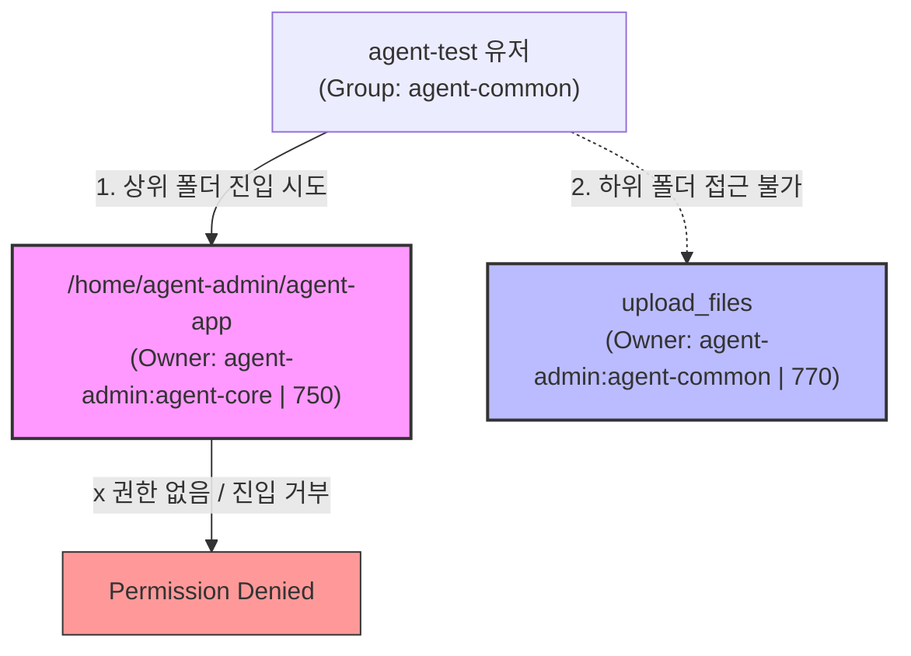

# 📝 Linux 시스템 및 인프라 구축 과제 피어 리뷰 가이드

이 문서는 구축된 Linux 서버 환경 및 시스템 관제 자동화 결과물에서 발견된 취약점과 개선 사항을 체계적으로 정리한 피어 리뷰 노트입니다. 동료(Peer)와 기술적인 토론을 유기적으로 진행하고, 더 높은 안정성과 완성도를 지닌 인프라를 구축할 수 있도록 돕는 피드백 항목들로 구성되어 있습니다.

---

## 🔍 핵심 요약 (Executive Summary)

* **총 발견 사항**: 6개
* **우선순위 분포**:
  * 🔴 **High (높음)**: 2개 (프로세스 오탐지 버그, 디렉토리 권한 구조 차단)
  * 🟡 **Medium (보통)**: 3개 (CPU 사용률 오계산, 키 파일 소유권 불일치, Cron sudo 권한 대기)
  * 🟢 **Low (낮음)**: 1개 (Docker-Compose 빌드 미연동)

---

## 🔴 High Severity (높은 중요도)

### 1. `monitor.sh` 프로세스 점검 로직의 모니터링 누수 (오탐지)

> [!WARNING]
> 서비스 데몬이 실제 다운되어 정상 동작하지 않는 비상 상황에서도, 모니터링 스크립트는 서비스 상태를 항상 `[OK]`로 판단하여 관제 시스템 전체가 무력화될 위험이 있습니다.

* **현상**: 스크립트 내에서 서비스 프로세스 존재 여부를 아래와 같이 확인합니다.
  ```bash
  APP_NAME="agent-app"
  PID=$(pgrep -f "$APP_NAME" | head -n 1 || true)
  ```
* **원인**: 
  모니터링 스크립트 자체의 물리 경로가 `/home/agent-admin/agent-app/bin/monitor.sh`입니다. `pgrep` 명령어의 `-f` 옵션은 프로세스의 **전체 명령줄(Argument)**에서 키워드를 매칭합니다. 따라서, 모니터링 스크립트가 실행될 때 그 실행 파일 경로명에 포함된 `agent-app` 문자열을 스크립트 스스로(또는 cron 래퍼 프로세스)가 감지하게 되어, 항상 자신의 PID를 반환하게 됩니다.
* **개선 안**:
  `-f` 옵션을 제거하고 정확한 서비스 실행 파일의 프로세스 이름(`agent-app-linux-x86`)만 조회하도록 변경하거나, 조회 시 스크립트 본인의 PID(`$$`)를 제외시키는 필터를 추가해야 합니다.
  ```bash
  # 개선 예시 (본인 PID 필터링)
  PID=$(pgrep -f "$APP_NAME" | grep -v "$$" | head -n 1 || true)
  ```

---

### 2. 상위 디렉토리 권한 제한으로 인한 공유 폴더 접근 차단

> [!CAUTION]
> 하위 디렉토리의 그룹 권한을 아무리 유연하게 열어두어도, 상위 디렉토리에서 경로 탐색 권한(x)이 막히면 하위 경로는 완벽히 격리되어 접근할 수 없습니다.



* **현상**:
  `agent-test` 유저는 전체 사용자 공유 그룹인 `agent-common`에 속해 있습니다. 공유 업로드 경로인 `/home/agent-admin/agent-app/upload_files` 디렉토리는 소유 그룹이 `agent-common`이며 권한이 `770`으로 잘 열려 있는 것처럼 보입니다.
* **원인**:
  하지만 그 상위 경로인 `/home/agent-admin/agent-app` 폴더의 소유 그룹이 핵심 운영 그룹인 `agent-core`이며 권한이 `750`(`rwxr-x---`)입니다. Linux 보안 체계상, 하위의 특정 파일/폴더에 가기 위해서는 **경로상의 모든 상위 디렉토리에 대한 실행 권한(x)**을 소유해야 합니다. `agent-test` 유저는 `agent-core` 그룹원이 아니기 때문에 상위 폴더 진입 과정에서 차단됩니다.
* **개선 안**:
  공유 업로드 경로는 특정 유저의 개인 홈 디렉토리가 아닌 공용 공간인 `/var/agent-app/upload_files`나 `/home/agent-common/upload_files` 등으로 분리하여 최상위 접근을 자유롭게 만들고 소유권을 제어하도록 재설계해야 합니다.

---

## 🟡 Medium Severity (보통 중요도)

### 3. `/proc/stat` CPU 사용률 일회성 조회로 인한 오계산

> [!NOTE]
> `/proc/stat`의 메트릭은 부팅 시점부터 누적된 누계 값이므로, 한 번만 조회하면 시스템 부하의 실시간 변화를 추적할 수 없습니다.

* **현상**:
  스크립트 80라인의 Fallback CPU 모니터링 코드는 다음과 같습니다.
  ```bash
  CPU_USAGE=$(awk '/^cpu / {
    idle=$5
    total=0
    for (i=2; i<=NF; i++) total += $i
    printf "%.1f", (1 - idle/total) * 100
  }' /proc/stat)
  ```
* **원인**:
  `/proc/stat`에 나열되는 커널 틱 수치들은 **부팅 이후 누적된 수치**입니다. 일회성으로 값을 읽어 연산하면 현재 부하와 무관한 **부팅 이후 평균 CPU 사용률**만 나오며, 이 값은 오랜 시간 동안 거의 고정되어 움직이지 않습니다.
* **개선 안**:
  실시간 부하를 측정하기 위해서는 `sleep 1` 등의 딜레이를 두고 2번 수치를 읽어 변화량(Delta)을 구한 후 사용률을 산출해야 합니다.
  ```bash
  # 개선 예시 (1초 간격 Delta 연산)
  read -r _ user1 nice1 sys1 idle1 iow1 irq1 soft1 steal1 _ < /proc/stat
  sleep 1
  read -r _ user2 nice2 sys2 idle2 iow2 irq2 soft2 steal2 _ < /proc/stat

  prev_idle=$((idle1 + iow1))
  curr_idle=$((idle2 + iow2))
  prev_non_idle=$((user1 + nice1 + sys1 + irq1 + soft1 + steal1))
  curr_non_idle=$((user2 + nice2 + sys2 + irq2 + soft2 + steal2))

  prev_total=$((prev_idle + prev_non_idle))
  curr_total=$((curr_idle + curr_non_idle))

  total_d=$((curr_total - prev_total))
  idle_d=$((curr_idle - prev_idle))

  cpu_percentage=$(awk -v t="$total_d" -v i="$idle_d" 'BEGIN {printf "%.1f", ((t - i) / t) * 100}')
  ```

---

### 4. `t_secret.key` 키 파일의 소유권 불일치 및 접근 불능

* **현상**: 비밀번호 검증용 키 파일을 생성할 때 사용한 명령입니다.
  ```bash
  echo "agent_api_key_test" | sudo tee /home/agent-admin/agent-app/api_keys/t_secret.key
  sudo chmod 660 /home/agent-admin/agent-app/api_keys/t_secret.key
  ```
* **원인**:
  `sudo` 권한으로 `tee`를 실행했으므로 생성된 파일의 소유 유저 및 그룹은 `root:root`가 됩니다. 이후 파일 권한을 `660`(`rw-rw----`)으로 격리했기 때문에 오직 `root` 사용자 본인과 `root` 그룹원만 파일에 접근할 수 있게 됩니다.
* **결과**:
  실제 서비스 구동 및 배치 작업을 처리하는 일반 유저인 `agent-admin`은 정작 이 키 파일을 읽을 수 없어 어플리케이션 작동 단계에서 실패(Permission Denied)를 겪게 됩니다.
* **개선 안**:
  파일을 작성하고 나서 명시적으로 소유권 이전을 해주는 명령을 작성해야 합니다.
  ```bash
  sudo chown agent-admin:agent-core /home/agent-admin/agent-app/api_keys/t_secret.key
  ```

---

### 5. Cron 스크립트 실행 시 `sudo ufw status` 패스워드 블로킹

* **현상**:
  `monitor.sh` 스크립트 내부에서 방화벽의 활성화 상태를 점검하기 위해 `sudo ufw status` 명령을 사용하고 있습니다.
* **원인**:
  크론 배치 작업이 일반 유저(`agent-admin`) 권한으로 주기적 실행될 텐데, 이때 `/etc/sudoers`에 해당 바이너리에 대한 패스워드 생략 규칙(`NOPASSWD`)이 매핑되어 있지 않다면 `sudo` 명령 실행 시 패스워드 입력을 요구하며 스크립트가 영구 대기(Hanging) 상태에 빠지거나 실패합니다.
* **개선 안**:
  모니터링 스크립트를 root의 크론탭(`sudo crontab -e`)으로 실행하도록 배치 흐름을 조정하거나, 보안 설정을 통해 모니터링 사용자에게 `ufw` 커맨드에 한정된 패스워드 면제 권한을 추가해야 안정적인 무중단 백그라운드 구동이 보장됩니다.

---

## 🟢 Low Severity (낮은 중요도)

### 6. Dockerfile 이미지 빌드와 Docker-Compose의 유기적 분리

* **현상**:
  정적인 웹 서버 이미지 생성을 위해 `Dockerfile`을 공들여 작성하고 `my-web:1.0`이라는 태그로 커스텀 빌드까지 완료했습니다. 그러나 `docker-compose.yml` 오케스트레이션 구성 파일에서는 이를 호출하지 않고 공식 `image: nginx:alpine`을 생으로 받아서 로컬 `./app` 디렉토리를 볼륨 마운트해 사용하고 있습니다.
* **결과**:
  Dockerfile 내부의 빌드 환경 구축 로직 및 어플리케이션 패키징 로직이 compose 환경에서는 완벽히 무시되어 버려, 두 설정 파일 간에 구조적 불일치가 생깁니다.
* **개선 안**:
  `docker-compose.yml` 내부에서 직접 `build: .` 지시자를 통해 로컬의 Dockerfile을 활용하게 유도하거나, 명시적으로 커스텀 빌드 이미지(`image: my-web:1.0`)를 사용하도록 매핑을 일치시켜 유기적인 인프라 구성을 갖출 것을 권장합니다.

---